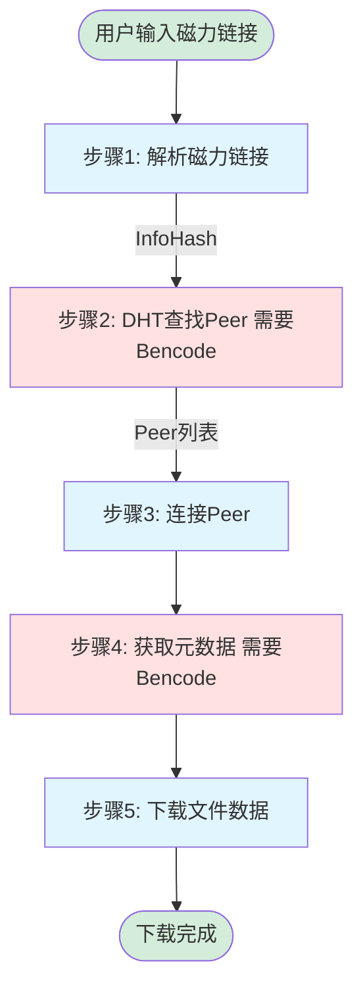
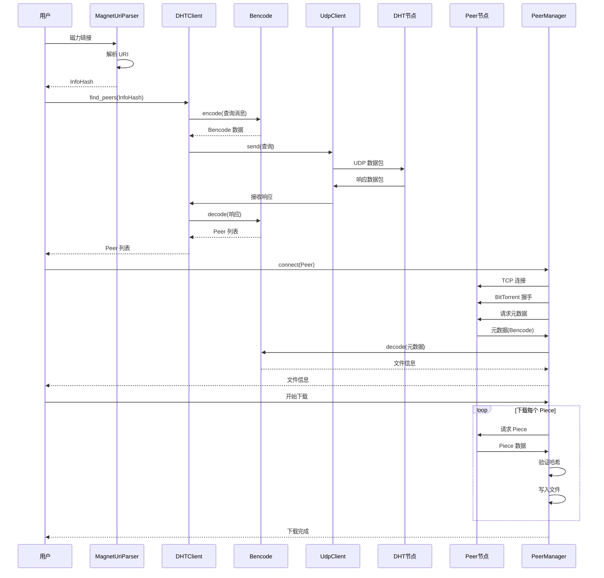
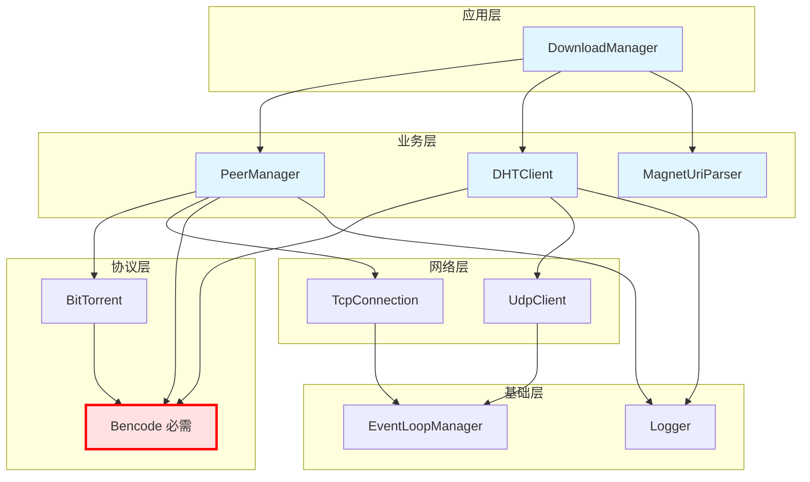
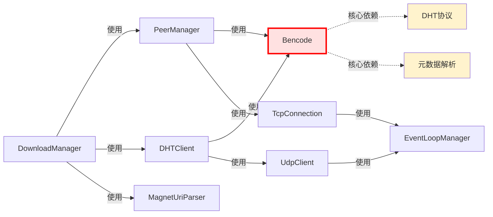

# 磁力链接下载完整流程

> **问题**：实现磁力链接下载，Bencode 是必需的吗？
> 
> **答案**：**是的，绝对必需！**

---

## 🔄 完整的下载流程

### 流程图（Mermaid）



### 时序图（Mermaid）



---

## 📊 模块依赖关系

### 架构图（Mermaid）



### 依赖关系详解



### 最小可工作系统

要实现磁力链接下载，**最少需要**：

```
✅ MagnetUriParser  - 解析磁力链接
✅ Bencode          - 编解码 DHT 消息和元数据
✅ UdpClient        - UDP 通信
✅ DHTClient        - 查找 Peer
✅ TcpConnection    - 连接 Peer
✅ PeerManager      - 管理 Peer 和下载数据
```

