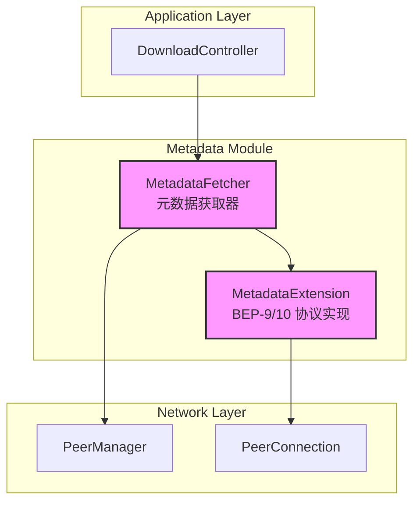
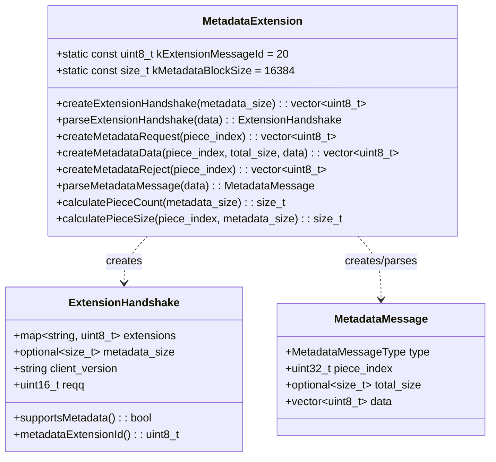
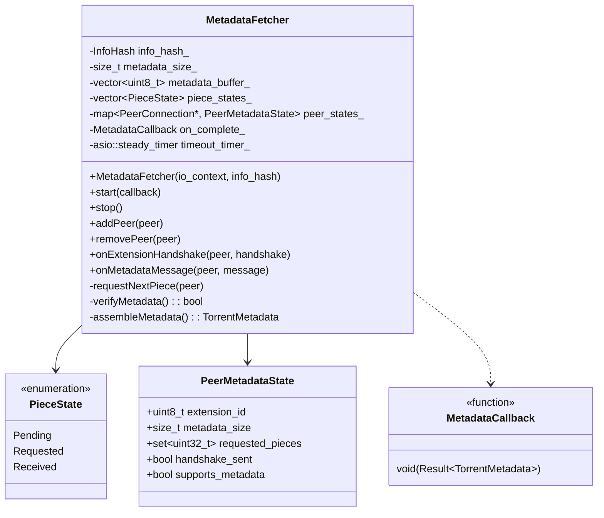
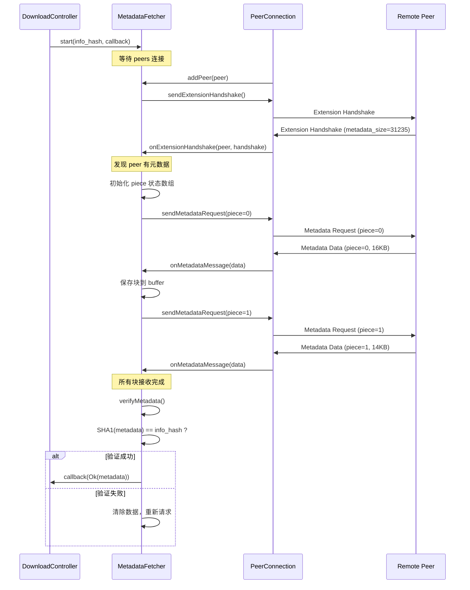
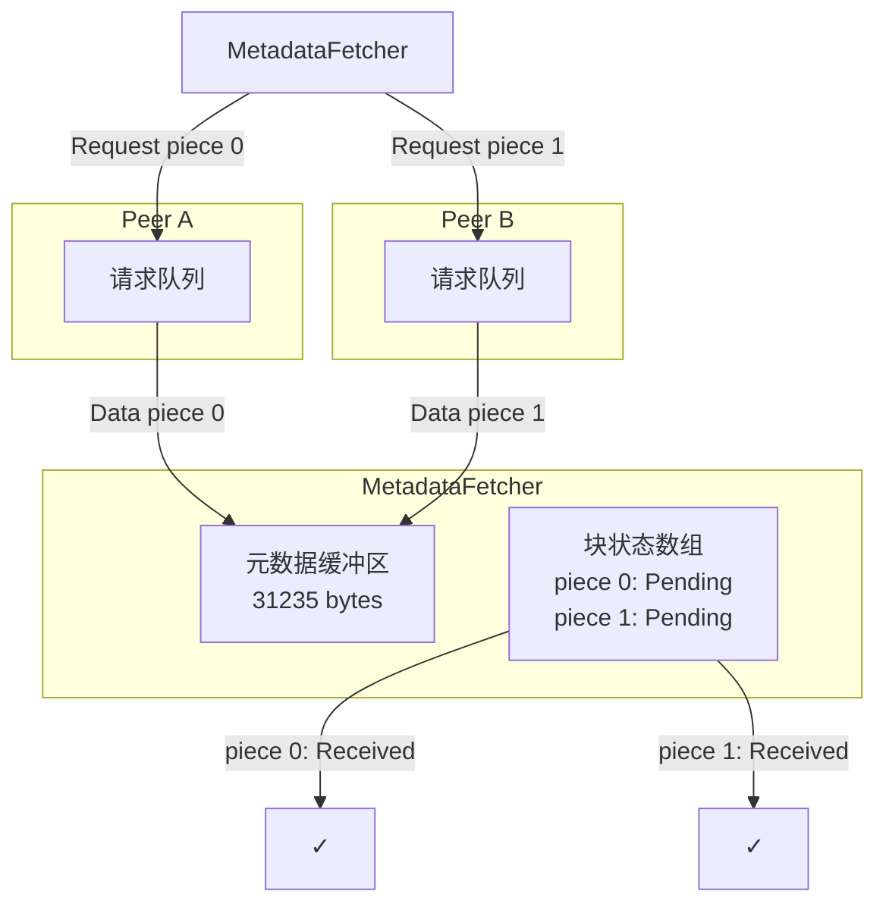
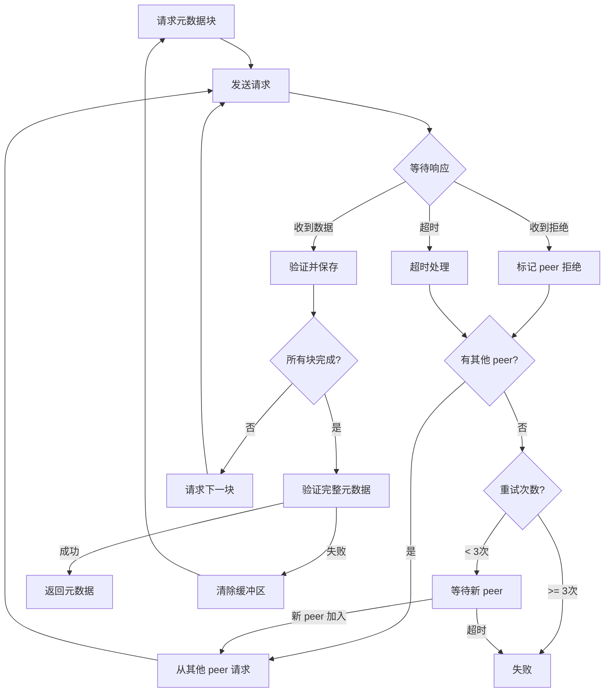

# BEP-9 元数据扩展协议设计文档

## 1. 概述

### 1.1 背景

磁力链接（Magnet URI）只包含 `info_hash`，不包含 torrent 文件的元数据（文件名、大小、piece hash 等）。BEP-9 协议定义了一种从其他 peers 获取元数据的方法。

### 1.2 为什么需要 BEP-9

```
磁力链接: magnet:?xt=urn:btih:3b245504cf5f11bbdbe1201cea6a6bf45aee1bc0

只包含:
  - info_hash (20字节)
  
不包含:
  - 文件名
  - 文件大小
  - piece 数量和大小
  - piece hash 列表
  - 目录结构（多文件种子）
```

**BEP-9 的作用**：允许客户端从已经拥有元数据的 peers 处获取这些信息。

### 1.3 协议依赖

BEP-9 基于 **BEP-10（扩展协议）** 框架：

```
BEP-10 扩展协议
    └── BEP-9 元数据扩展 (ut_metadata)
    └── 其他扩展 (ut_pex, lt_donthave, ...)
```

---

## 2. 设计目标

| 目标 | 描述 |
|------|------|
| 完整实现 | 完整实现 BEP-9 和必要的 BEP-10 支持 |
| 高效传输 | 支持从多个 peers 并行获取元数据块 |
| 容错性 | 处理 peers 断开、拒绝、超时等情况 |
| 验证性 | 对获取的元数据进行 SHA1 验证 |
| 可集成 | 与现有 PeerConnection 无缝集成 |

---

## 3. 协议详解

### 3.1 BEP-10 扩展握手

在 BitTorrent 握手后，双方交换扩展握手消息。

```
消息格式:
  - 长度前缀: 4 字节 (big-endian)
  - 消息 ID: 1 字节 (20 = 扩展消息)
  - 扩展消息 ID: 1 字节 (0 = 握手)
  - Bencode 字典: 变长

Bencode 字典内容:
{
    "m": {                          // 支持的扩展映射
        "ut_metadata": 1,           // 元数据扩展的本地消息 ID
        "ut_pex": 2                 // PEX 扩展（可选）
    },
    "metadata_size": 31235,         // 元数据大小（如果已有）
    "v": "MagnetDownload 0.1",      // 客户端版本
    "reqq": 250                     // 请求队列大小（可选）
}
```

### 3.2 BEP-9 消息类型

元数据扩展定义了 3 种消息类型：

```cpp
enum class MetadataMessageType : uint8_t {
    Request = 0,    // 请求元数据块
    Data    = 1,    // 元数据块数据
    Reject  = 2     // 拒绝请求
};
```

### 3.3 消息格式

#### Request 消息（请求元数据块）

```
{
    "msg_type": 0,      // Request
    "piece": 0          // 块索引 (0, 1, 2, ...)
}
```

#### Data 消息（元数据块数据）

```
{
    "msg_type": 1,      // Data
    "piece": 0,         // 块索引
    "total_size": 31235 // 元数据总大小
}
<16KB 元数据块>         // 紧跟在 bencode 字典后
```

#### Reject 消息（拒绝请求）

```
{
    "msg_type": 2,      // Reject
    "piece": 0          // 被拒绝的块索引
}
```

### 3.4 元数据块划分

```
元数据大小: 31235 字节
块大小: 16384 字节 (16KB)

块 0: [0, 16383]      - 16384 字节
块 1: [16384, 31234]  - 14851 字节 (最后一块)

总块数 = ceil(31235 / 16384) = 2
```

---

## 4. 架构设计

### 4.1 模块关系图



### 4.2 类职责

| 类 | 职责 |
|---|------|
| `MetadataExtension` | BEP-9/10 协议编解码 |
| `MetadataFetcher` | 协调多个 peers 获取元数据，处理重试和验证 |
| `PeerConnection` | 集成扩展消息收发 |

---

## 5. 类设计

### 5.1 MetadataExtension 类



### 5.2 MetadataFetcher 类



---

## 6. 核心流程

### 6.1 元数据获取流程



### 6.2 多 Peer 并行获取



---

## 7. 数据结构

### 7.1 扩展握手

```cpp
struct ExtensionHandshake {
    // 扩展映射: 扩展名 -> 本地消息 ID
    std::map<std::string, uint8_t> extensions;
    
    // 元数据大小（如果已有）
    std::optional<size_t> metadata_size;
    
    // 客户端版本
    std::string client_version;
    
    // 请求队列大小
    uint16_t request_queue_size{250};
    
    // 检查是否支持元数据扩展
    bool supportsMetadata() const {
        return extensions.count("ut_metadata") > 0;
    }
    
    // 获取元数据扩展的消息 ID
    uint8_t metadataExtensionId() const {
        auto it = extensions.find("ut_metadata");
        return it != extensions.end() ? it->second : 0;
    }
};
```

### 7.2 元数据消息

```cpp
enum class MetadataMessageType : uint8_t {
    Request = 0,
    Data    = 1,
    Reject  = 2
};

struct MetadataMessage {
    MetadataMessageType type;
    uint32_t piece_index;
    std::optional<size_t> total_size;  // 仅 Data 消息
    std::vector<uint8_t> data;         // 仅 Data 消息
};
```

### 7.3 Torrent 元数据

```cpp
struct TorrentMetadata {
    // 基本信息
    std::string name;                   // 种子名称
    size_t piece_length;                // 每个 piece 的大小
    std::vector<InfoHash> piece_hashes; // 所有 piece 的 SHA1 hash
    
    // 单文件种子
    std::optional<size_t> length;       // 文件大小
    
    // 多文件种子
    struct FileInfo {
        std::string path;
        size_t length;
    };
    std::vector<FileInfo> files;
    
    // 原始 info 字典（用于验证）
    std::vector<uint8_t> raw_info;
    
    // 计算总大小
    size_t totalSize() const;
    
    // 计算 piece 数量
    size_t pieceCount() const;
    
    // 是否为多文件种子
    bool isMultiFile() const { return !files.empty(); }
};
```

---

## 8. 错误处理

### 8.1 错误类型

```cpp
enum class MetadataError {
    Timeout,            // 获取超时
    AllPeersRejected,   // 所有 peers 拒绝
    NoPeersAvailable,   // 没有可用的 peers
    VerificationFailed, // SHA1 验证失败
    ParseError,         // 解析错误
    InvalidPieceIndex,  // 无效的块索引
    SizeMismatch        // 大小不匹配
};
```

### 8.2 重试策略



---

## 9. PeerConnection 集成

### 9.1 扩展消息处理

```cpp
// peer_connection.h 新增
class PeerConnection {
public:
    // 扩展握手
    void sendExtensionHandshake();
    void onExtensionHandshake(const ExtensionHandshake& handshake);
    
    // 元数据消息
    void sendMetadataRequest(uint32_t piece_index);
    void sendMetadataData(uint32_t piece_index, const std::vector<uint8_t>& data);
    void sendMetadataReject(uint32_t piece_index);
    
    // 回调
    using ExtensionHandshakeCallback = std::function<void(const ExtensionHandshake&)>;
    using MetadataMessageCallback = std::function<void(const MetadataMessage&)>;
    
    void setExtensionHandshakeCallback(ExtensionHandshakeCallback cb);
    void setMetadataMessageCallback(MetadataMessageCallback cb);
    
private:
    ExtensionHandshake peer_extensions_;
    uint8_t my_metadata_extension_id_{1};  // 我方的 ut_metadata ID
};
```

### 9.2 消息路由

```cpp
void PeerConnection::handleMessage(const BtMessage& msg) {
    switch (msg.type()) {
        // ... 现有消息处理 ...
        
        case BtMessageType::Extended:
            handleExtendedMessage(msg);
            break;
    }
}

void PeerConnection::handleExtendedMessage(const BtMessage& msg) {
    uint8_t ext_id = msg.extendedId();
    
    if (ext_id == 0) {
        // 扩展握手
        auto handshake = MetadataExtension::parseExtensionHandshake(msg.payload());
        peer_extensions_ = handshake;
        if (extension_handshake_callback_) {
            extension_handshake_callback_(handshake);
        }
    } else if (ext_id == peer_extensions_.metadataExtensionId()) {
        // 元数据消息
        auto metadata_msg = MetadataExtension::parseMetadataMessage(msg.payload());
        if (metadata_message_callback_) {
            metadata_message_callback_(metadata_msg);
        }
    }
}
```

---

## 10. 配置参数

```cpp
struct MetadataFetcherConfig {
    // 超时设置
    std::chrono::seconds fetch_timeout{120};      // 总超时
    std::chrono::seconds piece_timeout{30};       // 单块超时
    
    // 重试设置
    int max_retries{3};                           // 最大重试次数
    int max_peers{5};                             // 最大并行 peers
    
    // 块大小（BEP-9 规定）
    static constexpr size_t kBlockSize = 16384;   // 16KB
    
    // 元数据大小限制
    size_t max_metadata_size{10 * 1024 * 1024};   // 10MB
};
```

---

## 11. 公共 API

### 11.1 MetadataExtension

```cpp
namespace magnet::protocols {

class MetadataExtension {
public:
    // === 常量 ===
    static constexpr uint8_t kExtensionMessageId = 20;
    static constexpr size_t kMetadataBlockSize = 16384;
    static constexpr const char* kExtensionName = "ut_metadata";
    
    // === 扩展握手 ===
    static std::vector<uint8_t> createExtensionHandshake(
        std::optional<size_t> metadata_size = std::nullopt,
        const std::string& client_version = "MagnetDownload/0.1"
    );
    
    static std::optional<ExtensionHandshake> parseExtensionHandshake(
        const std::vector<uint8_t>& data
    );
    
    // === 元数据消息 ===
    static std::vector<uint8_t> createMetadataRequest(
        uint8_t extension_id,
        uint32_t piece_index
    );
    
    static std::vector<uint8_t> createMetadataData(
        uint8_t extension_id,
        uint32_t piece_index,
        size_t total_size,
        const std::vector<uint8_t>& data
    );
    
    static std::vector<uint8_t> createMetadataReject(
        uint8_t extension_id,
        uint32_t piece_index
    );
    
    static std::optional<MetadataMessage> parseMetadataMessage(
        const std::vector<uint8_t>& data
    );
    
    // === 辅助函数 ===
    static size_t calculatePieceCount(size_t metadata_size);
    static size_t calculatePieceSize(uint32_t piece_index, size_t metadata_size);
};

} // namespace magnet::protocols
```

### 11.2 MetadataFetcher

```cpp
namespace magnet::protocols {

class MetadataFetcher : public std::enable_shared_from_this<MetadataFetcher> {
public:
    using MetadataCallback = std::function<void(Result<TorrentMetadata, MetadataError>)>;
    
    MetadataFetcher(asio::io_context& io_context,
                    const InfoHash& info_hash,
                    MetadataFetcherConfig config = {});
    
    ~MetadataFetcher();
    
    // 生命周期
    void start(MetadataCallback callback);
    void stop();
    
    // Peer 管理
    void addPeer(std::shared_ptr<PeerConnection> peer);
    void removePeer(std::shared_ptr<PeerConnection> peer);
    
    // 状态查询
    bool isComplete() const;
    float progress() const;  // 0.0 - 1.0
    size_t metadataSize() const;
    
private:
    // ... 内部实现 ...
};

} // namespace magnet::protocols
```

---

## 12. 使用示例

```cpp
// 在 DownloadController 中使用
void DownloadController::startMetadataFetch() {
    metadata_fetcher_ = std::make_shared<MetadataFetcher>(
        io_context_, metadata_.info_hash);
    
    auto self = shared_from_this();
    metadata_fetcher_->start([self](Result<TorrentMetadata, MetadataError> result) {
        if (result.is_ok()) {
            LOG_INFO("Metadata fetched successfully!");
            self->onMetadataReceived(result.value());
        } else {
            LOG_ERROR("Failed to fetch metadata: " + 
                      std::to_string(static_cast<int>(result.error())));
            self->fail("Metadata fetch failed");
        }
    });
}

void DownloadController::onPeerConnected(std::shared_ptr<PeerConnection> peer) {
    // 添加 peer 到元数据获取器
    if (metadata_fetcher_ && !metadata_fetcher_->isComplete()) {
        metadata_fetcher_->addPeer(peer);
    }
}

void DownloadController::onMetadataReceived(const TorrentMetadata& metadata) {
    LOG_INFO("Torrent: " + metadata.name);
    LOG_INFO("Size: " + std::to_string(metadata.totalSize()) + " bytes");
    LOG_INFO("Pieces: " + std::to_string(metadata.pieceCount()));
    
    // 初始化文件管理器和 piece 管理器
    initializeStorage(metadata);
    
    // 状态转换
    setState(DownloadState::Downloading);
    
    // 开始请求数据
    requestMoreBlocks();
}
```

---

## 13. 实现检查清单

### Phase 1: MetadataExtension (协议编解码)
- [ ] 定义常量和数据结构
- [ ] 实现扩展握手创建
- [ ] 实现扩展握手解析
- [ ] 实现元数据请求/数据/拒绝消息创建
- [ ] 实现元数据消息解析
- [ ] 实现辅助计算函数

### Phase 2: PeerConnection 集成
- [ ] 添加 BtMessageType::Extended
- [ ] 实现扩展消息发送
- [ ] 实现扩展消息路由
- [ ] 添加扩展相关回调

### Phase 3: MetadataFetcher (获取逻辑)
- [ ] 实现 peer 管理
- [ ] 实现块请求调度
- [ ] 实现块接收和组装
- [ ] 实现 SHA1 验证
- [ ] 实现超时和重试
- [ ] 实现多 peer 并行获取

### Phase 4: DownloadController 集成
- [ ] 创建 MetadataFetcher
- [ ] 连接 peer 事件
- [ ] 处理元数据完成回调
- [ ] 初始化存储模块

### Phase 5: 测试
- [ ] 单元测试 - MetadataExtension
- [ ] 单元测试 - MetadataFetcher
- [ ] 集成测试 - 真实磁力链接

---

## 14. 参考资料

- [BEP-9: Extension for Peers to Send Metadata Files](http://www.bittorrent.org/beps/bep_0009.html)
- [BEP-10: Extension Protocol](http://www.bittorrent.org/beps/bep_0010.html)
- [BEP-3: The BitTorrent Protocol Specification](http://www.bittorrent.org/beps/bep_0003.html)

