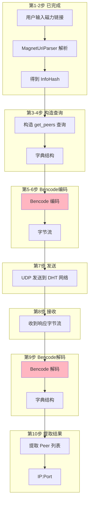
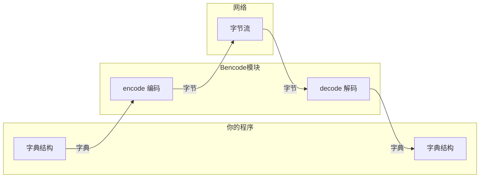

# Bencode 编解码模块需求文档

## 1. 为什么需要 Bencode？

### 1.1 完整流程：从磁力链接到找到 Peer

假设用户输入了一个磁力链接：

```
magnet:?xt=urn:btih:3b245504cf5f11bbdbe1201cea6a6bf45aee1bc0&dn=ubuntu-22.04.iso
```

**目标**：找到谁有这个文件，然后下载。

**问题**：你有了 `InfoHash`，但不知道谁有这个文件。

**解决方案**：去 DHT 网络问！DHT 网络是一个分布式的"电话簿"，你可以问它："谁有这个文件？"

### 1.2 完整的 10 步流程



### 1.3 每一步的具体内容

**第 1 步：用户输入磁力链接**
```
magnet:?xt=urn:btih:3b245504cf5f11bbdbe1201cea6a6bf45aee1bc0&dn=ubuntu-22.04.iso
```

**第 2 步：MagnetUriParser 解析（已完成）**
```cpp
auto result = parseMagnetUri("magnet:?xt=urn:btih:3b245504...");
MagnetInfo info = result.value();
// info.info_hash = 3b245504cf5f11bbdbe1201cea6a6bf45aee1bc0 (20字节)
```

**第 3-4 步：构造 DHT 查询消息**

DHT 协议规定，`get_peers` 查询必须是这样的字典结构：
```
{
    "t": "aa",                    // 事务ID（随机2字节）
    "y": "q",                     // 消息类型：q=查询
    "q": "get_peers",             // 查询方法
    "a": {
        "id": <你的NodeId，20字节>,
        "info_hash": <InfoHash>   // ← 这就是从 MagnetInfo 来的！
    }
}
```

**第 5-6 步：Bencode 编码（本模块的作用）**

UDP 只能发送字节，不能发送字典。所以需要把字典转成字节：
```
输入：上面的字典结构
输出：d1:ad2:id20:XXXX9:info_hash20:YYYYe1:q9:get_peers1:t2:aa1:y1:qe
```

**第 7 步：UDP 发送**
```cpp
udp_client.send(dht_node_ip, dht_node_port, encoded_bytes);
```

**第 8 步：收到响应（字节流）**
```
d1:rd2:id20:ZZZZ5:token8:xxxx6:valuesl6:AAAAAA6:BBBBBBee1:t2:aa1:y1:re
```

**第 9 步：Bencode 解码（本模块的作用）**

把字节流解码回字典：
```
输入：上面的字节流
输出：
{
    "t": "aa",
    "y": "r",
    "r": {
        "id": <响应节点的ID>,
        "token": <8字节>,
        "values": [           // ← Peer 列表！
            <6字节: IP+Port>,
            <6字节: IP+Port>
        ]
    }
}
```

**第 10 步：提取 Peer 信息**

从字典中提取 `values` 字段，得到 Peer 的 IP 和端口。

---

## 2. Bencode 模块的作用



**简单说**：
- **encode**：把字典变成可以发送的字节
- **decode**：把收到的字节变回字典

**Bencode 本身不关心 MagnetInfo**，它只负责"字典 ↔ 字节"的转换。

---

## 3. 用代码表示完整流程

```cpp
// ========== 第 1-2 步：解析磁力链接（已完成）==========
auto result = parseMagnetUri("magnet:?xt=urn:btih:3b245504...");
InfoHash info_hash = result.value().info_hash.value();

// ========== 第 3-4 步：构造 DHT 查询 ==========
BencodeDict args;
args["id"] = BencodeValue(my_node_id);
args["info_hash"] = BencodeValue(info_hash.bytes());  // 从 MagnetInfo 来

BencodeDict query;
query["t"] = BencodeValue("aa");           // 事务ID
query["y"] = BencodeValue("q");            // 消息类型：查询
query["q"] = BencodeValue("get_peers");    // 查询方法
query["a"] = BencodeValue(args);

// ========== 第 5-6 步：Bencode 编码 ==========
std::string encoded = Bencode::encode(BencodeValue(query));
// 结果：d1:ad2:id20:XXXX9:info_hash20:YYYYe1:q9:get_peers1:t2:aa1:y1:qe

// ========== 第 7 步：UDP 发送 ==========
udp_client.send(dht_node_ip, dht_node_port, encoded);

// ========== 第 8 步：收到响应 ==========
std::string response_data = udp_client.receive();

// ========== 第 9 步：Bencode 解码 ==========
auto decode_result = Bencode::decode(response_data);
if (!decode_result) {
    std::cerr << "解码失败" << std::endl;
    return;
}
BencodeValue response = decode_result.value();

// ========== 第 10 步：提取 Peer ==========
const auto& resp_dict = response.as_dict();
const auto& r_dict = resp_dict.at("r").as_dict();
const auto& values = r_dict.at("values").as_list();

for (const auto& peer_data : values) {
    const std::string& data = peer_data.as_string();
    // 6 字节：前 4 字节是 IP，后 2 字节是端口
    std::string ip = parseIP(data.substr(0, 4));
    uint16_t port = parsePort(data.substr(4, 2));
    std::cout << "Found peer: " << ip << ":" << port << std::endl;
}
```

---

## 4. Bencode 格式规范

Bencode 只有 4 种数据类型：

| 类型 | 编码格式 | 示例 | 解码结果 |
|------|----------|------|----------|
| 整数 | `i<数字>e` | `i42e` | 42 |
| 字符串 | `<长度>:<内容>` | `4:spam` | "spam" |
| 列表 | `l<元素>e` | `li1ei2ee` | [1, 2] |
| 字典 | `d<键值对>e` | `d3:foo3:bare` | {"foo": "bar"} |

---

## 5. 模块接口

### 5.1 基础类型定义

```cpp
namespace magnet::protocols {

// 基础类型别名
using BencodeInt = int64_t;
using BencodeString = std::string;  // 可能包含二进制数据，不一定是有效 UTF-8
using BencodeList = std::vector<BencodeValue>;
using BencodeDict = std::map<std::string, BencodeValue>;  // key 自动按字典序排序

}
```

### 5.2 BencodeValue 类

```cpp
namespace magnet::protocols {

class BencodeValue {
public:
    // 类型枚举
    enum class Type { INT, STRING, LIST, DICT };
    
    // ========== 构造函数 ==========
    BencodeValue();                          // 默认构造（空字符串）
    BencodeValue(BencodeInt value);          // 整数：BencodeValue(42)
    BencodeValue(const char* value);         // 字符串：BencodeValue("hello")
    BencodeValue(BencodeString value);       // 字符串：BencodeValue(std::string("hello"))
    BencodeValue(BencodeList value);         // 列表
    BencodeValue(BencodeDict value);         // 字典
    
    // ========== 拷贝和移动 ==========
    BencodeValue(const BencodeValue& other);
    BencodeValue(BencodeValue&& other) noexcept;
    BencodeValue& operator=(const BencodeValue& other);
    BencodeValue& operator=(BencodeValue&& other) noexcept;
    
    // ========== 类型检查 ==========
    Type type() const;
    bool is_int() const;
    bool is_string() const;
    bool is_list() const;
    bool is_dict() const;
    
    // ========== 值访问（类型不匹配时抛出 std::bad_variant_access）==========
    BencodeInt as_int() const;
    const BencodeString& as_string() const;
    const BencodeList& as_list() const;
    BencodeList& as_list();
    const BencodeDict& as_dict() const;
    BencodeDict& as_dict();

private:
    std::variant<BencodeInt, BencodeString, BencodeList, BencodeDict> data_;
};

}
```

### 5.3 Bencode 编解码类

```cpp
namespace magnet::protocols {

class Bencode {
public:
    /**
     * @brief 编码 BencodeValue 为字符串
     * @param value 要编码的值
     * @return 编码后的字符串（可能包含二进制数据）
     * 
     * 注意：字典的 key 会自动按字典序排序
     */
    static std::string encode(const BencodeValue& value);
    
    /**
     * @brief 解码字符串为 BencodeValue
     * @param data 要解码的数据
     * @return 解码后的值，失败返回 std::nullopt
     */
    static std::optional<BencodeValue> decode(std::string_view data);
    
    /**
     * @brief 解码字符串为 BencodeValue（带位置信息）
     * @param data 要解码的数据
     * @param pos 输出参数，解码结束的位置
     * @return 解码后的值，失败返回 std::nullopt
     * 
     * 用途：解析多个连续的 Bencode 值
     */
    static std::optional<BencodeValue> decode(std::string_view data, size_t& pos);
};

}
```

---

## 6. 测试用例

### 6.1 整数编解码测试

| 场景 | 输入值 | 编码结果 | 解码验证 |
|------|--------|----------|----------|
| 正整数 | 42 | `i42e` | ✓ |
| 负整数 | -42 | `i-42e` | ✓ |
| 零 | 0 | `i0e` | ✓ |
| 大整数 | 9223372036854775807 | `i9223372036854775807e` | ✓ |
| 小整数 | -9223372036854775808 | `i-9223372036854775808e` | ✓ |

### 6.2 字符串编解码测试

| 场景 | 输入值 | 编码结果 | 解码验证 |
|------|--------|----------|----------|
| 普通字符串 | "spam" | `4:spam` | ✓ |
| 空字符串 | "" | `0:` | ✓ |
| 含空格 | "hello world" | `11:hello world` | ✓ |
| 二进制数据 | `\x00\x01\x02\x03` | `4:\x00\x01\x02\x03` | ✓ |
| 含 null 字符 | "a\x00b" | `3:a\x00b` | ✓ |
| 中文字符 | "你好" | `6:你好` (UTF-8: 6字节) | ✓ |

### 6.3 列表编解码测试

| 场景 | 输入值 | 编码结果 | 解码验证 |
|------|--------|----------|----------|
| 简单列表 | [1, 2] | `li1ei2ee` | ✓ |
| 空列表 | [] | `le` | ✓ |
| 混合类型 | [1, "spam"] | `li1e4:spame` | ✓ |
| 嵌套列表 | [[1], [2]] | `lli1eeli2eee` | ✓ |

### 6.4 字典编解码测试

| 场景 | 输入值 | 编码结果 | 解码验证 |
|------|--------|----------|----------|
| 简单字典 | {"a": 1} | `d1:ai1ee` | ✓ |
| 空字典 | {} | `de` | ✓ |
| 多键字典 | {"b": 2, "a": 1} | `d1:ai1e1:bi2ee` (键已排序) | ✓ |
| 嵌套字典 | {"x": {"y": 1}} | `d1:xd1:yi1eee` | ✓ |

### 6.5 复杂嵌套测试

```cpp
// DHT get_peers 请求消息
BencodeDict args;
args["id"] = BencodeValue(std::string(20, 'A'));
args["info_hash"] = BencodeValue(std::string(20, 'B'));

BencodeDict query;
query["t"] = BencodeValue("aa");
query["y"] = BencodeValue("q");
query["q"] = BencodeValue("get_peers");
query["a"] = BencodeValue(args);

std::string encoded = Bencode::encode(BencodeValue(query));
// 预期：d1:ad2:id20:AAAAAAAAAAAAAAAAAAAA9:info_hash20:BBBBBBBBBBBBBBBBBBBBe1:q9:get_peers1:t2:aa1:y1:qe

auto decoded = Bencode::decode(encoded);
ASSERT_TRUE(decoded.has_value());
ASSERT_TRUE(decoded->is_dict());
ASSERT_EQ(decoded->as_dict().at("y").as_string(), "q");
```

### 6.6 错误处理测试

| 场景 | 错误输入 | 预期结果 |
|------|----------|----------|
| 缺少结束标记 | `i42` | `std::nullopt` |
| 前导零 | `i042e` | `std::nullopt` |
| 负零 | `i-0e` | `std::nullopt` |
| 字符串截断 | `4:spa` | `std::nullopt` |
| 空输入 | `` | `std::nullopt` |
| 无效起始字符 | `x42e` | `std::nullopt` |
| 字典键非字符串 | `di1e3:vale` | `std::nullopt` |
| 非法整数字符 | `i12a3e` | `std::nullopt` |
| 负数长度 | `-1:a` | `std::nullopt` |

### 6.7 往返测试（Round-trip）

```cpp
// 对于任意有效的 BencodeValue v:
void test_roundtrip(const BencodeValue& v) {
    std::string encoded = Bencode::encode(v);
    auto decoded = Bencode::decode(encoded);
    ASSERT_TRUE(decoded.has_value());
    
    // 重新编码应得到相同结果
    std::string re_encoded = Bencode::encode(decoded.value());
    ASSERT_EQ(encoded, re_encoded);
}
```

### 6.8 字典键排序验证测试

```cpp
// 验证字典编码时键按字典序排列
BencodeDict dict;
dict["z"] = BencodeValue(1);
dict["a"] = BencodeValue(2);
dict["m"] = BencodeValue(3);

std::string encoded = Bencode::encode(BencodeValue(dict));
// 预期顺序：a, m, z
ASSERT_EQ(encoded, "d1:ai2e1:mi3e1:zi1ee");
```

---

## 7. 性能与限制

### 7.1 数据范围

| 类型 | 范围/限制 |
|------|----------|
| 整数 | int64_t：-9223372036854775808 到 9223372036854775807 |
| 字符串长度 | 理论上无限制，受内存限制 |
| 列表元素数 | 理论上无限制，受内存限制 |
| 字典键值对数 | 理论上无限制，受内存限制 |

### 7.2 安全限制（建议实现）

| 限制项 | 建议值 | 说明 |
|--------|--------|------|
| 最大嵌套深度 | 100 | 防止栈溢出攻击 |
| 单个字符串最大长度 | 10MB | 防止内存耗尽 |
| 总数据最大大小 | 100MB | 防止内存耗尽 |

### 7.3 注意事项

1. **二进制安全**：字符串可以包含任意字节，包括 `\0`
2. **字典键排序**：`std::map` 自动保证键的字典序
3. **整数格式**：不允许前导零（除了 `i0e`），不允许负零 `i-0e`
4. **解码容错**：当前实现会忽略末尾多余数据，可根据需求改为严格模式

---

## 8. 文件结构

```
include/magnet/protocols/
├── bencode.h           # 编解码器接口
└── bencode_types.h     # 类型定义

src/protocols/
└── bencode.cpp         # 实现

tests/protocols/
└── bencode_test.cpp    # 单元测试
```

---

## 9. 验收清单

### 9.1 功能测试

- [ ] 整数编解码正确（正数、负数、零、边界值）
- [ ] 字符串编解码正确（普通、空、二进制）
- [ ] 列表编解码正确（空列表、嵌套列表）
- [ ] 字典编解码正确（空字典、嵌套字典）
- [ ] 字典编码时键按字典序排列
- [ ] 支持二进制字符串（可包含 `\0`）
- [ ] 往返测试（Round-trip）通过
- [ ] DHT 消息完整编解码测试通过

### 9.2 错误处理

- [ ] 前导零整数返回 nullopt
- [ ] 负零返回 nullopt
- [ ] 截断数据返回 nullopt
- [ ] 无效格式返回 nullopt
- [ ] 空输入返回 nullopt

### 9.3 代码质量

- [ ] 无编译警告
- [ ] 无内存泄漏（Valgrind/AddressSanitizer 通过）
- [ ] 代码覆盖率 > 90%
- [ ] 符合项目代码规范
