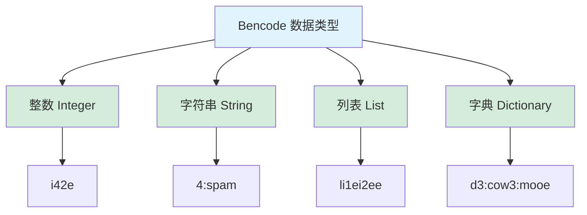
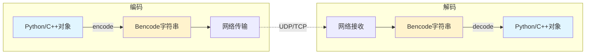

# Bencode 编解码器设计文档

> **模块名称**：Bencode - BitTorrent 编码格式的编解码器
> 
> **设计时间**：2025-12-31
> 
> **设计目标**：实现 Bencode 格式的编码和解码

---

## 📋 目录

1. [什么是 Bencode](#什么是-bencode)
2. [为什么需要 Bencode](#为什么需要-bencode)
3. [Bencode 格式规范](#bencode-格式规范)
4. [接口设计](#接口设计)
5. [使用示例](#使用示例)
6. [实现要点](#实现要点)

---

## 🎯 什么是 Bencode

**Bencode** 是 BitTorrent 协议使用的编码格式，类似于 JSON，但更简单、更紧凑。

### 特点

- ✅ **简单**：只有 4 种数据类型
- ✅ **紧凑**：比 JSON 更节省空间
- ✅ **二进制安全**：可以编码任意字节序列
- ✅ **确定性**：相同数据编码结果唯一

### 与 JSON 对比

```
JSON:  {"name": "test", "size": 100}
Bencode: d4:name4:test4:sizei100ee

优势：
- 更短（节省带宽）
- 支持二进制数据
- 解析更快
```

---

## 🔧 为什么需要 Bencode

### 在项目中的使用

**1. DHT 协议通信**
```cpp
// DHT 查询消息
{
    "q": "get_peers",
    "a": {
        "id": "<20字节>",
        "info_hash": "<20字节>"
    }
}
// 需要编码为 Bencode 后通过 UDP 发送
```

**2. .torrent 文件解析**
```cpp
// .torrent 文件是 Bencode 格式
{
    "info": {
        "name": "file.iso",
        "length": 1234567890,
        "pieces": "<SHA1哈希列表>"
    },
    "announce": "http://tracker.com/announce"
}
```

**3. Peer 元数据交换**
```cpp
// 从 Peer 获取的元数据也是 Bencode 格式
```

---

## 📖 Bencode 格式规范

### 数据类型概览（Mermaid）



### 编解码流程（Mermaid）



**格式**：`i<数字>e`

**示例**：
```
i42e     → 42
i-3e     → -3
i0e      → 0
```

**规则**：
- 必须以 `i` 开头，`e` 结尾
- 不能有前导零（除了 `i0e`）
- 负数用 `-` 表示

---

### 2. 字符串（String）

**格式**：`<长度>:<内容>`

**示例**：
```
4:spam   → "spam"
0:       → ""
20:<20字节二进制数据>
```

**规则**：
- 长度是十进制数字
- 冒号后跟指定长度的字节
- 支持二进制数据（不一定是 UTF-8）

---

### 3. 列表（List）

**格式**：`l<元素1><元素2>...e`

**示例**：
```
l4:spam4:eggse           → ["spam", "eggs"]
li1ei2ei3ee              → [1, 2, 3]
ld3:cow3:mooee           → [{"cow": "moo"}]
le                       → []
```

**规则**：
- 必须以 `l` 开头，`e` 结尾
- 元素可以是任意类型
- 元素按顺序排列

---

### 4. 字典（Dictionary）

**格式**：`d<key1><value1><key2><value2>...e`

**示例**：
```
d3:cow3:moo4:spam4:eggse → {"cow": "moo", "spam": "eggs"}
de                       → {}
```

**规则**：
- 必须以 `d` 开头，`e` 结尾
- key 必须是字符串
- key 必须按字典序排序
- value 可以是任意类型

---

## 🏗️ 接口设计

### 文件结构

```
include/magnet/protocols/
  ├── bencode.h          ← Bencode 类定义
  └── bencode_types.h    ← Bencode 数据类型

src/protocols/
  └── bencode.cpp        ← Bencode 实现
```

---

### bencode_types.h - 数据类型定义

见下一个文件...


## 💡 使用示例

### 示例 1：编码简单数据

```cpp
#include <magnet/protocols/bencode.h>
#include <iostream>

using namespace magnet::protocols;

int main() {
    // 创建一个字典
    BencodeDict dict;
    dict["name"] = BencodeValue("example");
    dict["size"] = BencodeValue(1024);
    dict["active"] = BencodeValue(1);  // 布尔值用整数表示
    
    // 编码
    std::string encoded = Bencode::encode(BencodeValue(dict));
    std::cout << "编码结果: " << encoded << std::endl;
    // 输出: d6:activei1e4:name7:example4:sizei1024ee
    
    return 0;
}
```

### 示例 2：解码数据

```cpp
std::string data = "d4:name4:test4:sizei100ee";

auto result = Bencode::decode(data);
if (result) {
    const auto& value = result.value();
    
    if (value.is_dict()) {
        const auto& dict = value.as_dict();
        
        // 访问字段
        if (dict.count("name")) {
            std::cout << "Name: " << dict.at("name").as_string() << std::endl;
        }
        
        if (dict.count("size")) {
            std::cout << "Size: " << dict.at("size").as_int() << std::endl;
        }
    }
} else {
    std::cerr << "解码失败" << std::endl;
}
```

### 示例 3：DHT 查询消息

```cpp
// 构造 DHT get_peers 查询
BencodeDict query;
query["q"] = BencodeValue("get_peers");

BencodeDict args;
args["id"] = BencodeValue(std::string(20, '\x01'));  // 20字节节点ID
args["info_hash"] = BencodeValue(info_hash.bytes());  // 20字节InfoHash

query["a"] = BencodeValue(args);

// 编码为字节数组
std::string encoded = Bencode::encode(BencodeValue(query));
std::vector<uint8_t> data(encoded.begin(), encoded.end());

// 通过 UDP 发送
udp_client.send(target, data, callback);
```

### 示例 4：解析 DHT 响应

```cpp
void handle_dht_response(const UdpMessage& message) {
    // 解码 Bencode 数据
    std::string_view data_view(
        reinterpret_cast<const char*>(message.data.data()),
        message.data.size()
    );
    
    auto result = Bencode::decode(data_view);
    if (!result || !result->is_dict()) {
        return;  // 解析失败
    }
    
    const auto& dict = result->as_dict();
    
    // 检查是否是响应消息
    if (dict.count("r") && dict.at("r").is_dict()) {
        const auto& r = dict.at("r").as_dict();
        
        // 提取 Peer 列表
        if (r.count("values") && r.at("values").is_list()) {
            const auto& values = r.at("values").as_list();
            
            for (const auto& value : values) {
                if (value.is_string()) {
                    // 解析 Peer 地址（6字节：4字节IP + 2字节端口）
                    const auto& peer_data = value.as_string();
                    if (peer_data.size() == 6) {
                        // 提取 IP 和端口
                        // ...
                    }
                }
            }
        }
    }
}
```

---

## 🔨 实现要点

### 1. 编码实现

**整数编码**：
```cpp
void Bencode::encode_int(BencodeInt value, std::string& output) {
    output += 'i';
    output += std::to_string(value);
    output += 'e';
}
```

**字符串编码**：
```cpp
void Bencode::encode_string(const BencodeString& value, std::string& output) {
    output += std::to_string(value.size());
    output += ':';
    output += value;
}
```

**列表编码**：
```cpp
void Bencode::encode_list(const BencodeList& value, std::string& output) {
    output += 'l';
    for (const auto& item : value) {
        encode(item);  // 递归编码
    }
    output += 'e';
}
```

**字典编码**：
```cpp
void Bencode::encode_dict(const BencodeDict& value, std::string& output) {
    output += 'd';
    // map 自动按 key 排序
    for (const auto& [key, val] : value) {
        encode_string(key, output);
        encode(val);  // 递归编码
    }
    output += 'e';
}
```

### 2. 解码实现

**整数解码**：
```cpp
std::optional<BencodeInt> Bencode::decode_int(std::string_view data, size_t& pos) {
    if (pos >= data.size() || data[pos] != 'i') {
        return std::nullopt;
    }
    
    pos++;  // 跳过 'i'
    
    // 查找结束符 'e'
    size_t end = data.find('e', pos);
    if (end == std::string_view::npos) {
        return std::nullopt;
    }
    
    // 解析数字
    std::string num_str(data.substr(pos, end - pos));
    BencodeInt value = std::stoll(num_str);
    
    pos = end + 1;  // 跳过 'e'
    return value;
}
```

**字符串解码**：
```cpp
std::optional<BencodeString> Bencode::decode_string(std::string_view data, size_t& pos) {
    // 查找冒号
    size_t colon = data.find(':', pos);
    if (colon == std::string_view::npos) {
        return std::nullopt;
    }
    
    // 解析长度
    std::string len_str(data.substr(pos, colon - pos));
    size_t length = std::stoull(len_str);
    
    pos = colon + 1;
    
    // 检查是否有足够的数据
    if (pos + length > data.size()) {
        return std::nullopt;
    }
    
    // 提取字符串
    BencodeString value(data.substr(pos, length));
    pos += length;
    
    return value;
}
```

---

## ⚠️ 注意事项

### 1. 二进制数据处理

Bencode 字符串可能包含二进制数据（如 InfoHash），不要假设是 UTF-8：

```cpp
// ✅ 正确
std::string binary_data(20, '\x00');  // 20字节二进制
BencodeValue value(binary_data);

// ❌ 错误
// 不要用 std::cout 直接输出，可能包含不可打印字符
```

### 2. 字典 key 排序

Bencode 规范要求字典的 key 必须按字典序排序：

```cpp
// std::map 自动排序，所以直接使用即可
BencodeDict dict;
dict["z"] = BencodeValue(1);
dict["a"] = BencodeValue(2);
// 编码时会自动按 "a", "z" 顺序
```

### 3. 错误处理

解码可能失败，务必检查返回值：

```cpp
auto result = Bencode::decode(data);
if (!result) {
    // 处理解码失败
    return;
}
// 使用 result.value()
```

---

## 📝 总结

### Bencode 的核心价值

1. **DHT 协议的基础**
   - 所有 DHT 消息都是 Bencode 格式
   - 必须先实现 Bencode 才能实现 DHT

2. **.torrent 文件解析**
   - .torrent 文件是 Bencode 格式
   - 可以解析种子文件

3. **元数据交换**
   - Peer 之间交换的元数据是 Bencode 格式

### 下一步

1. **实现 Bencode**
   - 按照接口实现 .cpp 文件
   - 编写单元测试

2. **实现 DHT 客户端**
   - 使用 Bencode 编解码 DHT 消息
   - 使用 UdpClient 发送/接收

---

**设计完成！可以开始实现了。**
