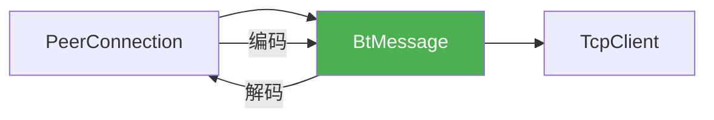
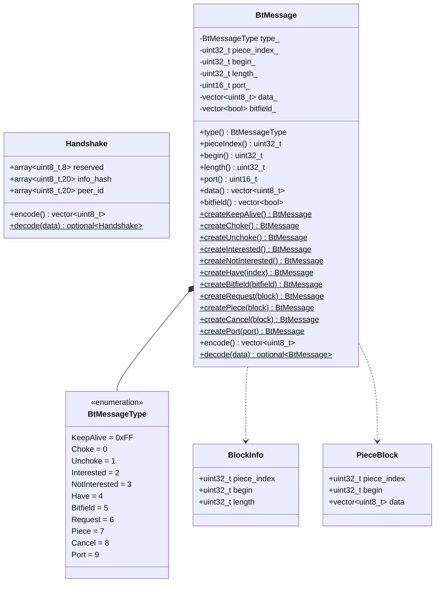
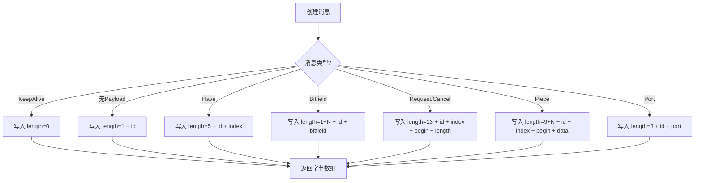
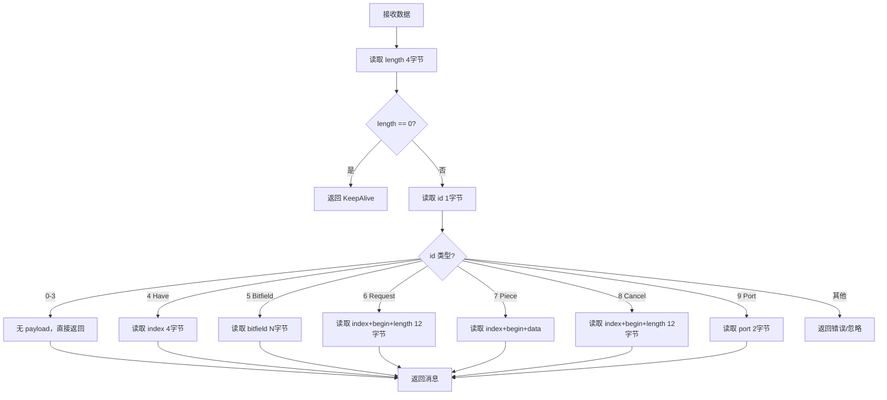
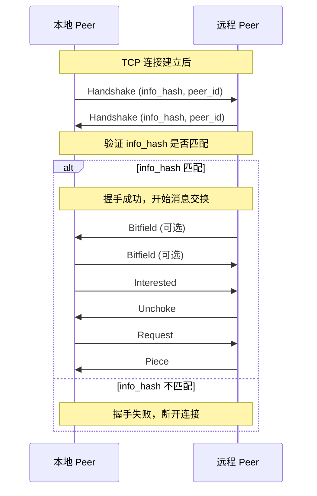

# BtMessage 设计文档

> **模块名称**：BtMessage - BitTorrent 协议消息  
> **版本**：v1.0  
> **最后更新**：2025-01-12  
> **作者**：MagnetDownload Team

---

## 1. 模块概述

### 1.1 职责定义

BtMessage 负责 **BitTorrent Peer Wire Protocol** 消息的编码和解码。它定义了 Peer 之间通信的所有消息类型和格式。

### 1.2 协议背景

BitTorrent Peer Wire Protocol (BEP 3) 定义了 Peer 之间的通信协议：

```
┌─────────────────────────────────────────────────────┐
│                    TCP 连接                          │
├─────────────────────────────────────────────────────┤
│  1. 握手 (Handshake)                                │
│  2. 消息交换 (Message Exchange)                      │
│     - 状态消息: choke, unchoke, interested...       │
│     - 数据消息: have, bitfield, request, piece...   │
└─────────────────────────────────────────────────────┘
```

### 1.3 与其他模块的关系



---

## 2. 消息格式

### 2.1 握手消息 (Handshake)

握手是连接建立后的第一条消息，格式固定：

```
┌───────┬──────────────────────┬──────────┬─────────────┬───────────┐
│ 1字节 │       19字节          │  8字节    │   20字节    │   20字节   │
├───────┼──────────────────────┼──────────┼─────────────┼───────────┤
│  19   │ "BitTorrent protocol"│ reserved │  info_hash  │  peer_id  │
└───────┴──────────────────────┴──────────┴─────────────┴───────────┘
总长度: 68 字节
```

| 字段 | 长度 | 说明 |
|------|------|------|
| pstrlen | 1 | 协议名长度，固定为 19 |
| pstr | 19 | 协议名 "BitTorrent protocol" |
| reserved | 8 | 保留字节，用于扩展 |
| info_hash | 20 | 文件的 info_hash |
| peer_id | 20 | 本客户端的 peer_id |

### 2.2 普通消息格式

握手之后的所有消息都采用统一格式：

```
┌──────────┬─────────┬─────────────┐
│  4字节   │  1字节   │   变长       │
├──────────┼─────────┼─────────────┤
│  length  │   id    │   payload   │
└──────────┴─────────┴─────────────┘
```

| 字段 | 长度 | 说明 |
|------|------|------|
| length | 4 | 消息长度（大端序），不包含 length 本身 |
| id | 1 | 消息类型 |
| payload | 变长 | 消息内容 |

**特殊情况**：`length = 0` 表示 Keep-Alive 消息（无 id 和 payload）

### 2.3 消息类型

| ID | 名称 | Payload | 说明 |
|----|------|---------|------|
| - | keep-alive | (无) | length=0，保持连接 |
| 0 | choke | (无) | 阻塞对方，不发送数据 |
| 1 | unchoke | (无) | 解除阻塞 |
| 2 | interested | (无) | 表示对对方的数据感兴趣 |
| 3 | not interested | (无) | 表示不感兴趣 |
| 4 | have | index(4) | 通知拥有某个分片 |
| 5 | bitfield | bitfield(N) | 拥有的分片位图 |
| 6 | request | index(4)+begin(4)+length(4) | 请求数据块 |
| 7 | piece | index(4)+begin(4)+block(N) | 数据块 |
| 8 | cancel | index(4)+begin(4)+length(4) | 取消请求 |
| 9 | port | port(2) | DHT 端口（BEP 5） |

---

## 3. 数据结构

### 3.1 消息类型枚举

```cpp
enum class BtMessageType : uint8_t {
    KeepAlive = 0xFF,       // 特殊值，实际无 ID
    Choke = 0,
    Unchoke = 1,
    Interested = 2,
    NotInterested = 3,
    Have = 4,
    Bitfield = 5,
    Request = 6,
    Piece = 7,
    Cancel = 8,
    Port = 9
};
```

### 3.2 握手消息结构

```cpp
struct Handshake {
    static constexpr size_t kSize = 68;
    static constexpr const char* kProtocol = "BitTorrent protocol";
    static constexpr uint8_t kProtocolLength = 19;
    
    std::array<uint8_t, 8> reserved{};      // 保留字节
    std::array<uint8_t, 20> info_hash{};    // 文件哈希
    std::array<uint8_t, 20> peer_id{};      // Peer ID
    
    std::vector<uint8_t> encode() const;
    static std::optional<Handshake> decode(const std::vector<uint8_t>& data);
};
```

### 3.3 请求/取消块结构

```cpp
struct BlockInfo {
    uint32_t piece_index;   // 分片索引
    uint32_t begin;         // 块在分片中的偏移
    uint32_t length;        // 块长度（通常 16KB）
    
    static constexpr uint32_t kDefaultBlockSize = 16384;  // 16KB
};
```

### 3.4 数据块结构

```cpp
struct PieceBlock {
    uint32_t piece_index;           // 分片索引
    uint32_t begin;                 // 块偏移
    std::vector<uint8_t> data;      // 实际数据
};
```

---

## 4. 类图



---

## 5. 核心流程

### 5.1 消息编码流程



### 5.2 消息解码流程



### 5.3 握手流程



---

## 6. 公共 API

```cpp
namespace magnet::protocols {

// ============================================================================
// 握手消息
// ============================================================================

struct Handshake {
    static constexpr size_t kSize = 68;
    static constexpr const char* kProtocol = "BitTorrent protocol";
    
    std::array<uint8_t, 8> reserved{};
    std::array<uint8_t, 20> info_hash{};
    std::array<uint8_t, 20> peer_id{};
    
    // 编码为字节数组
    std::vector<uint8_t> encode() const;
    
    // 从字节数组解码
    static std::optional<Handshake> decode(const std::vector<uint8_t>& data);
    static std::optional<Handshake> decode(const uint8_t* data, size_t len);
    
    // 创建握手消息
    static Handshake create(const InfoHash& info_hash, const std::string& peer_id);
};

// ============================================================================
// 块信息
// ============================================================================

struct BlockInfo {
    uint32_t piece_index{0};
    uint32_t begin{0};
    uint32_t length{0};
    
    static constexpr uint32_t kDefaultBlockSize = 16384;  // 16KB
    
    bool operator==(const BlockInfo& other) const;
};

// ============================================================================
// 数据块
// ============================================================================

struct PieceBlock {
    uint32_t piece_index{0};
    uint32_t begin{0};
    std::vector<uint8_t> data;
    
    BlockInfo toBlockInfo() const;
};

// ============================================================================
// BT 消息
// ============================================================================

class BtMessage {
public:
    // 创建各类消息
    static BtMessage createKeepAlive();
    static BtMessage createChoke();
    static BtMessage createUnchoke();
    static BtMessage createInterested();
    static BtMessage createNotInterested();
    static BtMessage createHave(uint32_t piece_index);
    static BtMessage createBitfield(const std::vector<bool>& bitfield);
    static BtMessage createRequest(const BlockInfo& block);
    static BtMessage createPiece(const PieceBlock& block);
    static BtMessage createCancel(const BlockInfo& block);
    static BtMessage createPort(uint16_t port);
    
    // 编码
    std::vector<uint8_t> encode() const;
    
    // 解码
    static std::optional<BtMessage> decode(const std::vector<uint8_t>& data);
    static std::optional<BtMessage> decode(const uint8_t* data, size_t len);
    
    // 类型检查
    BtMessageType type() const;
    bool isKeepAlive() const;
    bool isChoke() const;
    bool isUnchoke() const;
    // ... 其他类型检查
    
    // 获取字段
    uint32_t pieceIndex() const;
    uint32_t begin() const;
    uint32_t length() const;
    uint16_t port() const;
    const std::vector<uint8_t>& data() const;
    const std::vector<bool>& bitfield() const;
    
    // 获取结构化数据
    BlockInfo toBlockInfo() const;
    PieceBlock toPieceBlock() const;
};

} // namespace magnet::protocols
```

---

## 7. 使用示例

### 7.1 创建和发送握手

```cpp
// 创建握手
auto handshake = Handshake::create(info_hash, "-MT0001-xxxxxxxxxxxx");
auto data = handshake.encode();
tcp_client->send(data);
```

### 7.2 发送请求

```cpp
// 请求第 5 个分片的第一个块
BlockInfo block{5, 0, 16384};
auto msg = BtMessage::createRequest(block);
tcp_client->send(msg.encode());
```

### 7.3 解码消息

```cpp
// 从接收缓冲区解码
auto msg = BtMessage::decode(received_data);
if (msg) {
    switch (msg->type()) {
        case BtMessageType::Piece:
            auto block = msg->toPieceBlock();
            // 处理数据块...
            break;
        case BtMessageType::Choke:
            // 被阻塞，停止请求
            break;
        // ...
    }
}
```

---

## 8. 字节序处理

BitTorrent 协议使用**大端序 (Big Endian)**：

```cpp
// 写入 32 位大端整数
void writeUint32BE(std::vector<uint8_t>& buffer, uint32_t value) {
    buffer.push_back((value >> 24) & 0xFF);
    buffer.push_back((value >> 16) & 0xFF);
    buffer.push_back((value >> 8) & 0xFF);
    buffer.push_back(value & 0xFF);
}

// 读取 32 位大端整数
uint32_t readUint32BE(const uint8_t* data) {
    return (static_cast<uint32_t>(data[0]) << 24) |
           (static_cast<uint32_t>(data[1]) << 16) |
           (static_cast<uint32_t>(data[2]) << 8) |
           static_cast<uint32_t>(data[3]);
}
```

---

## 9. 实现检查清单

### 9.1 必须实现

- [ ] `Handshake` 结构和编解码
- [ ] `BlockInfo` 结构
- [ ] `PieceBlock` 结构
- [ ] `BtMessage` 类
- [ ] 所有消息类型的工厂方法
- [ ] `encode()` 方法
- [ ] `decode()` 方法
- [ ] 字节序处理工具函数

### 9.2 测试要点

- [ ] 握手编解码
- [ ] 各类消息编解码
- [ ] 空消息 (KeepAlive)
- [ ] 大端序正确性
- [ ] 边界条件（数据不足、格式错误）

---

**设计文档完成，可以开始实现！**

