# DHT 模块完整设计文档

## 1. 目标

**输入**：`MagnetInfo`（包含 `InfoHash`，即文件的唯一标识）

**输出**：`Peer 列表`（拥有该文件的节点的 IP 和端口）

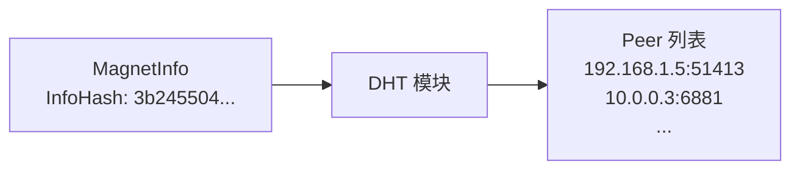

---

## 2. 为什么需要 DHT？

### 2.1 问题

你有一个文件的 `InfoHash`，但不知道谁有这个文件。

### 2.2 传统解决方案：Tracker

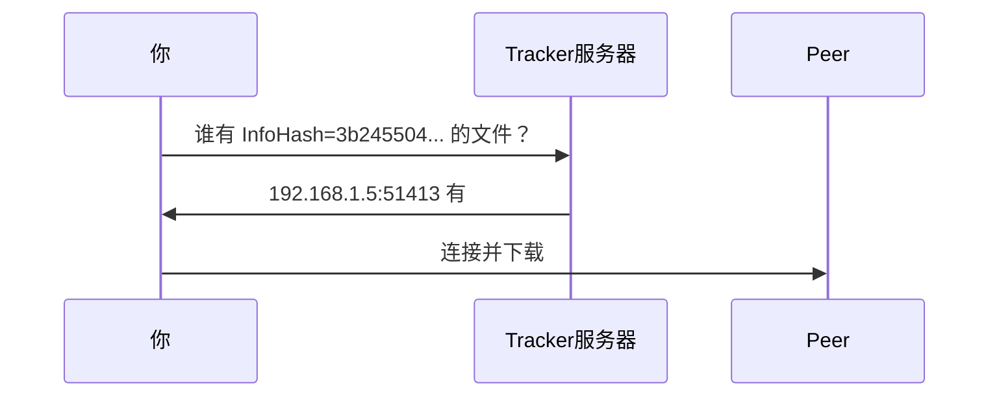

**问题**：Tracker 是中心化的，如果挂了就找不到 Peer。

### 2.3 DHT 解决方案：去中心化

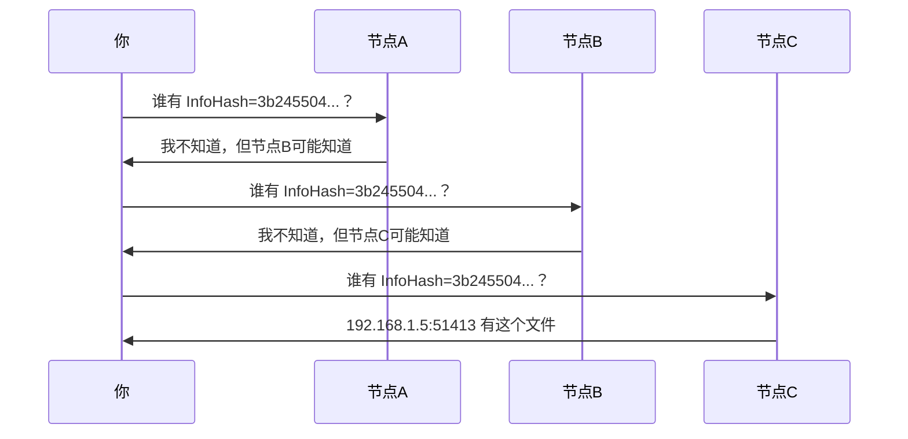

**优点**：没有中心服务器，任何节点挂了都不影响整体。

---

## 3. DHT 的核心概念

### 3.1 每个节点都有一个 NodeId

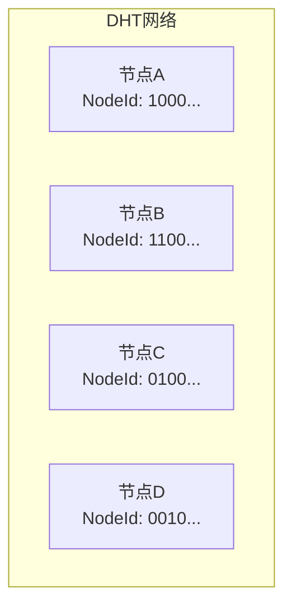

- NodeId 是 20 字节（160 位）的随机数
- 每个节点启动时生成自己的 NodeId
- NodeId 用于计算节点之间的"距离"

### 3.2 文件信息存在"最近"的节点上

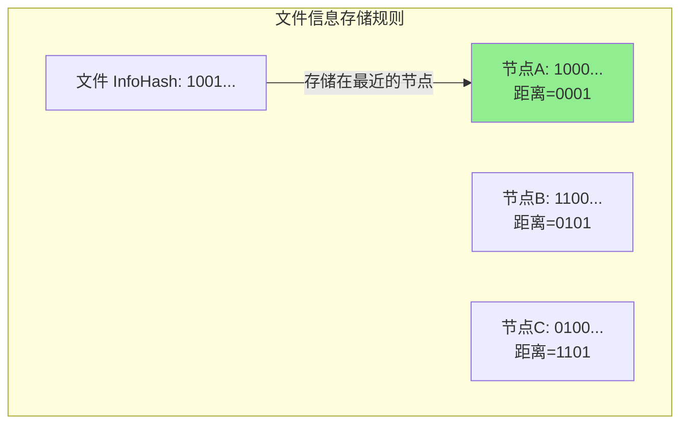

**规则**：文件信息存储在 NodeId 与 InfoHash 最接近的节点上。

### 3.3 XOR 距离

"接近"用 XOR 距离定义：

```
InfoHash: 1001 0000 ...
NodeId A: 1000 0000 ...
─────────────────────
XOR 距离: 0001 0000 ... = 16

InfoHash: 1001 0000 ...
NodeId B: 1100 0000 ...
─────────────────────
XOR 距离: 0101 0000 ... = 80

结论：A 比 B 更接近这个 InfoHash
```

---

## 4. DHT 查找过程详解

### 4.1 整体流程

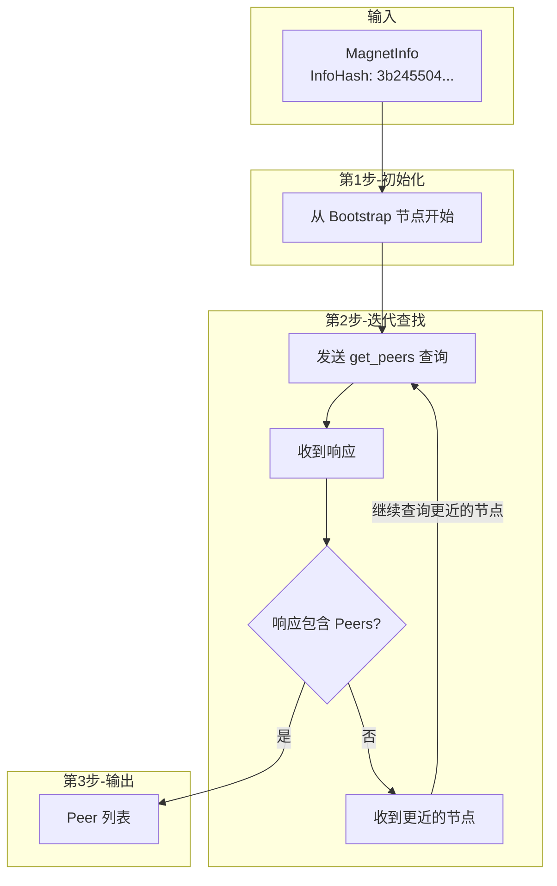

### 4.2 详细时序图

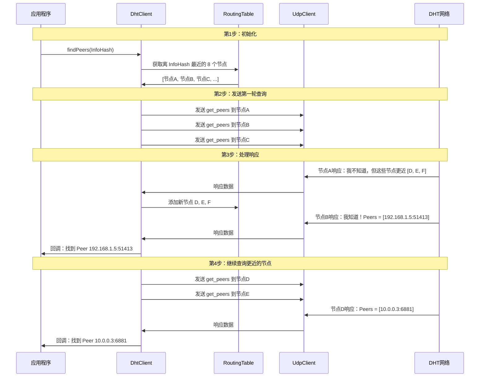

---

## 5. DHT 协议消息格式

DHT 使用 KRPC 协议，消息用 Bencode 编码。

### 5.1 get_peers 查询

**目的**：询问某个节点"谁有这个文件"

```
{
    "t": "aa",              // 事务ID，用于匹配请求和响应
    "y": "q",               // 消息类型：q=查询
    "q": "get_peers",       // 查询方法
    "a": {
        "id": <我的NodeId, 20字节>,
        "info_hash": <文件InfoHash, 20字节>
    }
}
```

**Bencode 编码后**：
```
d1:ad2:id20:XXXXXXXXXXXXXXXXXXXX9:info_hash20:YYYYYYYYYYYYYYYYYYYYe1:q9:get_peers1:t2:aa1:y1:qe
```

### 5.2 get_peers 响应（有 Peers）

**当节点知道谁有这个文件时**：

```
{
    "t": "aa",              // 与查询相同的事务ID
    "y": "r",               // 消息类型：r=响应
    "r": {
        "id": <响应节点的NodeId>,
        "token": <8字节token，用于后续announce>,
        "values": [         // Peer列表！
            <6字节: 4字节IP + 2字节端口>,
            <6字节: 4字节IP + 2字节端口>,
            ...
        ]
    }
}
```

### 5.3 get_peers 响应（没有 Peers，但有更近的节点）

**当节点不知道谁有文件，但知道更近的节点时**：

```
{
    "t": "aa",
    "y": "r",
    "r": {
        "id": <响应节点的NodeId>,
        "token": <8字节token>,
        "nodes": <紧凑格式的节点列表，每个26字节>
    }
}
```

**nodes 的紧凑格式**：
```
| NodeId (20字节) | IP (4字节) | Port (2字节) |
|-----------------|------------|--------------|
| 共 26 字节/节点                              |
```

---

## 6. 数据结构设计

### 6.1 整体架构

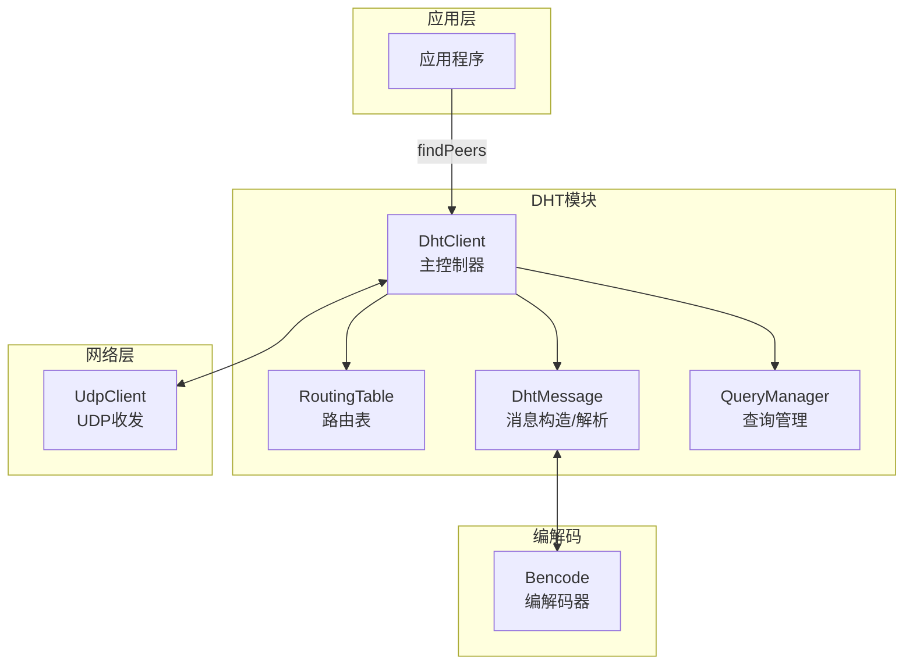

### 6.2 各模块职责

| 模块 | 职责 | 输入 | 输出 |
|------|------|------|------|
| DhtClient | 主控制器，协调各模块 | InfoHash | Peer列表 |
| RoutingTable | 存储已知节点，按距离组织 | DhtNode | 最近的K个节点 |
| DhtMessage | 构造和解析KRPC消息 | 参数 | BencodeValue |
| QueryManager | 管理并发查询，处理超时 | 查询请求 | 查询结果 |
| Bencode | 编解码 | 字典/字节 | 字节/字典 |
| UdpClient | 网络收发 | 字节 | 字节 |

---

## 7. 核心数据结构

### 7.1 NodeId

```cpp
class NodeId {
    std::array<uint8_t, 20> data_;
    
public:
    static NodeId random();                    // 生成随机ID
    static NodeId fromInfoHash(InfoHash);      // 从文件哈希转换
    NodeId distance(const NodeId& other);      // XOR距离
    int compareDistance(NodeId& a, NodeId& b); // 比较谁更近
};
```

**为什么需要**：
- 标识节点身份
- 计算距离，决定路由

### 7.2 DhtNode

```cpp
struct DhtNode {
    NodeId id;           // 节点ID
    std::string ip;      // IP地址
    uint16_t port;       // 端口
    time_point last_seen; // 最后响应时间
    int failed_queries;  // 连续失败次数
    
    bool isGood();       // 15分钟内有响应
    bool isBad();        // 连续失败3次
};
```

**为什么需要**：
- 存储节点的完整信息
- 判断节点是否可用

### 7.3 RoutingTable（K-Bucket）

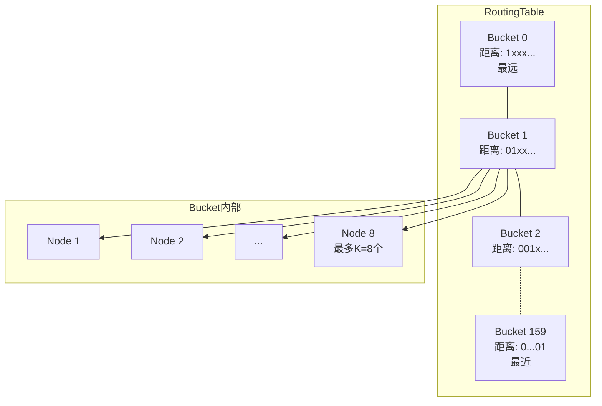

```cpp
class RoutingTable {
    NodeId my_id_;
    std::array<std::vector<DhtNode>, 160> buckets_;  // 160个桶
    
public:
    void addNode(const DhtNode& node);
    std::vector<DhtNode> findClosest(const NodeId& target, int count = 8);
};
```

**为什么用 K-Bucket**：
- 按距离分层存储节点
- 近的节点存得多，远的节点存得少
- 查找时能快速定位到最近的节点

**Bucket 索引计算**：
```cpp
void addNode(const DhtNode& node) {
    NodeId dist = my_id_.distance(node.id);
    size_t bucket_idx = dist.bucketIndex();  // 0-159
    buckets_[bucket_idx].push_back(node);
}
```

### 7.4 DhtMessage

```cpp
class DhtMessage {
public:
    // 构造查询消息
    static DhtMessage createPing(NodeId my_id);
    static DhtMessage createFindNode(NodeId my_id, NodeId target);
    static DhtMessage createGetPeers(NodeId my_id, InfoHash info_hash);
    static DhtMessage createAnnouncePeer(NodeId my_id, InfoHash info_hash, 
                                         uint16_t port, std::string token);
    
    // 解析响应
    static Result<DhtMessage, Error> parse(const BencodeValue& value);
    
    // 编码为字节
    std::vector<uint8_t> encode();
    
    // 获取响应内容
    std::vector<DhtNode> getNodes();   // 从 nodes 字段解析
    std::vector<PeerInfo> getPeers();  // 从 values 字段解析
};
```

### 7.5 QueryManager

```cpp
class QueryManager {
    struct PendingQuery {
        std::string transaction_id;
        NodeId target;
        std::chrono::time_point sent_time;
        std::function<void(DhtMessage)> callback;
    };
    
    std::map<std::string, PendingQuery> pending_;
    
public:
    // 发送查询
    std::string sendQuery(DhtNode node, DhtMessage msg, Callback cb);
    
    // 处理响应
    void handleResponse(const std::string& tid, DhtMessage response);
    
    // 检查超时
    void checkTimeouts();
};
```

**为什么需要**：
- DHT 查询是异步的，需要匹配请求和响应
- 需要处理超时和重试

---

## 8. 完整的 get_peers 流程

### 8.1 数据流图

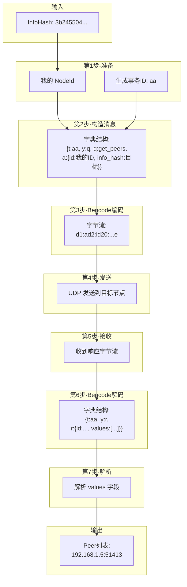

### 8.2 代码流程

```cpp
// ========== 第1步：应用程序调用 ==========
void Application::downloadFile(const std::string& magnet_uri) {
    auto info = MagnetUriParser::parse(magnet_uri);
    InfoHash hash = info.info_hash.value();
    
    dht_client.findPeers(hash, [this](const std::string& ip, uint16_t port) {
        // 找到 Peer 后的回调
        connectToPeer(ip, port);
    });
}

// ========== 第2步：DhtClient 开始查找 ==========
void DhtClient::findPeers(const InfoHash& hash, PeerCallback callback) {
    NodeId target = NodeId::fromInfoHash(hash);
    
    // 从路由表获取最近的节点
    auto closest = routing_table_.findClosest(target, 8);
    
    // 向每个节点发送 get_peers
    for (auto& node : closest) {
        sendGetPeers(node, hash, callback);
    }
}

// ========== 第3步：构造并发送消息 ==========
void DhtClient::sendGetPeers(DhtNode node, InfoHash hash, PeerCallback cb) {
    // 3.1 构造消息
    DhtMessage msg = DhtMessage::createGetPeers(my_id_, hash);
    
    // 3.2 编码为字节
    BencodeValue value = msg.toBencode();
    std::vector<uint8_t> bytes = Bencode::encode(value);
    
    // 3.3 记录待处理查询
    std::string tid = msg.transactionId();
    pending_queries_[tid] = {hash, cb, std::chrono::steady_clock::now()};
    
    // 3.4 发送 UDP
    udp_client_.send(node.ip, node.port, bytes);
}

// ========== 第4步：接收响应 ==========
void DhtClient::onUdpReceive(const std::vector<uint8_t>& data, 
                              const std::string& from_ip, uint16_t from_port) {
    // 4.1 Bencode 解码
    auto result = Bencode::decode(data);
    if (!result.is_ok()) return;
    
    BencodeValue value = result.value();
    
    // 4.2 解析消息
    auto msg_result = DhtMessage::parse(value);
    if (!msg_result.is_ok()) return;
    
    DhtMessage msg = msg_result.value();
    
    // 4.3 匹配事务ID
    std::string tid = msg.transactionId();
    auto it = pending_queries_.find(tid);
    if (it == pending_queries_.end()) return;
    
    auto& query = it->second;
    
    // 4.4 处理响应
    handleGetPeersResponse(msg, query, from_ip, from_port);
}

// ========== 第5步：处理响应 ==========
void DhtClient::handleGetPeersResponse(DhtMessage& msg, PendingQuery& query,
                                        const std::string& from_ip, uint16_t from_port) {
    // 5.1 如果有 peers，回调给应用
    if (msg.hasPeers()) {
        for (auto& peer : msg.getPeers()) {
            query.callback(peer.ip, peer.port);
        }
    }
    
    // 5.2 如果有 nodes，添加到路由表并继续查询
    if (msg.hasNodes()) {
        for (auto& node : msg.getNodes()) {
            routing_table_.addNode(node);
            
            // 如果这个节点更近，继续查询
            if (isCloser(node.id, query.target)) {
                sendGetPeers(node, query.info_hash, query.callback);
            }
        }
    }
    
    // 5.3 更新响应节点的状态
    DhtNode responding_node(NodeId::fromString(msg.responderId()), from_ip, from_port);
    responding_node.markResponded();
    routing_table_.addNode(responding_node);
}
```

---

## 9. 迭代查找算法

### 9.1 为什么需要迭代

第一次查询可能找不到 Peer，但会返回更近的节点。需要不断向更近的节点查询，直到：
1. 找到 Peer
2. 没有更近的节点了

### 9.2 算法流程

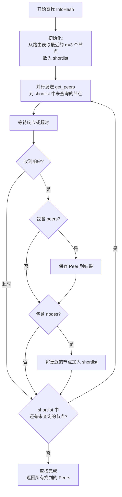

### 9.3 关键参数

| 参数 | 值 | 含义 |
|------|-----|------|
| α (alpha) | 3 | 并行查询数 |
| K | 8 | 每个桶最多存储的节点数 |
| 超时 | 2秒 | 单次查询超时时间 |
| 最大轮次 | 20 | 防止无限循环 |

---

## 10. Bootstrap（引导）过程

### 10.1 问题

程序第一次启动时，路由表是空的，不知道任何 DHT 节点。

### 10.2 解决方案

使用硬编码的 Bootstrap 节点：

```cpp
const std::vector<std::pair<std::string, uint16_t>> BOOTSTRAP_NODES = {
    {"router.bittorrent.com", 6881},
    {"dht.transmissionbt.com", 6881},
    {"router.utorrent.com", 6881},
};
```

### 10.3 Bootstrap 流程

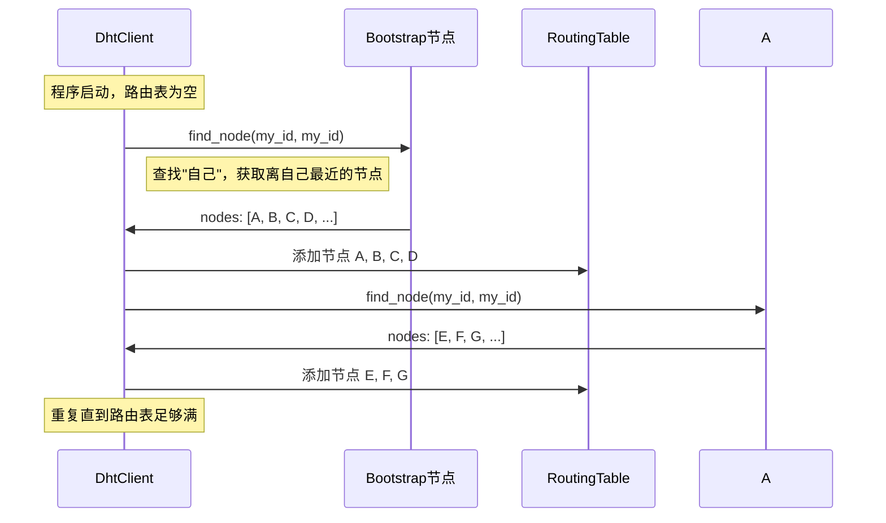

---

## 11. 模块依赖关系

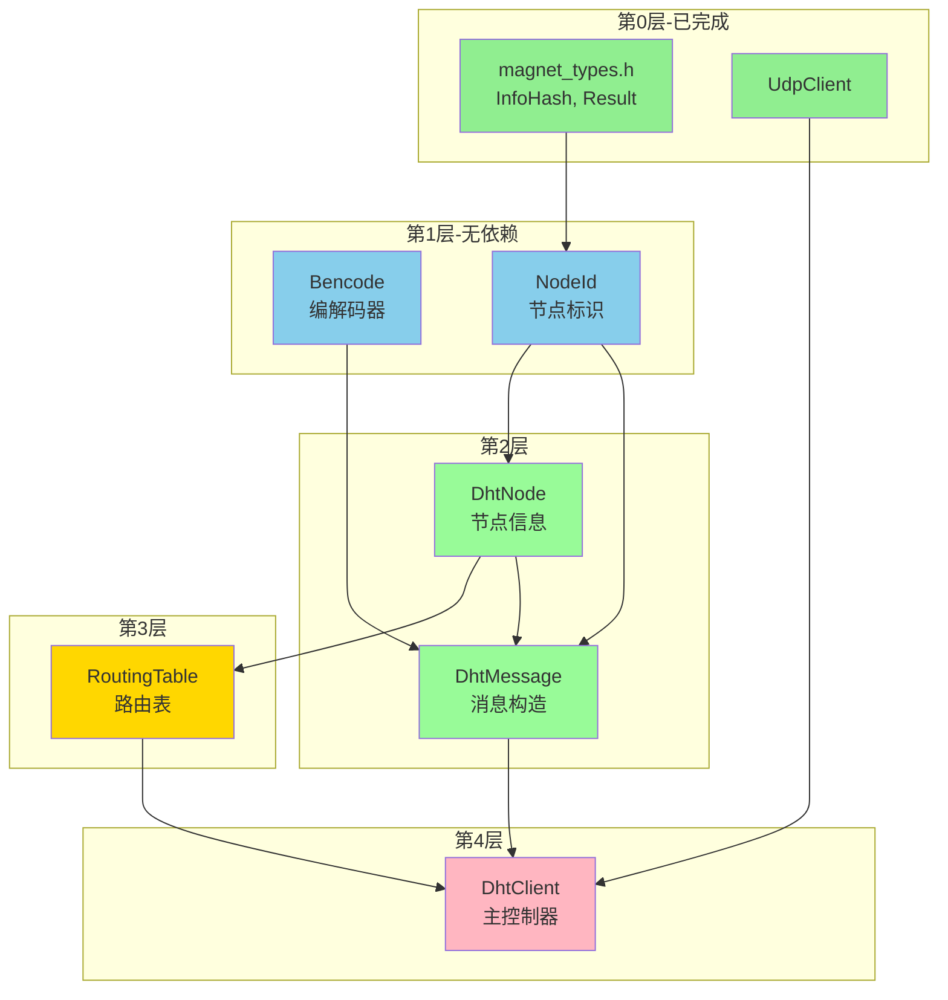

## 
