# DhtClient 设计文档

> **模块名称**：DhtClient - DHT 主控制器  
> **版本**：v1.0  
> **最后更新**：2025-01-12  
> **作者**：MagnetDownload Team

---

## 1. 承上启下：DhtClient 的角色

### 1.1 已完成模块回顾

在实现 DhtClient 之前，我们已经完成了 DHT 协议栈的所有基础组件：

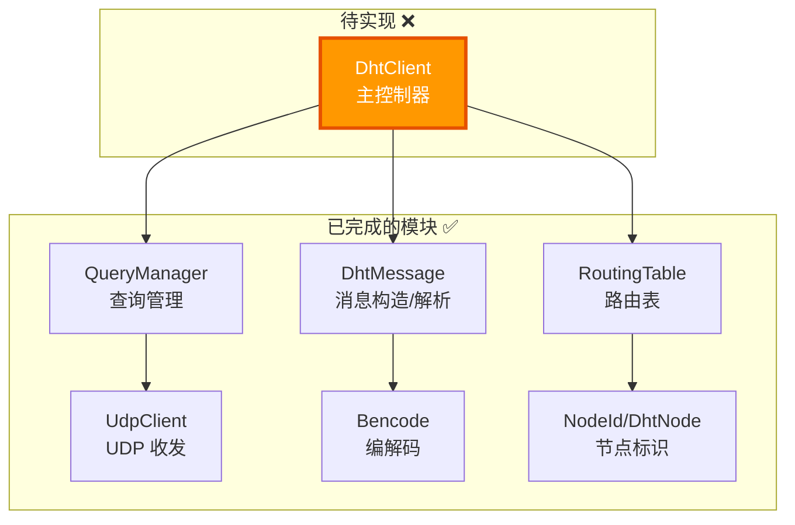

| 模块 | 职责 | 状态 |
|------|------|------|
| **UdpClient** | UDP 数据包收发 | ✅ |
| **Bencode** | 消息编解码 | ✅ |
| **NodeId/DhtNode** | 节点标识和信息 | ✅ |
| **DhtMessage** | KRPC 消息构造和解析 | ✅ |
| **RoutingTable** | K-Bucket 路由表 | ✅ |
| **QueryManager** | 查询超时和重试管理 | ✅ |
| **DhtClient** | **整合所有模块，提供完整 DHT 功能** | ❌ |

### 1.2 DhtClient 要解决的问题

**用户（应用层）的需求很简单**：

```cpp
// 用户只想做这件事：
dht_client.findPeers(info_hash, [](PeerInfo peer) {
    // 拿到 peer，开始下载
    connectAndDownload(peer);
});
```

**但底层需要协调多个模块**：

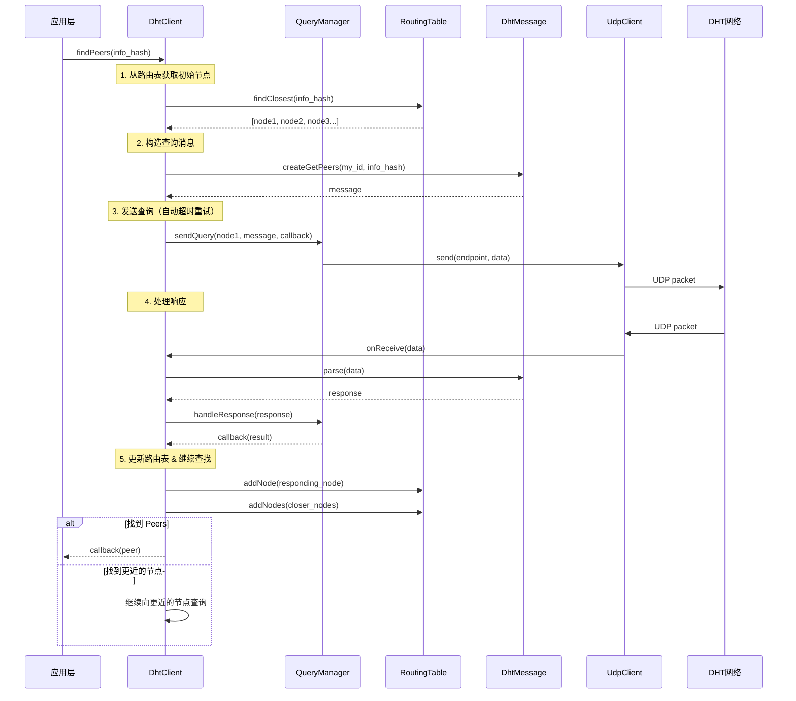

**DhtClient 的核心价值**：
- **统一入口**：对外提供简单的 `findPeers()` API
- **协调模块**：内部协调 QueryManager、RoutingTable、DhtMessage
- **实现算法**：实现迭代查找算法（α-并发、收敛检测）
- **状态管理**：管理 DHT 客户端的生命周期

---

## 2. 设计目标

### 2.1 功能目标

| 功能 | 说明 | 优先级 |
|------|------|--------|
| **findPeers** | 根据 InfoHash 查找拥有文件的 Peer | 高 |
| **bootstrap** | 加入 DHT 网络（从引导节点开始） | 高 |
| **announce** | 宣告自己拥有某个文件 | 中 |
| **维护** | 定期刷新路由表，保持在线状态 | 中 |

### 2.2 非功能目标

| 目标 | 说明 |
|------|------|
| **异步** | 所有操作都是异步的，不阻塞调用线程 |
| **高效** | 并发查询（α=3），避免重复查询 |
| **健壮** | 处理网络错误、恶意节点、超时 |
| **可观测** | 提供统计信息和日志 |

---

## 3. 架构设计

### 3.1 整体架构

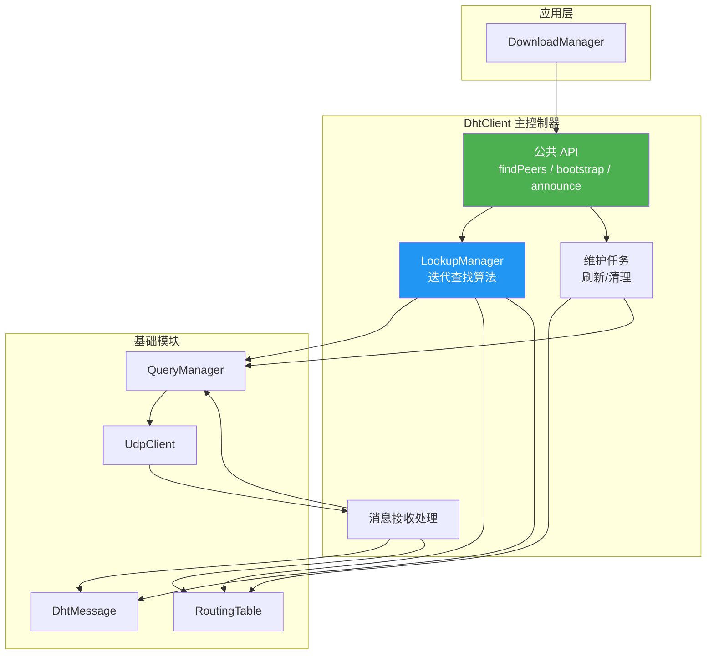

### 3.2 模块交互

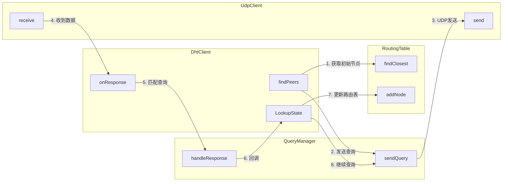

---

## 4. 核心数据结构

### 4.1 DhtClient 配置

```cpp
struct DhtClientConfig {
    uint16_t listen_port{6881};              // 监听端口
    size_t alpha{3};                          // 并发查询数
    size_t k{8};                              // 每次查询返回的节点数
    std::chrono::seconds refresh_interval{15min};  // 路由表刷新间隔
    std::chrono::seconds announce_interval{30min}; // 重新宣告间隔
    
    // Bootstrap 节点
    std::vector<std::pair<std::string, uint16_t>> bootstrap_nodes{
        {"router.bittorrent.com", 6881},
        {"dht.transmissionbt.com", 6881},
        {"router.utorrent.com", 6881}
    };
};
```

### 4.2 Lookup 状态（迭代查找）

```cpp
struct LookupState {
    InfoHash target;                         // 查找目标
    NodeId target_id;                        // 目标转换为 NodeId
    
    std::set<NodeId> queried;               // 已查询的节点
    std::set<NodeId> pending;               // 待查询的节点
    std::map<NodeId, DhtNode> candidates;   // 候选节点（按距离排序）
    
    std::vector<PeerInfo> found_peers;      // 找到的 Peers
    std::string token;                       // 用于 announce 的 token
    
    PeerCallback callback;                   // 结果回调
    size_t alpha;                            // 并发数
    bool completed{false};                   // 是否完成
    
    // 检查是否应该继续查找
    bool shouldContinue() const;
    
    // 获取下一批要查询的节点
    std::vector<DhtNode> getNextNodes(size_t count);
    
    // 添加新发现的节点
    void addNodes(const std::vector<DhtNode>& nodes);
    
    // 记录找到的 Peer
    void addPeers(const std::vector<PeerInfo>& peers);
};
```

### 4.3 回调类型

```cpp
// Peer 发现回调（每找到一个 Peer 调用一次）
using PeerCallback = std::function<void(const PeerInfo& peer)>;

// 查找完成回调
using LookupCompleteCallback = std::function<void(
    bool success,
    const std::vector<PeerInfo>& peers
)>;

// Bootstrap 完成回调
using BootstrapCallback = std::function<void(bool success, size_t node_count)>;
```

---

## 5. 类图

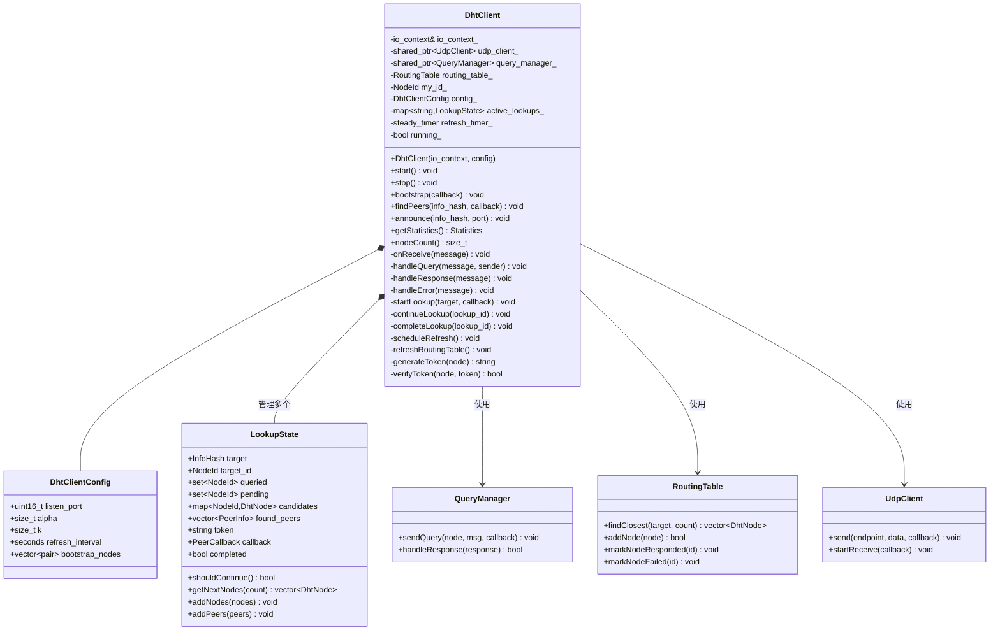

---

## 6. 核心流程

### 6.1 Bootstrap 流程（加入 DHT 网络）

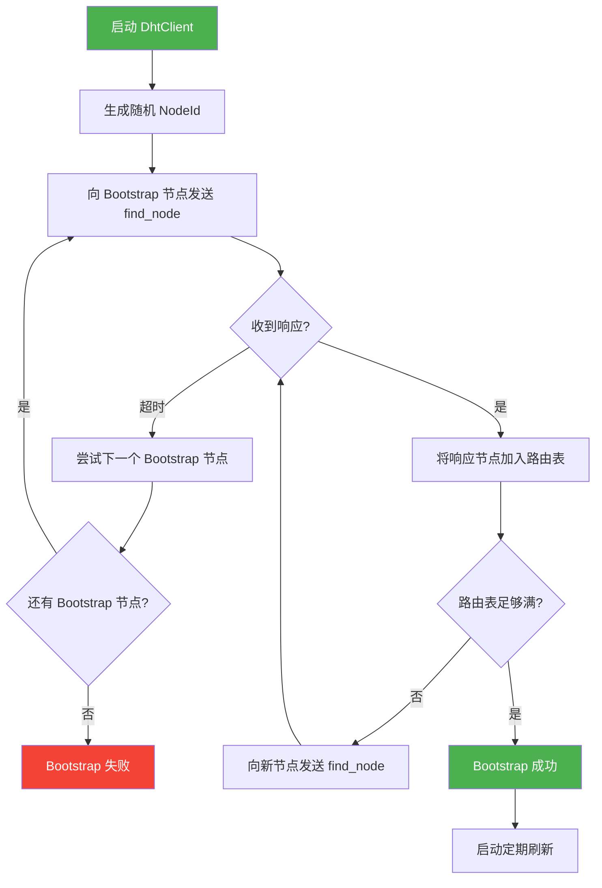

**Bootstrap 的目的**：
1. 让自己被其他节点知道
2. 填充路由表，获取足够的节点信息
3. 为后续的 `findPeers` 做准备

### 6.2 findPeers 流程（迭代查找算法）

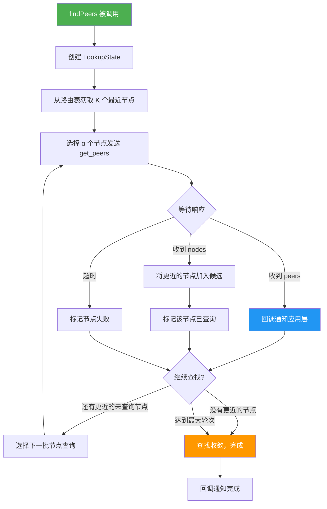

### 6.3 迭代查找算法详解

```
输入：目标 InfoHash
输出：拥有该文件的 Peer 列表

1. 初始化
   - 从路由表获取离目标最近的 K 个节点
   - 创建候选集 candidates = {这些节点}
   - 创建已查询集 queried = {}
   - 创建待处理集 pending = {}

2. 循环
   a. 从 candidates 中选择 α 个最近的、未查询的节点
   b. 向这些节点发送 get_peers 查询
   c. 将它们加入 pending
   
   d. 等待响应：
      - 如果收到 peers：
        * 记录 peers，回调通知应用
        * 记录 token（用于后续 announce）
      - 如果收到 nodes：
        * 将比当前最近节点更近的节点加入 candidates
      - 更新 queried 和 pending
   
   e. 终止条件检查：
      - 所有 K 个最近节点都已查询 → 收敛，结束
      - 连续 N 轮没有发现更近的节点 → 收敛，结束
      - 达到最大查询次数 → 超时，结束

3. 返回所有找到的 peers
```

### 6.4 消息接收处理流程

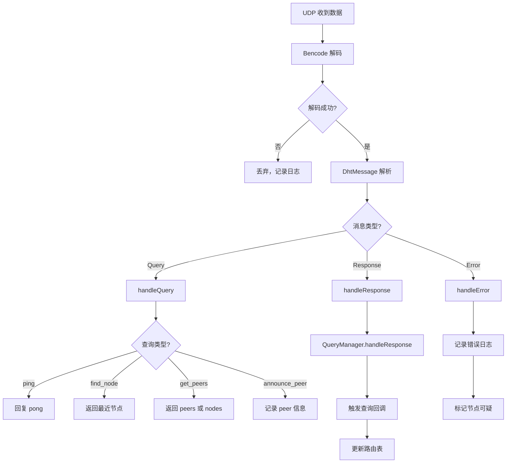

---

## 7. 时序图

### 7.1 完整的 findPeers 时序

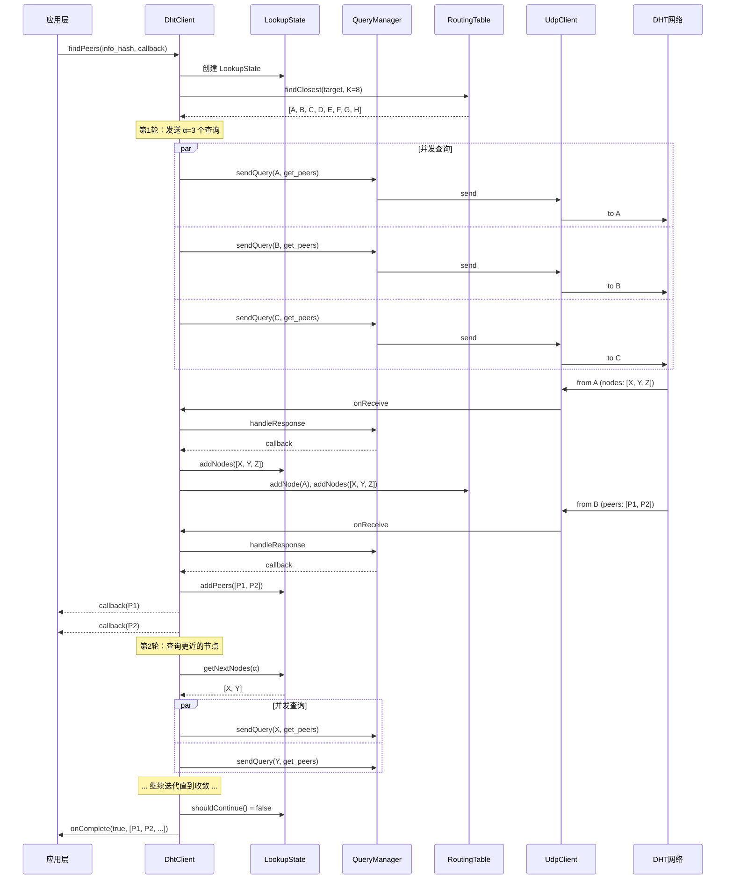

### 7.2 响应查询时序

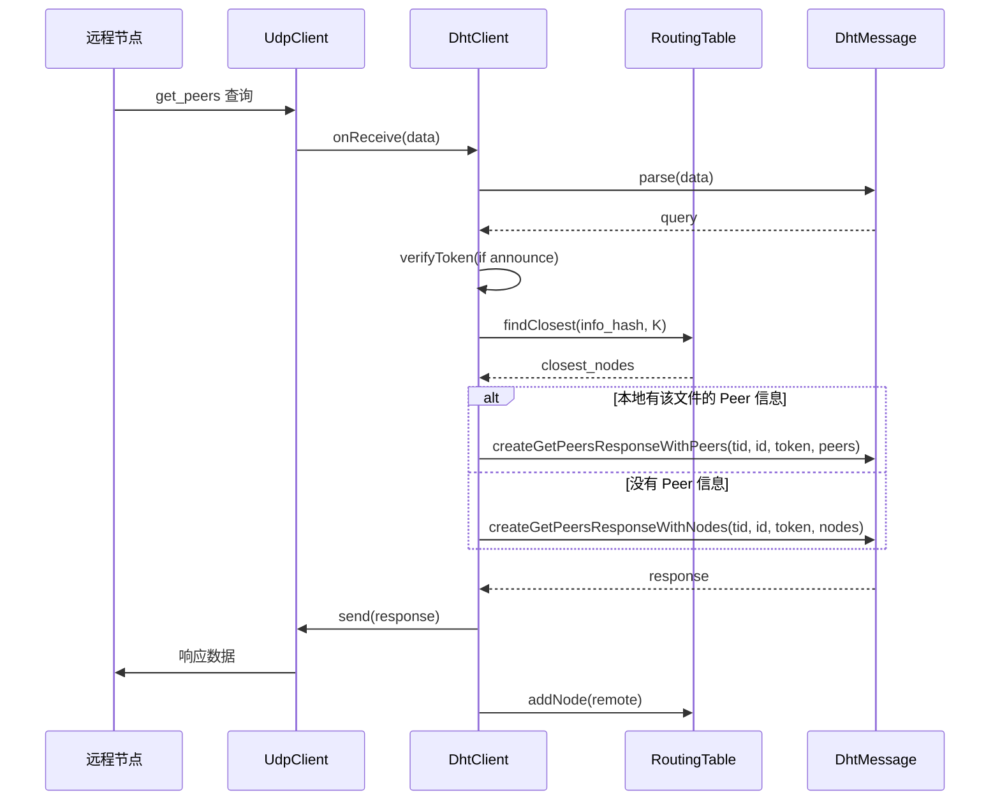

---

## 8. 线程模型

### 8.1 线程分配

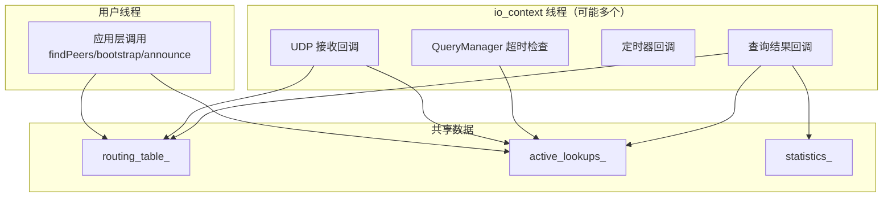

### 8.2 线程安全设计

```cpp
class DhtClient {
    // 所有公共方法都是线程安全的
    mutable std::mutex mutex_;
    
    // RoutingTable 自带线程安全
    RoutingTable routing_table_;
    
    // active_lookups_ 需要锁保护
    std::map<std::string, LookupState> active_lookups_;
};
```

**原则**：
- 公共 API 方法通过 `asio::post()` 将工作提交到 io_context
- 所有回调都在 io_context 线程中执行
- 共享数据使用 mutex 保护

---

## 9. 错误处理

### 9.1 错误类型

| 错误场景 | 处理方式 |
|----------|----------|
| Bootstrap 失败 | 重试，报告失败 |
| 查询超时 | 标记节点失败，重试其他节点 |
| 恶意响应 | 丢弃，记录日志 |
| 路由表为空 | 重新 Bootstrap |
| 网络不可用 | 暂停查询，等待恢复 |

### 9.2 节点质量管理

```cpp
void DhtClient::onQueryResult(const DhtNode& node, QueryResult result) {
    if (result.is_ok()) {
        routing_table_.markNodeResponded(node.id_);
    } else if (result.error() == QueryError::Timeout) {
        routing_table_.markNodeFailed(node.id_);
        // 如果节点变成 "bad"，从路由表移除
    }
}
```

---

## 10. 配置参数

| 参数 | 默认值 | 说明 |
|------|--------|------|
| `listen_port` | 6881 | UDP 监听端口 |
| `alpha` | 3 | 并发查询数（BEP-0005 推荐） |
| `k` | 8 | 路由表桶大小 / 返回节点数 |
| `query_timeout` | 2s | 单次查询超时 |
| `max_retries` | 2 | 最大重试次数 |
| `refresh_interval` | 15min | 路由表刷新间隔 |
| `max_lookup_rounds` | 20 | 最大查找轮次 |

---

## 11. 公共 API

```cpp
class DhtClient {
public:
    // 构造和生命周期
    DhtClient(asio::io_context& io_context, DhtClientConfig config = {});
    ~DhtClient();
    
    void start();
    void stop();
    bool isRunning() const;
    
    // 核心功能
    void bootstrap(BootstrapCallback callback = nullptr);
    void findPeers(const InfoHash& info_hash, 
                   PeerCallback on_peer,
                   LookupCompleteCallback on_complete = nullptr);
    void announce(const InfoHash& info_hash, uint16_t port);
    
    // 状态查询
    NodeId localId() const;
    size_t nodeCount() const;
    Statistics getStatistics() const;
};
```

---

## 12. 使用示例

### 12.1 基本使用

```cpp
// 创建并启动
asio::io_context io_context;
DhtClient dht(io_context);
dht.start();

// 加入网络
dht.bootstrap([](bool success, size_t nodes) {
    if (success) {
        std::cout << "Bootstrap 成功，路由表有 " << nodes << " 个节点\n";
    }
});

// 查找 Peers
InfoHash hash = ...;
dht.findPeers(hash,
    // 每找到一个 Peer
    [](const PeerInfo& peer) {
        std::cout << "发现 Peer: " << peer.ip << ":" << peer.port << "\n";
        // 可以立即开始连接
    },
    // 查找完成
    [](bool success, const std::vector<PeerInfo>& all_peers) {
        std::cout << "查找完成，共找到 " << all_peers.size() << " 个 Peers\n";
    }
);

// 运行事件循环
io_context.run();
```

### 12.2 与下载管理器集成

```cpp
class DownloadManager {
    DhtClient dht_;
    
    void download(const std::string& magnet_uri) {
        auto info = MagnetUriParser::parse(magnet_uri);
        if (!info.info_hash) return;
        
        dht_.findPeers(*info.info_hash,
            [this](const PeerInfo& peer) {
                // 立即尝试连接
                connectToPeer(peer);
            }
        );
    }
};
```

---

## 13. 实现检查清单

### 13.1 必须实现

- [ ] 构造函数：初始化所有子模块
- [ ] start() / stop()：管理生命周期
- [ ] bootstrap()：加入 DHT 网络
- [ ] findPeers()：迭代查找算法
- [ ] onReceive()：处理收到的消息
- [ ] handleQuery()：响应其他节点的查询
- [ ] refreshRoutingTable()：定期刷新

### 13.2 可选增强

- [ ] announce()：宣告文件
- [ ] Peer 存储（记住哪些 Peer 有哪些文件）
- [ ] Token 验证（防止滥用 announce）
- [ ] 黑名单（屏蔽恶意节点）

### 13.3 测试要点

- [ ] Bootstrap 成功/失败
- [ ] findPeers 找到/未找到
- [ ] 查询超时和重试
- [ ] 并发查找
- [ ] 响应其他节点的查询
- [ ] 长时间运行稳定性

---

## 14. 依赖关系总结

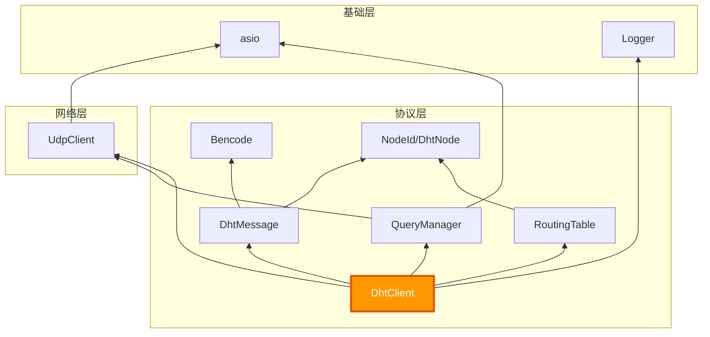

---

**设计文档完成，可以开始实现 DhtClient！**

