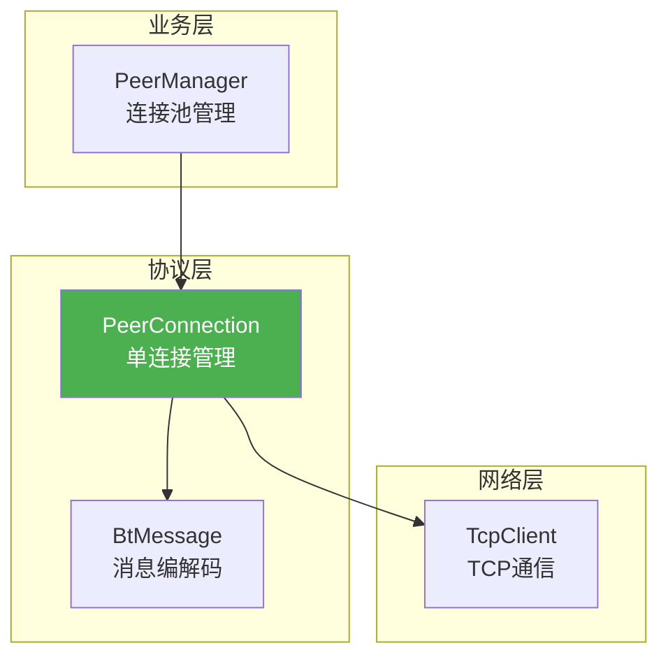
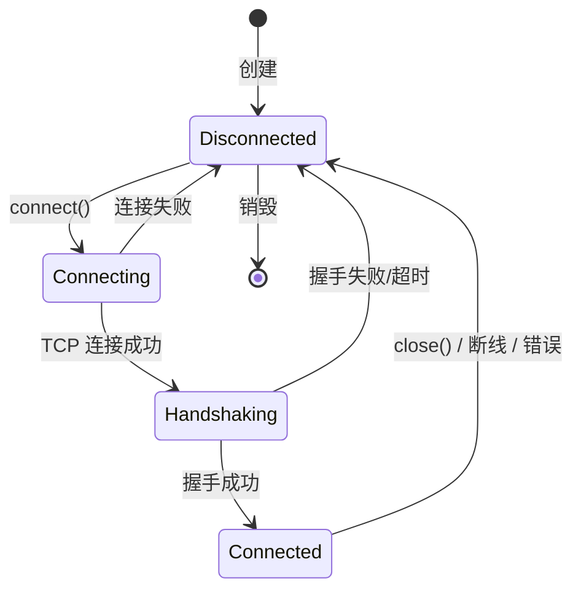
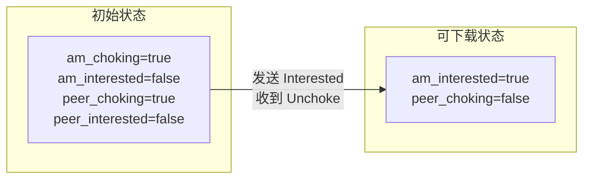
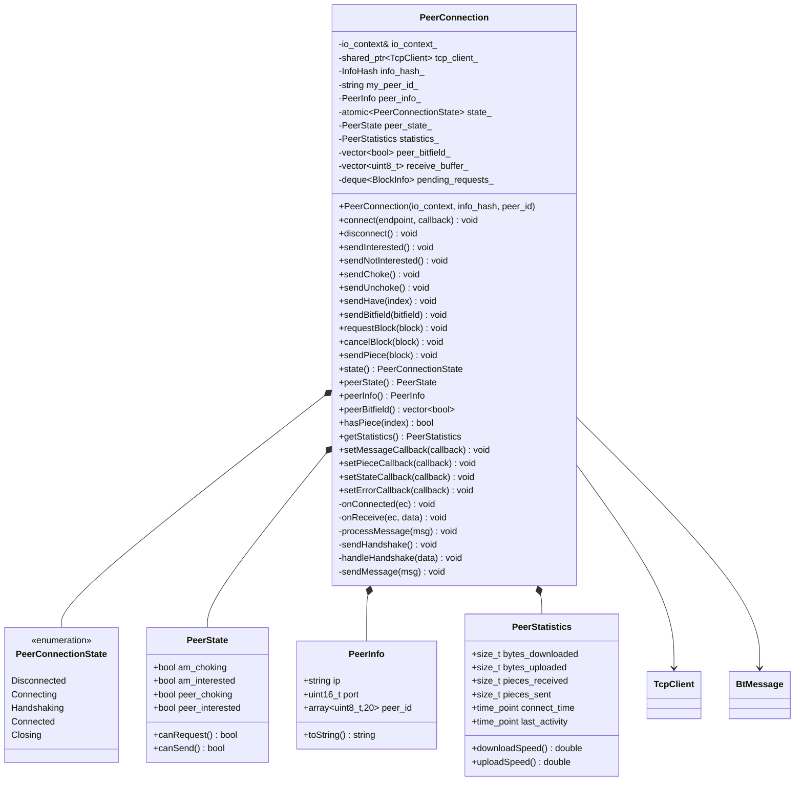
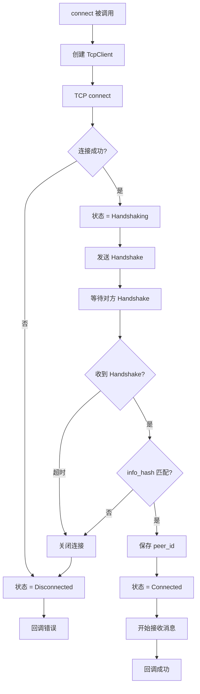
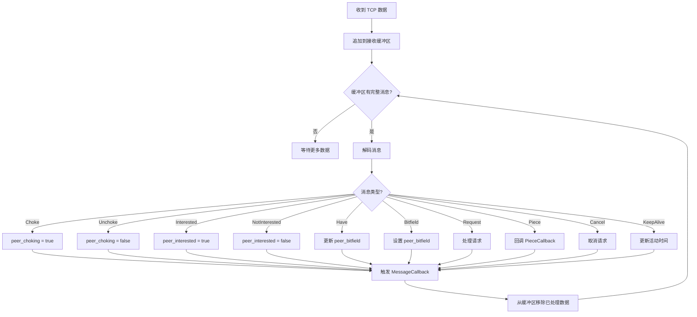
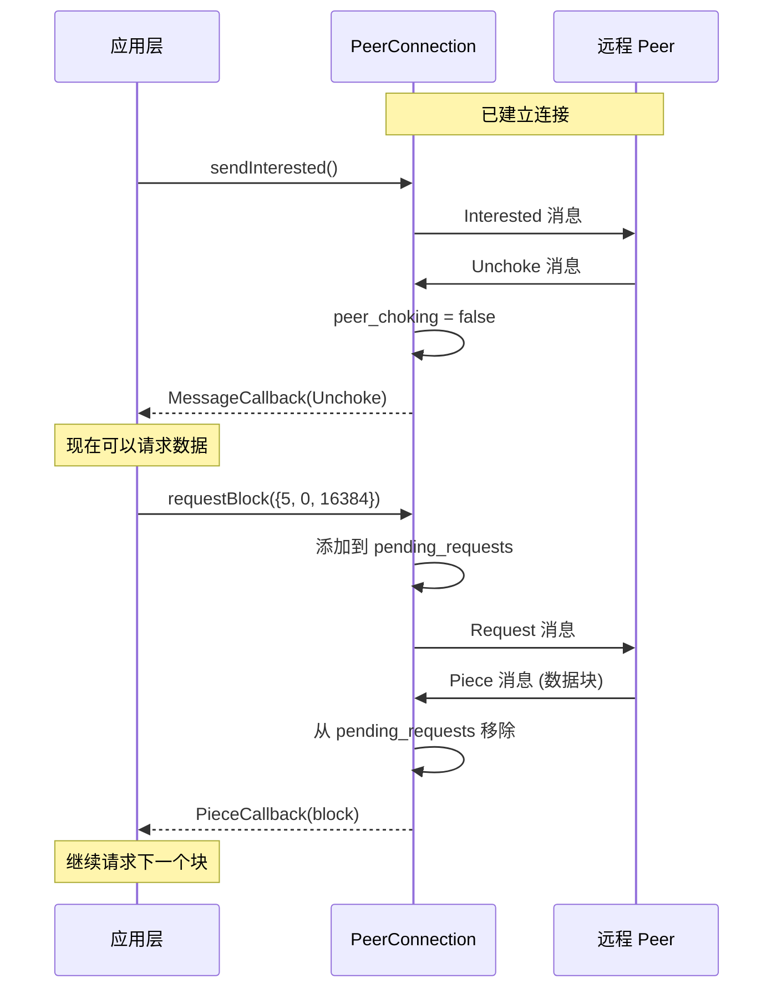
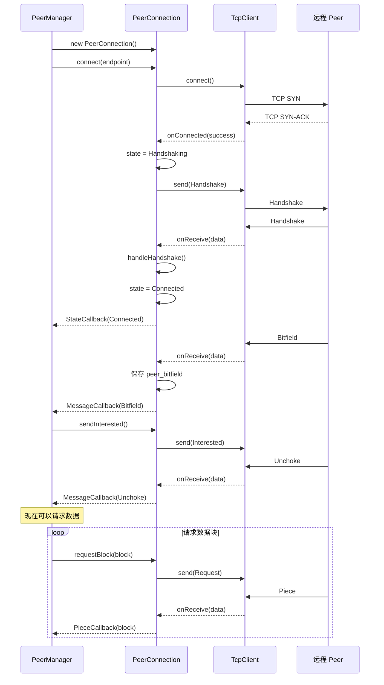
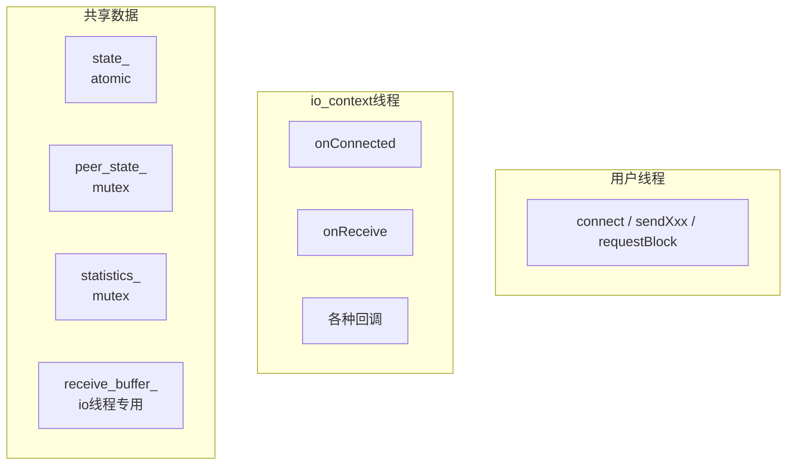

# PeerConnection 设计文档

> **模块名称**：PeerConnection - Peer 连接管理  
> **版本**：v1.0  
> **最后更新**：2025-01-12  
> **作者**：MagnetDownload Team

---

## 1. 模块概述

### 1.1 职责定义

PeerConnection 负责管理**单个 BitTorrent Peer 连接**的完整生命周期，包括：
- TCP 连接建立和维护
- BitTorrent 握手协议
- 消息收发和状态管理
- 数据块请求和接收

### 1.2 在架构中的位置



### 1.3 设计原则

| 原则 | 说明 |
|------|------|
| **单一职责** | 只管理一个 Peer 连接 |
| **事件驱动** | 基于回调的异步模型 |
| **状态机** | 清晰的状态转换 |
| **无阻塞** | 所有操作都是异步的 |

---

## 2. 状态机设计

### 2.1 连接状态



### 2.2 传输状态

在 Connected 状态下，还有传输相关的状态：

```cpp
struct PeerState {
    bool am_choking = true;      // 我阻塞对方（不发送数据给对方）
    bool am_interested = false;  // 我对对方的数据感兴趣
    bool peer_choking = true;    // 对方阻塞我（不发送数据给我）
    bool peer_interested = false;// 对方对我的数据感兴趣
};
```

**状态含义**：
- 要下载数据：需要 `am_interested = true` 且 `peer_choking = false`
- 要上传数据：需要 `peer_interested = true` 且 `am_choking = false`

### 2.3 状态转换图



---

## 3. 核心数据结构

### 3.1 连接状态枚举

```cpp
enum class PeerConnectionState {
    Disconnected,   // 未连接
    Connecting,     // TCP 连接中
    Handshaking,    // 握手中
    Connected,      // 已连接（可通信）
    Closing         // 关闭中
};
```

### 3.2 Peer 状态

```cpp
struct PeerState {
    bool am_choking{true};       // 我阻塞对方
    bool am_interested{false};   // 我对对方感兴趣
    bool peer_choking{true};     // 对方阻塞我
    bool peer_interested{false}; // 对方对我感兴趣
    
    // 是否可以请求数据
    bool canRequest() const {
        return am_interested && !peer_choking;
    }
    
    // 是否可以发送数据
    bool canSend() const {
        return peer_interested && !am_choking;
    }
};
```

### 3.3 Peer 信息

```cpp
struct PeerInfo {
    std::string ip;
    uint16_t port;
    std::array<uint8_t, 20> peer_id{};  // 握手后获得
    
    std::string toString() const;
};
```

### 3.4 统计信息

```cpp
struct PeerStatistics {
    size_t bytes_downloaded{0};     // 从该 Peer 下载的字节数
    size_t bytes_uploaded{0};       // 上传给该 Peer 的字节数
    size_t pieces_received{0};      // 收到的数据块数
    size_t pieces_sent{0};          // 发送的数据块数
    size_t requests_pending{0};     // 待处理的请求数
    
    std::chrono::steady_clock::time_point connect_time;  // 连接时间
    std::chrono::steady_clock::time_point last_activity; // 最后活动时间
    
    // 下载速度（字节/秒）
    double downloadSpeed() const;
    // 上传速度（字节/秒）  
    double uploadSpeed() const;
};
```

### 3.5 回调类型

```cpp
// 连接状态变化回调
using StateCallback = std::function<void(PeerConnectionState state)>;

// 收到消息回调
using MessageCallback = std::function<void(const BtMessage& message)>;

// 收到数据块回调
using PieceCallback = std::function<void(const PieceBlock& block)>;

// 错误回调
using ErrorCallback = std::function<void(const std::string& error)>;
```

---

## 4. 类图



---

## 5. 核心流程

### 5.1 连接和握手流程



### 5.2 消息处理流程



### 5.3 请求数据块流程



---

## 6. 时序图

### 6.1 完整的连接-下载流程



---

## 7. 消息缓冲和解析

### 7.1 为什么需要缓冲？

TCP 是字节流协议，可能出现：
- **粘包**：多个消息合并在一次接收中
- **拆包**：一个消息分多次接收

### 7.2 缓冲区设计

```cpp
class MessageBuffer {
    std::vector<uint8_t> buffer_;
    
public:
    // 追加收到的数据
    void append(const uint8_t* data, size_t len);
    
    // 尝试提取一个完整消息
    std::optional<BtMessage> extractMessage();
    
    // 尝试提取握手消息
    std::optional<Handshake> extractHandshake();
};
```

### 7.3 解析流程

```
接收缓冲区: [4字节length][1字节id][payload...][下一个消息...]
             ↓
         读取 length
             ↓
         检查数据是否足够
             ↓
         解码消息，移除已处理数据
             ↓
         继续检查是否还有完整消息
```

---

## 8. 线程安全

### 8.1 线程模型



### 8.2 同步策略

| 数据 | 保护方式 |
|------|----------|
| `state_` | `std::atomic` |
| `peer_state_` | `std::mutex` |
| `statistics_` | `std::mutex` |
| `peer_bitfield_` | `std::mutex` |
| `pending_requests_` | `std::mutex` |
| `receive_buffer_` | 仅 io_context 线程访问，无需锁 |

---

## 9. 错误处理

### 9.1 错误场景

| 场景 | 处理 |
|------|------|
| TCP 连接失败 | 状态变为 Disconnected，回调错误 |
| 握手超时 | 关闭连接，状态变为 Disconnected |
| info_hash 不匹配 | 关闭连接 |
| 消息格式错误 | 忽略该消息，继续处理 |
| 对方断开连接 | 状态变为 Disconnected，回调错误 |
| 协议违规 | 关闭连接 |

### 9.2 超时设置

| 超时项 | 默认值 | 说明 |
|--------|--------|------|
| 连接超时 | 30s | TCP connect 超时 |
| 握手超时 | 30s | 等待对方握手响应 |
| KeepAlive 间隔 | 2min | 无活动时发送 KeepAlive |
| 空闲超时 | 5min | 无活动则断开 |

---

## 10. 公共 API

```cpp
namespace magnet::protocols {

class PeerConnection : public std::enable_shared_from_this<PeerConnection> {
public:
    // ========== 构造 ==========
    PeerConnection(asio::io_context& io_context,
                   const InfoHash& info_hash,
                   const std::string& my_peer_id);
    ~PeerConnection();
    
    // ========== 连接管理 ==========
    void connect(const TcpEndpoint& endpoint, 
                 std::function<void(bool success)> callback = nullptr);
    void disconnect();
    
    // ========== 发送消息 ==========
    void sendInterested();
    void sendNotInterested();
    void sendChoke();
    void sendUnchoke();
    void sendHave(uint32_t piece_index);
    void sendBitfield(const std::vector<bool>& bitfield);
    void requestBlock(const BlockInfo& block);
    void cancelBlock(const BlockInfo& block);
    void sendPiece(const PieceBlock& block);
    
    // ========== 状态查询 ==========
    PeerConnectionState state() const;
    bool isConnected() const;
    const PeerState& peerState() const;
    const PeerInfo& peerInfo() const;
    const std::vector<bool>& peerBitfield() const;
    bool hasPiece(uint32_t index) const;
    PeerStatistics getStatistics() const;
    
    // ========== 回调设置 ==========
    void setStateCallback(StateCallback callback);
    void setMessageCallback(MessageCallback callback);
    void setPieceCallback(PieceCallback callback);
    void setErrorCallback(ErrorCallback callback);
};

} // namespace magnet::protocols
```

---

## 11. 使用示例

```cpp
auto peer = std::make_shared<PeerConnection>(io_context, info_hash, "-MT0001-xxxx");

// 设置回调
peer->setStateCallback([](PeerConnectionState state) {
    std::cout << "状态: " << stateToString(state) << "\n";
});

peer->setPieceCallback([](const PieceBlock& block) {
    std::cout << "收到数据块: piece=" << block.piece_index 
              << " offset=" << block.begin << "\n";
    // 保存数据...
});

peer->setMessageCallback([peer](const BtMessage& msg) {
    if (msg.isUnchoke()) {
        // 对方解除阻塞，可以请求数据了
        peer->requestBlock({0, 0, 16384});
    }
});

// 连接
peer->connect({"192.168.1.100", 6881}, [peer](bool success) {
    if (success) {
        peer->sendInterested();
    }
});
```

---

## 12. 实现检查清单

### 12.1 必须实现

- [ ] 构造函数和析构函数
- [ ] `connect()` - 连接和握手
- [ ] `disconnect()` - 断开连接
- [ ] 所有 `sendXxx()` 方法
- [ ] `requestBlock()` / `cancelBlock()`
- [ ] 消息接收和解析
- [ ] 状态管理
- [ ] 回调机制

### 12.2 内部实现

- [ ] 消息缓冲区管理
- [ ] 握手处理
- [ ] 各类消息处理
- [ ] 超时处理（可选）
- [ ] KeepAlive 机制（可选）

---

**设计文档完成，可以开始实现！**

