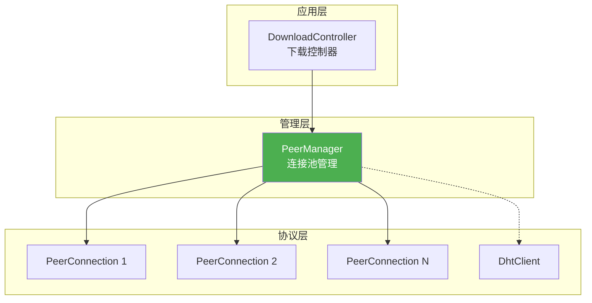
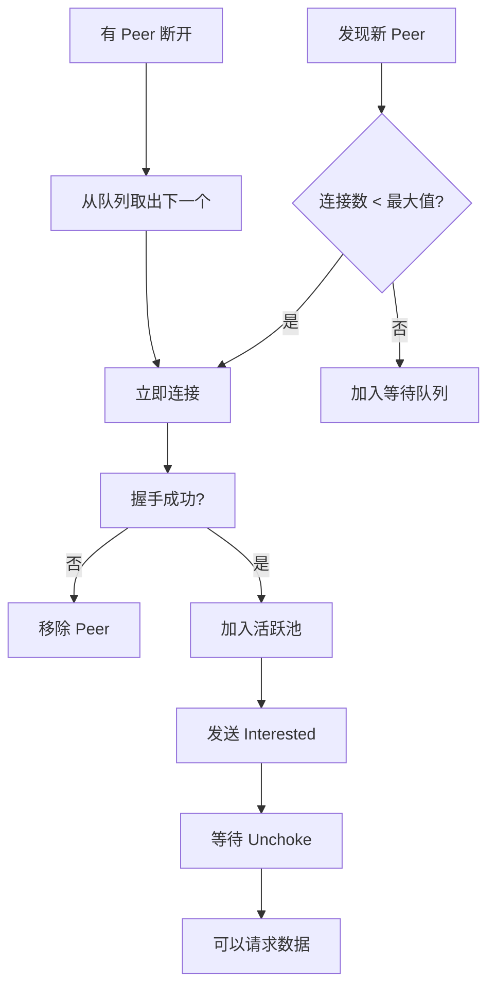
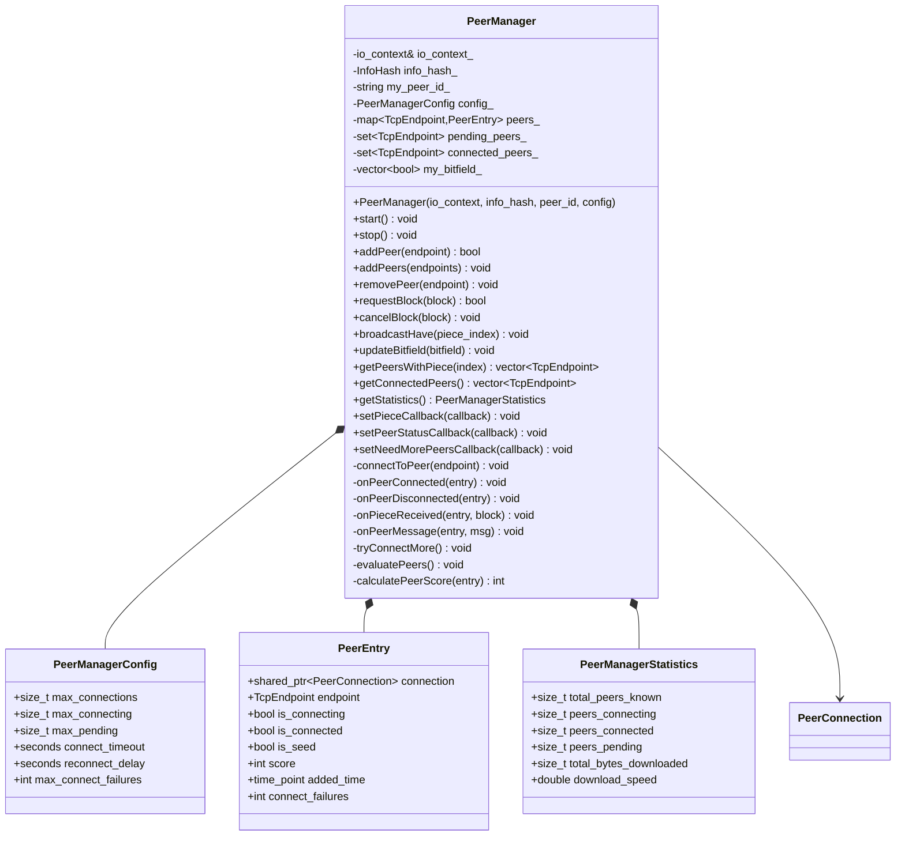
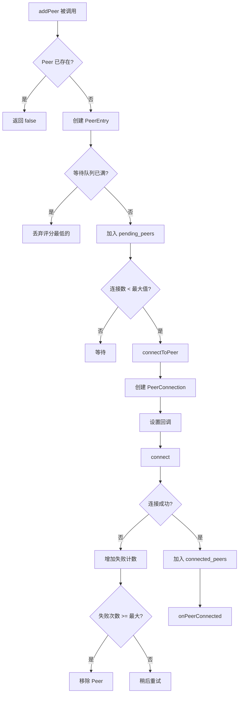
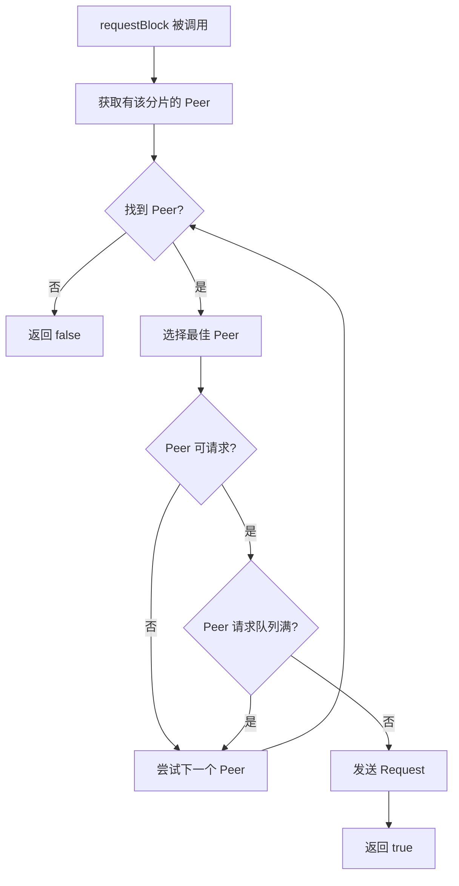
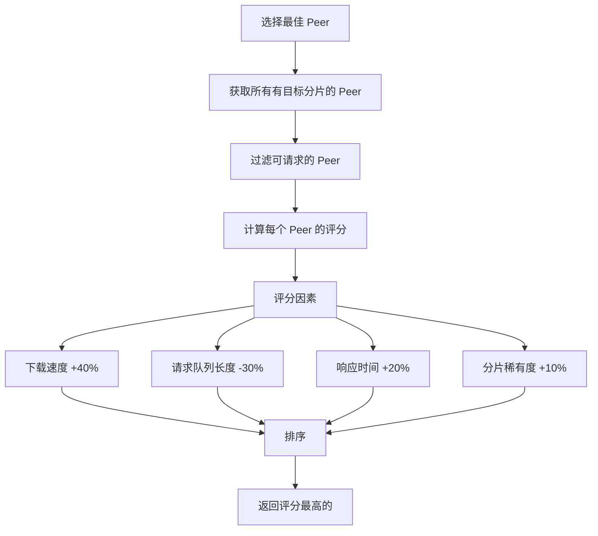
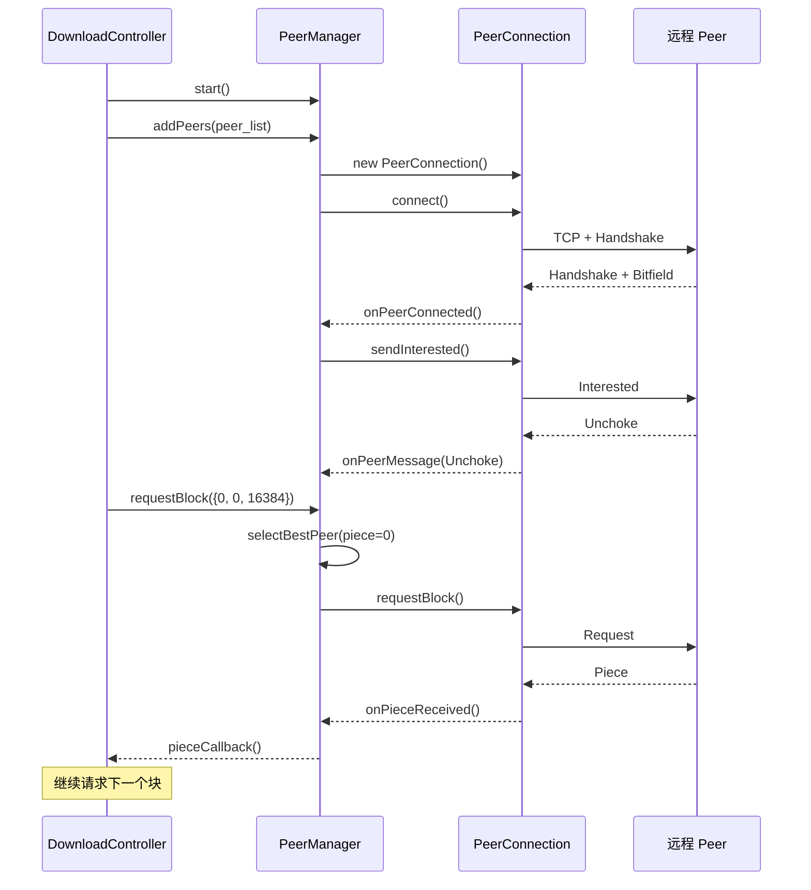
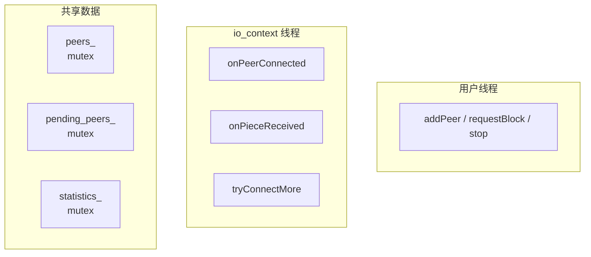

# PeerManager 设计文档

> **模块名称**：PeerManager - Peer 连接池管理  
> **版本**：v1.0  
> **最后更新**：2025-01-12  
> **作者**：MagnetDownload Team

---

## 1. 模块概述

### 1.1 职责定义

PeerManager 是 **Peer 连接池管理器**，负责：
- 管理多个 `PeerConnection` 的生命周期
- 协调 Peer 选择策略（连接谁、断开谁）
- 聚合下载/上传统计信息
- 提供 Peer 发现接口（与 DHT 集成）

### 1.2 在架构中的位置



### 1.3 设计原则

| 原则 | 说明 |
|------|------|
| **连接池** | 复用连接，避免频繁创建销毁 |
| **智能选择** | 优先连接速度快、分片多的 Peer |
| **限制并发** | 控制最大连接数，避免资源耗尽 |
| **事件聚合** | 统一处理所有 Peer 的事件 |

---

## 2. 核心功能

### 2.1 功能列表

| 功能 | 说明 |
|------|------|
| **添加 Peer** | 从 DHT/Tracker 获取 Peer 后添加 |
| **连接管理** | 自动连接/断开，控制并发数 |
| **分片查询** | 查询哪些 Peer 有指定分片 |
| **数据请求** | 向合适的 Peer 请求数据块 |
| **状态监控** | 监控所有 Peer 的状态和速度 |
| **策略控制** | 实现 choke/unchoke 算法 |

### 2.2 连接策略



---

## 3. 数据结构

### 3.1 Peer 条目

```cpp
struct PeerEntry {
    std::shared_ptr<PeerConnection> connection;
    network::TcpEndpoint endpoint;
    
    // 状态
    bool is_connecting{false};
    bool is_connected{false};
    bool is_seed{false};        // 是否是做种者（拥有所有分片）
    
    // 评分（用于选择策略）
    int score{0};
    
    // 时间戳
    std::chrono::steady_clock::time_point added_time;
    std::chrono::steady_clock::time_point last_connect_attempt;
    int connect_failures{0};    // 连接失败次数
};
```

### 3.2 配置参数

```cpp
struct PeerManagerConfig {
    size_t max_connections{50};         // 最大连接数
    size_t max_connecting{10};          // 最大同时连接中的数量
    size_t max_pending{200};            // 最大等待连接的 Peer 数
    
    std::chrono::seconds connect_timeout{30};
    std::chrono::seconds reconnect_delay{60};   // 重连间隔
    int max_connect_failures{3};                // 最大连接失败次数
    
    size_t max_requests_per_peer{10};   // 每个 Peer 最大并发请求数
    size_t target_request_queue{50};    // 目标请求队列长度
};
```

### 3.3 统计信息

```cpp
struct PeerManagerStatistics {
    size_t total_peers_known{0};        // 已知 Peer 总数
    size_t peers_connecting{0};         // 连接中的 Peer 数
    size_t peers_connected{0};          // 已连接的 Peer 数
    size_t peers_pending{0};            // 等待连接的 Peer 数
    
    size_t total_bytes_downloaded{0};   // 总下载字节数
    size_t total_bytes_uploaded{0};     // 总上传字节数
    size_t total_pieces_received{0};    // 总接收分片数
    
    double download_speed{0};           // 当前下载速度 (bytes/s)
    double upload_speed{0};             // 当前上传速度 (bytes/s)
};
```

### 3.4 回调类型

```cpp
// 收到数据块回调
using PieceReceivedCallback = std::function<void(
    uint32_t piece_index, 
    uint32_t begin, 
    const std::vector<uint8_t>& data)>;

// Peer 连接状态变化回调
using PeerStatusCallback = std::function<void(
    const network::TcpEndpoint& endpoint,
    bool connected)>;

// 需要更多 Peer 回调
using NeedMorePeersCallback = std::function<void()>;
```

---

## 4. 类图



---

## 5. 核心流程

### 5.1 添加和连接 Peer



### 5.2 请求数据块



### 5.3 Peer 选择算法



---

## 6. 时序图

### 6.1 完整下载流程



---

## 7. Choke/Unchoke 策略

### 7.1 策略说明

BitTorrent 使用 tit-for-tat 策略来激励分享：
- **Unchoke**：解除阻塞速度最快的几个 Peer
- **Optimistic Unchoke**：随机解除阻塞一个 Peer（发现新的好 Peer）

### 7.2 实现

```cpp
void PeerManager::evaluatePeers() {
    // 每 10 秒执行一次
    
    // 1. 按上传速度排序连接的 Peer
    std::vector<PeerEntry*> peers;
    for (auto& [ep, entry] : peers_) {
        if (entry.is_connected) {
            peers.push_back(&entry);
        }
    }
    
    std::sort(peers.begin(), peers.end(), [](auto* a, auto* b) {
        return a->connection->getStatistics().bytes_uploaded >
               b->connection->getStatistics().bytes_uploaded;
    });
    
    // 2. Unchoke 前 4 个
    size_t unchoke_count = std::min(size_t(4), peers.size());
    for (size_t i = 0; i < peers.size(); ++i) {
        if (i < unchoke_count) {
            peers[i]->connection->sendUnchoke();
        } else {
            peers[i]->connection->sendChoke();
        }
    }
    
    // 3. 每 30 秒随机 Optimistic Unchoke 一个
    if (optimistic_unchoke_counter_++ % 3 == 0 && peers.size() > unchoke_count) {
        size_t random_idx = unchoke_count + (rand() % (peers.size() - unchoke_count));
        peers[random_idx]->connection->sendUnchoke();
    }
}
```

---

## 8. 线程安全

### 8.1 线程模型



### 8.2 锁策略

| 数据 | 保护方式 |
|------|----------|
| `peers_` | `std::mutex` |
| `pending_peers_` | 同上（同一把锁） |
| `connected_peers_` | 同上 |
| `statistics_` | `std::mutex` |
| `my_bitfield_` | `std::mutex` |

---

## 9. 公共 API

```cpp
namespace magnet::protocols {

class PeerManager : public std::enable_shared_from_this<PeerManager> {
public:
    // ========== 构造 ==========
    PeerManager(asio::io_context& io_context,
                const InfoHash& info_hash,
                const std::string& my_peer_id,
                PeerManagerConfig config = {});
    ~PeerManager();
    
    // ========== 生命周期 ==========
    void start();
    void stop();
    bool isRunning() const;
    
    // ========== Peer 管理 ==========
    bool addPeer(const network::TcpEndpoint& endpoint);
    void addPeers(const std::vector<network::TcpEndpoint>& endpoints);
    void removePeer(const network::TcpEndpoint& endpoint);
    
    // ========== 数据传输 ==========
    bool requestBlock(const BlockInfo& block);
    void cancelBlock(const BlockInfo& block);
    void broadcastHave(uint32_t piece_index);
    void updateBitfield(const std::vector<bool>& bitfield);
    
    // ========== 查询 ==========
    std::vector<network::TcpEndpoint> getPeersWithPiece(uint32_t piece_index) const;
    std::vector<network::TcpEndpoint> getConnectedPeers() const;
    size_t connectedCount() const;
    PeerManagerStatistics getStatistics() const;
    
    // ========== 回调 ==========
    void setPieceCallback(PieceReceivedCallback callback);
    void setPeerStatusCallback(PeerStatusCallback callback);
    void setNeedMorePeersCallback(NeedMorePeersCallback callback);
};

} // namespace magnet::protocols
```

---

## 10. 使用示例

```cpp
auto pm = std::make_shared<PeerManager>(io_context, info_hash, "-MT0001-xxxx");

// 设置回调
pm->setPieceCallback([](uint32_t piece, uint32_t begin, const auto& data) {
    std::cout << "Received piece " << piece << " offset " << begin << "\n";
    // 保存数据到磁盘...
});

pm->setPeerStatusCallback([](const auto& ep, bool connected) {
    std::cout << "Peer " << ep.toString() << (connected ? " connected" : " disconnected") << "\n";
});

pm->setNeedMorePeersCallback([]() {
    // 通知 DHT 查找更多 Peer
});

// 启动
pm->start();

// 添加 Peer
pm->addPeers(peers_from_dht);

// 请求数据块
pm->requestBlock({0, 0, 16384});
pm->requestBlock({0, 16384, 16384});
```

---

## 11. 实现检查清单

### 11.1 必须实现

- [ ] 构造函数和析构函数
- [ ] `start()` / `stop()`
- [ ] `addPeer()` / `addPeers()` / `removePeer()`
- [ ] `requestBlock()` / `cancelBlock()`
- [ ] `broadcastHave()` / `updateBitfield()`
- [ ] `getPeersWithPiece()` / `getConnectedPeers()`
- [ ] `getStatistics()`
- [ ] 所有回调设置方法

### 11.2 内部实现

- [ ] `connectToPeer()` - 连接单个 Peer
- [ ] `onPeerConnected()` - 连接成功处理
- [ ] `onPeerDisconnected()` - 断线处理
- [ ] `onPieceReceived()` - 收到数据块
- [ ] `tryConnectMore()` - 尝试连接更多 Peer
- [ ] `evaluatePeers()` - 评估和选择 Peer
- [ ] `calculatePeerScore()` - 计算 Peer 评分

---

**设计文档完成，可以开始实现！**

