# QueryManager 设计文档

> **模块名称**：QueryManager - DHT 查询管理器  
> **版本**：v1.0  
> **最后更新**：2025-01-12  
> **作者**：MagnetDownload Team

---

## 1. 为什么需要 QueryManager？

### 1.1 问题背景

DHT 查询是**异步**的，存在以下挑战：

```
你 ──发送 get_peers──► 节点A
    （等待...）
你 ──发送 get_peers──► 节点B
    （等待...）
你 ──发送 get_peers──► 节点C
    （等待...）

节点B 响应
节点A 响应
节点C 超时...
```

**核心问题**：

1. **请求-响应匹配**：收到响应时，如何知道它对应哪个请求？
2. **并发管理**：同时发出多个查询，如何管理它们的状态？
3. **超时处理**：节点不响应时，如何检测并重试？
4. **回调触发**：响应到达时，如何通知调用者？

### 1.2 没有 QueryManager 的代码

```cpp
// 问题：手动管理查询状态，代码混乱
class DhtClient {
    std::map<std::string, std::function<void(DhtMessage)>> pending_callbacks_;
    std::map<std::string, std::chrono::time_point<...>> pending_times_;
    std::map<std::string, int> retry_counts_;
    std::map<std::string, DhtNode> pending_targets_;
    
    void sendQuery(DhtNode node, DhtMessage msg, Callback cb) {
        auto tid = msg.transactionId();
        pending_callbacks_[tid] = cb;
        pending_times_[tid] = std::chrono::steady_clock::now();
        retry_counts_[tid] = 0;
        pending_targets_[tid] = node;
        // ... 发送
    }
    
    void onReceive(DhtMessage response) {
        auto tid = response.transactionId();
        auto it = pending_callbacks_.find(tid);
        if (it != pending_callbacks_.end()) {
            it->second(response);
            pending_callbacks_.erase(it);
            pending_times_.erase(tid);
            retry_counts_.erase(tid);
            pending_targets_.erase(tid);
        }
    }
    
    void checkTimeouts() {
        // 遍历所有 pending，检查超时，重试或失败...
        // 代码越来越复杂
    }
};
```

### 1.3 QueryManager 的解决方案

```cpp
// 使用 QueryManager 后的代码
class DhtClient {
    QueryManager query_manager_;
    
    void findPeers(InfoHash hash, PeerCallback cb) {
        auto msg = DhtMessage::createGetPeers(my_id_, hash);
        
        query_manager_.sendQuery(target_node, msg, [this, cb](auto result) {
            if (result.is_ok()) {
                auto peers = result.value().getPeers();
                for (auto& p : peers) cb(p);
            }
            // 超时/失败已由 QueryManager 处理
        });
    }
};
```

---

## 2. 设计目标与原则

### 2.1 设计目标

| 目标 | 说明 | 优先级 |
|------|------|--------|
| **请求-响应匹配** | 通过 transaction_id 自动匹配 | 高 |
| **超时检测** | 自动检测无响应的查询 | 高 |
| **重试机制** | 超时后可配置重试次数 | 高 |
| **并发控制** | 限制同时进行的查询数量 | 中 |
| **统计信息** | 查询成功率、延迟等指标 | 中 |
| **线程安全** | 支持多线程访问 | 高 |

### 2.2 设计原则

#### 原则1：单一职责

QueryManager **只负责查询生命周期管理**，不涉及：
- 消息构造（由 DhtMessage 负责）
- 网络发送（由 UdpClient 负责）
- 路由决策（由 RoutingTable 负责）
- 协议逻辑（由 DhtClient 负责）

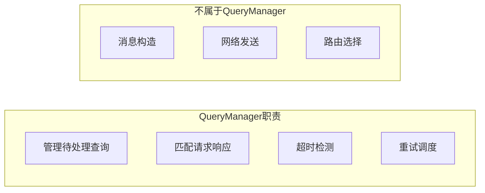

#### 原则2：回调通知

使用回调通知查询结果，而不是 Future/Promise：

```cpp
// 我们的设计
void sendQuery(DhtNode target, DhtMessage msg, QueryCallback callback);

// callback 会在以下情况被调用：
// 1. 收到响应 → callback(Result::ok(response))
// 2. 超时且重试耗尽 → callback(Result::err(QueryError::Timeout))
// 3. 发送失败 → callback(Result::err(QueryError::SendFailed))
```

**为什么用回调？**
- 与 asio 异步模型一致
- 避免阻塞线程
- 支持链式操作

#### 原则3：事务 ID 唯一性

每个查询都有唯一的 transaction_id，由 DhtMessage::generateTransactionId() 生成：

```cpp
// 2 字节的随机 ID，65536 种可能
// 对于 DHT 场景足够（同时不会有太多待处理查询）
std::string tid = DhtMessage::generateTransactionId(2);
```

---

## 3. 架构设计

### 3.1 在系统中的位置

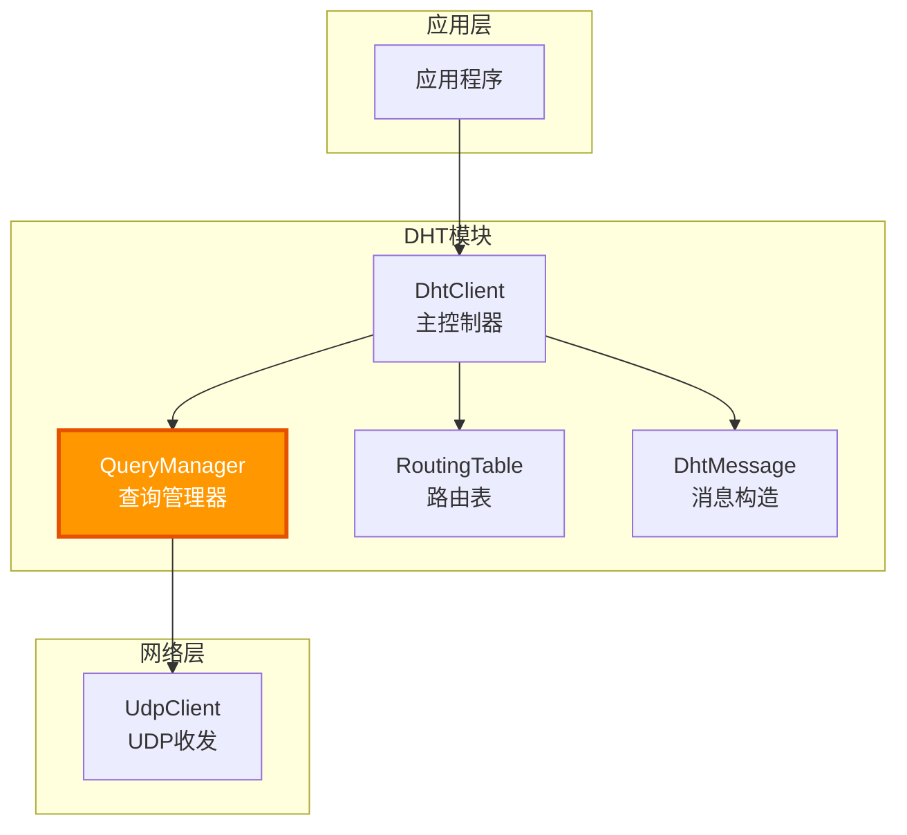

### 3.2 与其他模块的交互

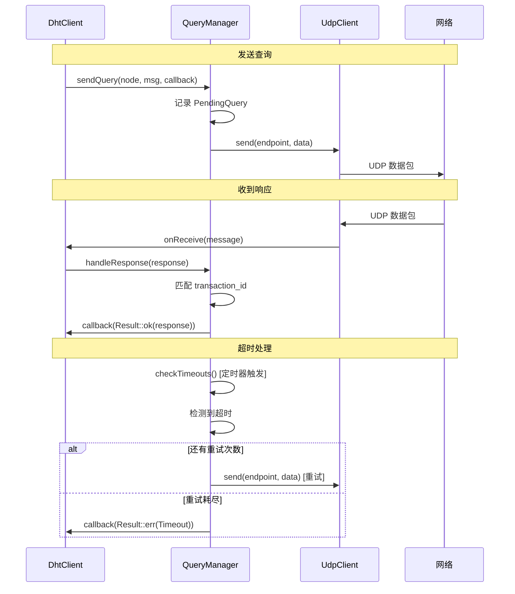

---

## 4. 数据结构设计

### 4.1 PendingQuery 结构

```cpp
struct PendingQuery {
    std::string transaction_id;         // 事务 ID
    DhtNode target;                      // 目标节点
    DhtMessage message;                  // 原始消息（用于重试）
    QueryCallback callback;              // 结果回调
    
    std::chrono::steady_clock::time_point sent_time;  // 发送时间
    int retry_count;                     // 已重试次数
    int max_retries;                     // 最大重试次数
    
    std::chrono::milliseconds timeout;   // 超时时间
};
```

**为什么需要保存原始消息？**

重试时需要重新发送相同的消息，transaction_id 保持不变。

### 4.2 QueryError 枚举

```cpp
enum class QueryError {
    Timeout,        // 超时且重试耗尽
    SendFailed,     // 发送失败
    Cancelled,      // 被取消
    ShuttingDown    // 管理器正在关闭
};
```

### 4.3 QueryResult 类型

```cpp
using QueryResult = Result<DhtMessage, QueryError>;
using QueryCallback = std::function<void(QueryResult)>;
```

### 4.4 Statistics 结构

```cpp
struct Statistics {
    size_t queries_sent;        // 发送的查询数
    size_t queries_succeeded;   // 成功的查询数
    size_t queries_failed;      // 失败的查询数
    size_t queries_timeout;     // 超时的查询数
    size_t retries_total;       // 总重试次数
    
    double avg_latency_ms;      // 平均延迟
    double success_rate;        // 成功率
};
```

---

## 5. 类图

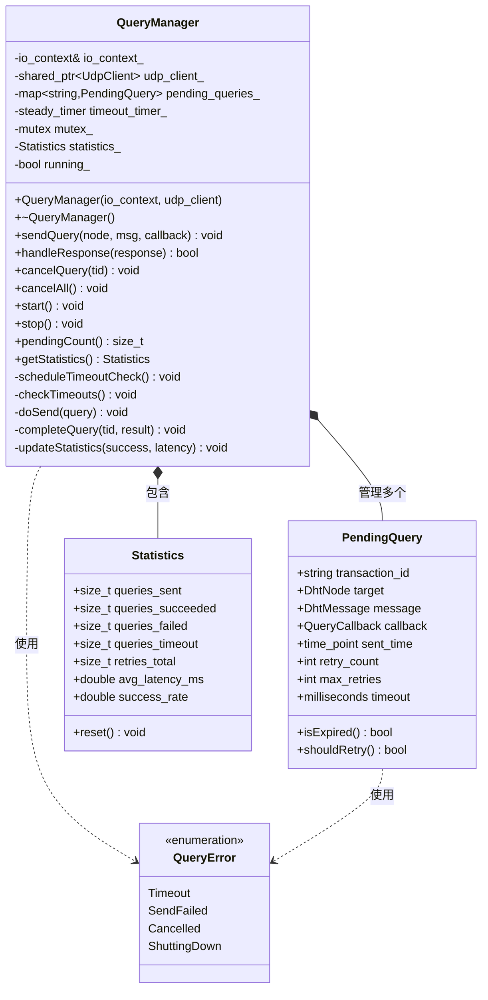

---

## 6. 核心方法详解

### 6.1 构造函数

```cpp
QueryManager(asio::io_context& io_context, 
             std::shared_ptr<UdpClient> udp_client,
             Config config = {});

struct Config {
    std::chrono::milliseconds default_timeout{2000};  // 默认超时 2 秒
    int default_max_retries{2};                        // 默认重试 2 次
    std::chrono::milliseconds check_interval{500};    // 检查间隔 500ms
    size_t max_pending_queries{1000};                 // 最大待处理数
};
```

**为什么需要传入 UdpClient？**

QueryManager 需要通过 UdpClient 发送查询，但不负责创建它。这样：
- 单一职责：QueryManager 只管理查询
- 可测试性：可以传入 Mock UdpClient
- 灵活性：多个 QueryManager 可以共享一个 UdpClient

### 6.2 sendQuery() 方法

```cpp
void sendQuery(const DhtNode& target,
               DhtMessage message,
               QueryCallback callback,
               std::chrono::milliseconds timeout = std::chrono::milliseconds{0},
               int max_retries = -1);
```

**参数说明**：

| 参数 | 说明 |
|------|------|
| `target` | 目标节点 |
| `message` | 要发送的消息（会被移动） |
| `callback` | 结果回调 |
| `timeout` | 超时时间，0 表示使用默认值 |
| `max_retries` | 最大重试次数，-1 表示使用默认值 |

**流程**：

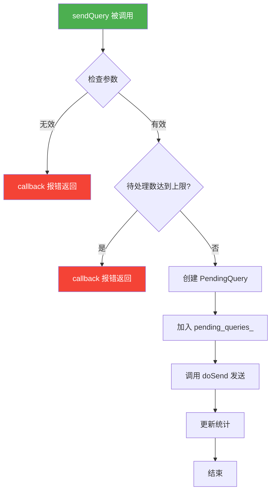

### 6.3 handleResponse() 方法

```cpp
bool handleResponse(const DhtMessage& response);
```

**返回值**：
- `true`：找到匹配的待处理查询并已处理
- `false`：没有匹配的查询（可能是过期响应或攻击）

**流程**：

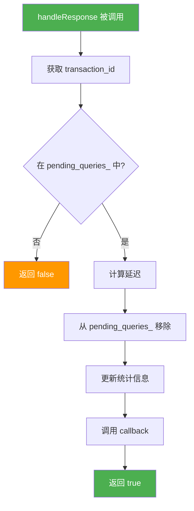

### 6.4 checkTimeouts() 方法（内部）

```cpp
void checkTimeouts();
```

由定时器定期触发，检查所有待处理查询：

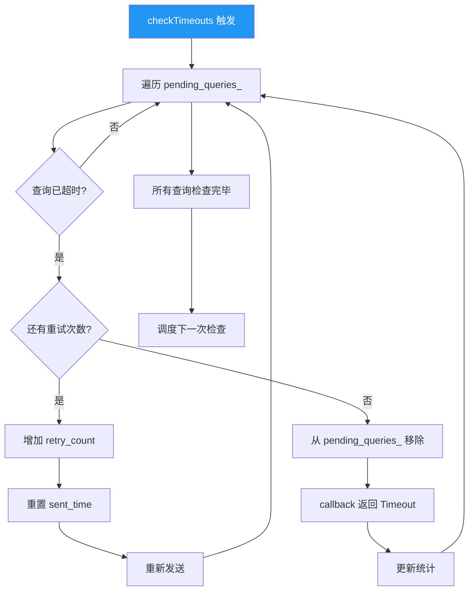

### 6.5 cancelQuery() 和 cancelAll()

```cpp
void cancelQuery(const std::string& transaction_id);
void cancelAll();
```

**用途**：
- `cancelQuery`：取消特定查询（如用户取消操作）
- `cancelAll`：关闭时取消所有待处理查询

**行为**：
- 从 `pending_queries_` 移除
- 调用 callback，传入 `QueryError::Cancelled`

---

## 7. 超时与重试策略

### 7.1 为什么需要重试？

DHT 网络中，UDP 包可能丢失：
- 网络拥塞
- NAT 问题
- 目标节点暂时不可达

**重试可以提高成功率**，但需要平衡：
- 重试太多 → 浪费资源，延迟高
- 重试太少 → 成功率低

### 7.2 重试策略

```
时间线：
0s        2s        4s        6s
|---------|---------|---------|
发送      超时重试1   超时重试2   最终失败
```

**默认配置**：
- 超时时间：2 秒
- 最大重试：2 次
- 总等待时间：最多 6 秒

### 7.3 自适应超时（可选增强）

```cpp
// 根据历史延迟动态调整超时
auto calculateTimeout() {
    // RTT 平均值 + 2 倍标准差
    return avg_latency_ + 2 * latency_stddev_;
}
```

---

## 8. 线程安全设计

### 8.1 并发场景

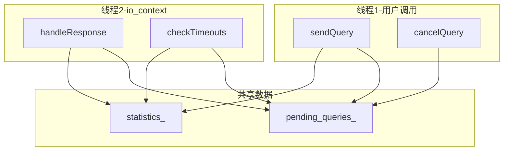

### 8.2 锁策略

```cpp
class QueryManager {
    mutable std::mutex mutex_;  // 保护 pending_queries_ 和 statistics_
    
    void sendQuery(...) {
        std::lock_guard<std::mutex> lock(mutex_);
        // 操作 pending_queries_
    }
    
    bool handleResponse(...) {
        std::lock_guard<std::mutex> lock(mutex_);
        // 操作 pending_queries_
    }
};
```

**注意**：callback 的调用应该在锁外进行，避免死锁：

```cpp
void handleResponse(const DhtMessage& response) {
    QueryCallback callback;
    {
        std::lock_guard<std::mutex> lock(mutex_);
        auto it = pending_queries_.find(response.transactionId());
        if (it == pending_queries_.end()) return false;
        callback = std::move(it->second.callback);
        pending_queries_.erase(it);
    }
    // 锁已释放，安全调用 callback
    callback(QueryResult::ok(response));
}
```

---

## 9. 时序图

### 9.1 成功查询

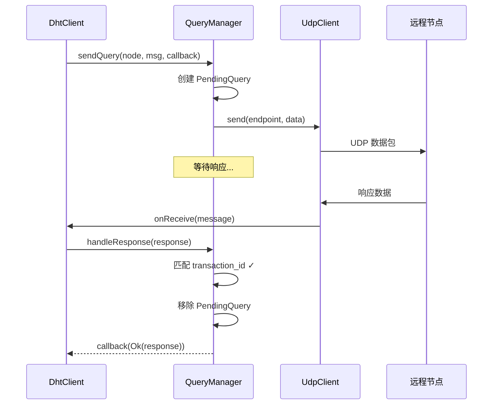

### 9.2 超时重试后成功

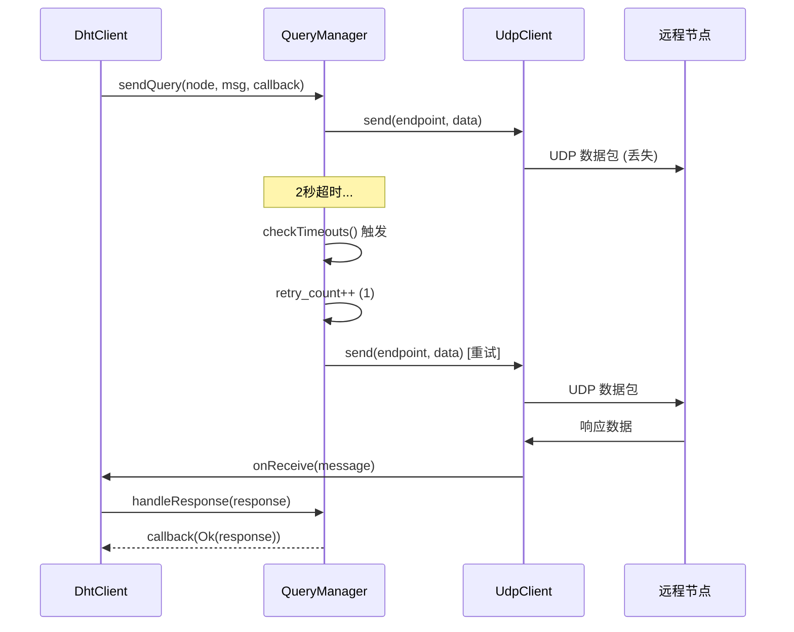

### 9.3 超时失败

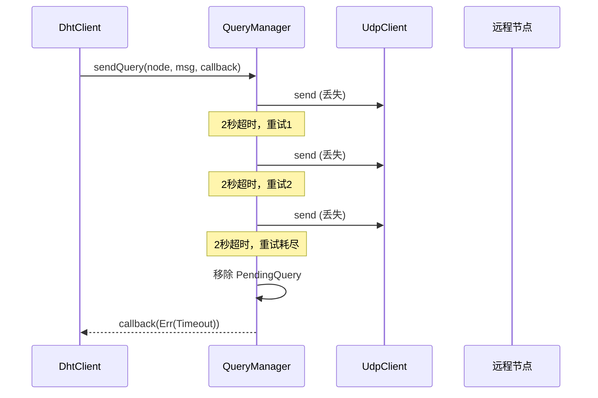

---

## 10. 流程图

### 10.1 整体查询流程

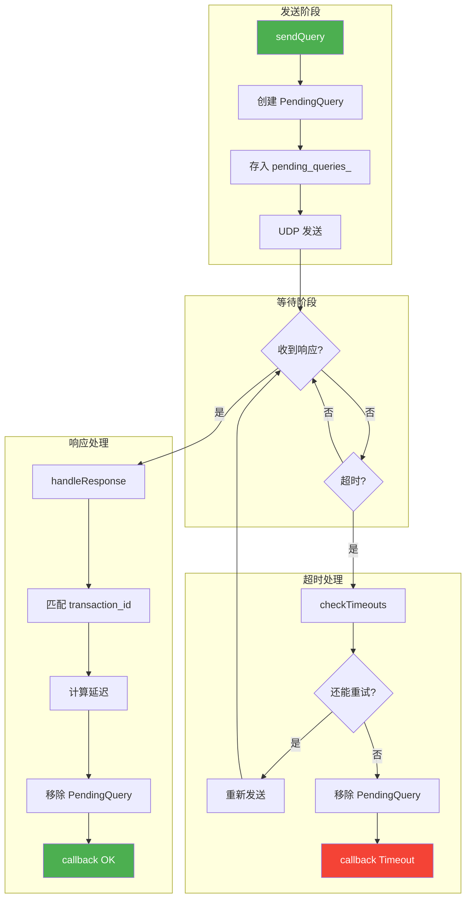

---

## 11. 错误处理

### 11.1 错误类型及处理

| 错误类型 | 原因 | 处理方式 |
|----------|------|----------|
| `Timeout` | 多次重试后仍无响应 | 标记节点为 questionable/bad |
| `SendFailed` | UDP 发送失败 | 立即返回错误，不重试 |
| `Cancelled` | 用户取消或关闭 | 清理资源，不需要特殊处理 |
| `ShuttingDown` | QueryManager 正在关闭 | 所有待处理查询都会收到此错误 |

### 11.2 调用者处理示例

```cpp
query_manager.sendQuery(node, msg, [this](QueryResult result) {
    if (result.is_ok()) {
        auto& response = result.value();
        // 处理成功响应
        routing_table_.markNodeResponded(response.senderId());
    } else {
        switch (result.error()) {
            case QueryError::Timeout:
                // 标记节点失败
                routing_table_.markNodeFailed(node.id_);
                break;
            case QueryError::SendFailed:
                // 网络问题，可以稍后重试
                break;
            case QueryError::Cancelled:
            case QueryError::ShuttingDown:
                // 正常取消，不需要处理
                break;
        }
    }
});
```

---

## 12. 配置参数

| 参数 | 默认值 | 说明 |
|------|--------|------|
| `default_timeout` | 2000ms | 单次查询超时时间 |
| `default_max_retries` | 2 | 默认重试次数 |
| `check_interval` | 500ms | 超时检查间隔 |
| `max_pending_queries` | 1000 | 最大同时待处理查询数 |

### 12.1 参数调优建议

**高延迟网络**：
```cpp
Config config;
config.default_timeout = std::chrono::milliseconds(5000);
config.default_max_retries = 3;
```

**低延迟局域网**：
```cpp
Config config;
config.default_timeout = std::chrono::milliseconds(500);
config.default_max_retries = 1;
```

---

## 13. 实现检查清单

### 13.1 必须实现的功能

- [ ] 构造函数：初始化 io_context、UdpClient、定时器
- [ ] sendQuery()：创建 PendingQuery、发送、记录
- [ ] handleResponse()：匹配 transaction_id、回调、清理
- [ ] checkTimeouts()：检测超时、重试或失败
- [ ] cancelQuery() / cancelAll()：取消查询
- [ ] start() / stop()：启动/停止定时器
- [ ] getStatistics()：获取统计信息

### 13.2 边界条件处理

- [ ] transaction_id 不存在（过期或攻击响应）
- [ ] 待处理查询数达到上限
- [ ] 在 callback 中调用 sendQuery（递归）
- [ ] stop() 时有待处理查询
- [ ] 重复调用 start() / stop()

### 13.3 测试要点

- [ ] 正常查询成功
- [ ] 超时后重试成功
- [ ] 重试耗尽后失败
- [ ] 并发发送多个查询
- [ ] 取消查询
- [ ] 统计信息准确性
- [ ] 线程安全测试

---

## 14. 使用示例

```cpp
// 创建 QueryManager
auto udp_client = std::make_shared<UdpClient>(io_context, 6881);
QueryManager query_manager(io_context, udp_client);
query_manager.start();

// 发送查询
auto msg = DhtMessage::createGetPeers(my_id, info_hash);
query_manager.sendQuery(target_node, std::move(msg), 
    [](QueryResult result) {
        if (result.is_ok()) {
            std::cout << "Got response!\n";
            auto peers = result.value().getPeers();
            // ...
        } else {
            std::cout << "Query failed\n";
        }
    }
);

// 运行事件循环
io_context.run();

// 关闭
query_manager.stop();
```

---

**设计文档完成，可以开始实现！**

