# RoutingTable 路由表设计文档

## 1. 概述

### 1.1 什么是路由表？

路由表是 DHT 客户端用来存储"已知节点"的数据结构。当你要查找某个文件时，需要从路由表中找出"最可能知道答案的节点"去询问。

### 1.2 输入输出

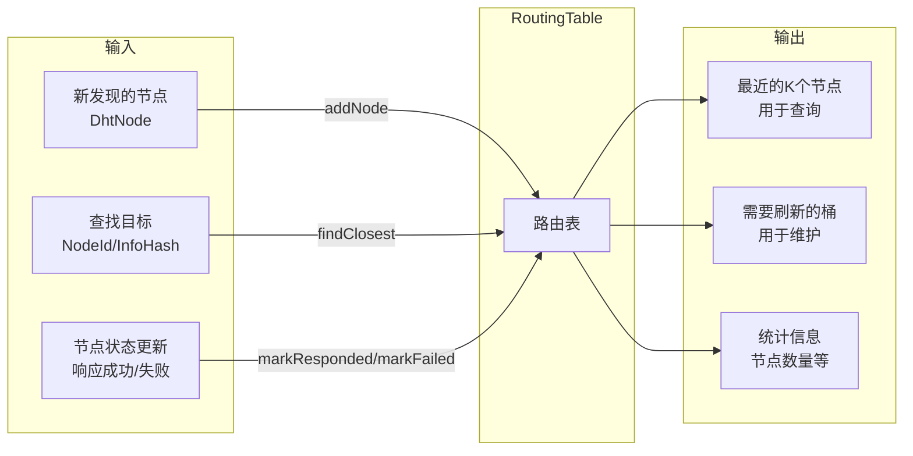

---

## 2. 为什么需要路由表？

### 2.1 问题

DHT 网络有数百万个节点，不可能全部存储。需要一种策略：
- 存储"有用"的节点
- 快速找到"离目标最近"的节点

### 2.2 Kademlia 的解决方案：K-Bucket

**核心思想**：按距离分层存储，近的存得多，远的存得少。

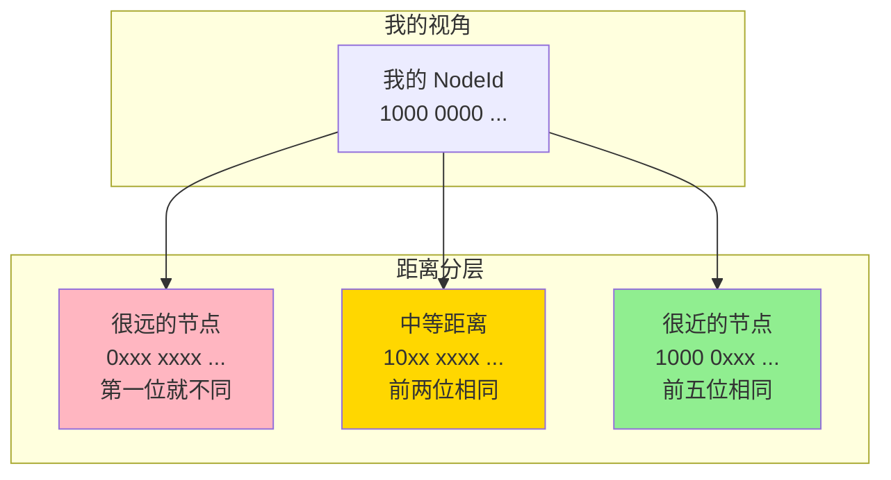

**为什么这样设计？**
- 查找时，总是从近到远逐步逼近目标
- 近的节点更可能在后续查询中用到
- 远的节点只需要少量代表即可

---

## 3. K-Bucket 结构

### 3.1 160 个桶

NodeId 是 160 位，所以有 160 个桶：

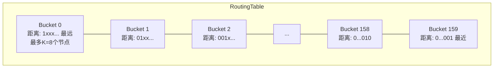

### 3.2 桶索引计算

```
我的 NodeId:    1000 0000 0000 0000 ...
其他节点:       1100 0000 0000 0000 ...
─────────────────────────────────────
XOR 距离:       0100 0000 0000 0000 ...
                 ↑
                 第一个 1 在第 1 位
                 
桶索引 = 159 - 1 = 158
```

**规则**：
- 找到 XOR 距离中第一个 1 的位置（从高位数，0-159）
- 桶索引 = 159 - 该位置
- 距离越小，桶索引越大

### 3.3 每个桶的结构

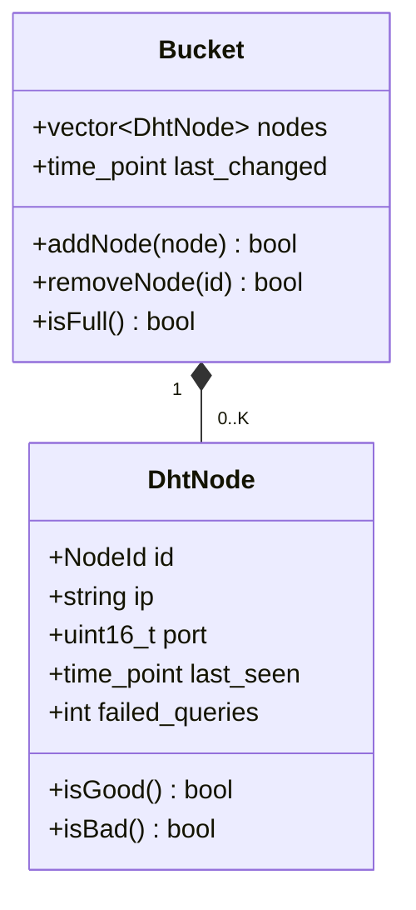

---

## 4. 核心操作

### 4.1 添加节点 (addNode)

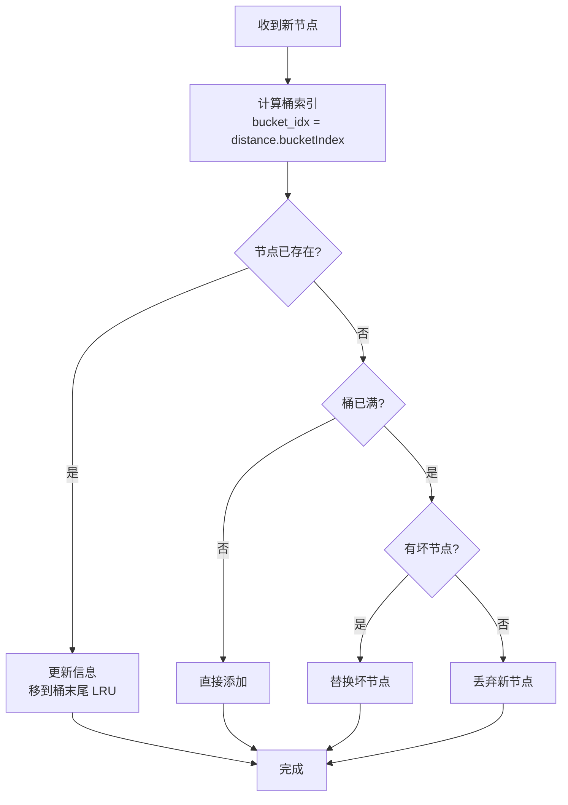

**LRU 策略**：最近响应的节点放在桶末尾，最久未响应的在桶头部。

### 4.2 查找最近节点 (findClosest)

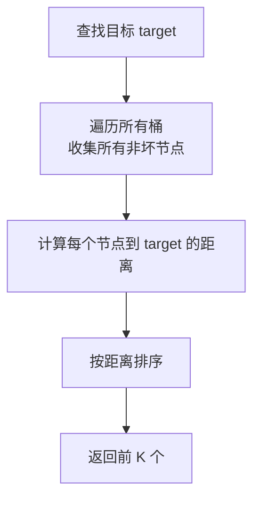

### 4.3 节点状态管理

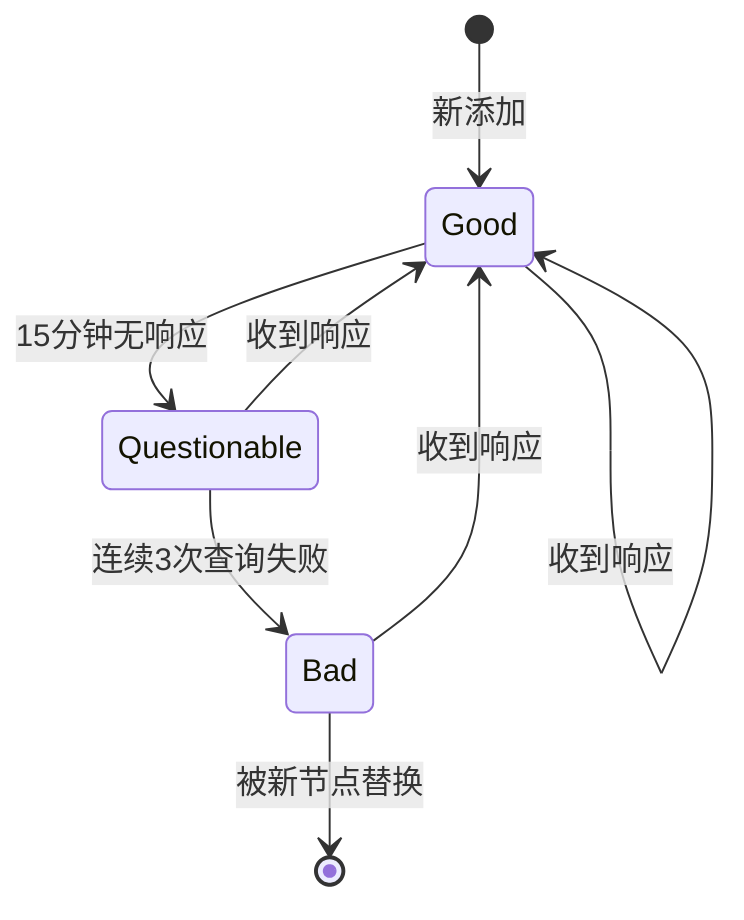

**节点状态定义**：
- **Good**：15 分钟内有响应，且无失败
- **Questionable**：超过 15 分钟未响应，但失败次数 < 3
- **Bad**：连续失败 >= 3 次

---

## 5. 使用场景

### 5.1 场景1：DHT 查询时获取初始节点

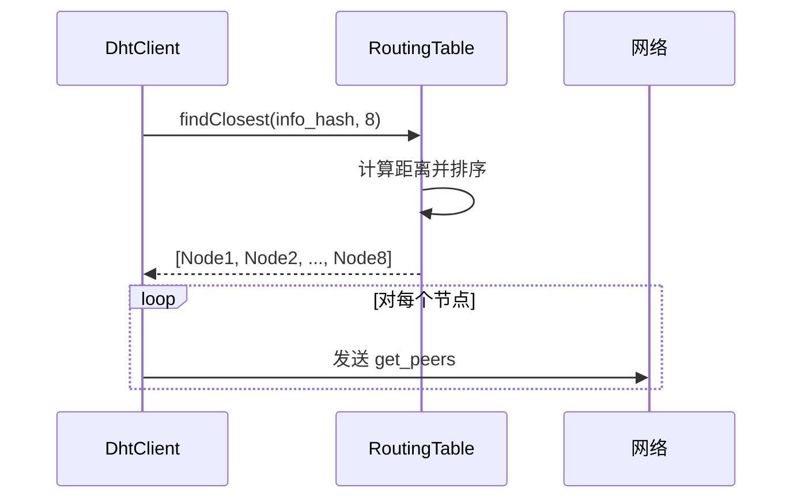

### 5.2 场景2：收到响应后更新路由表

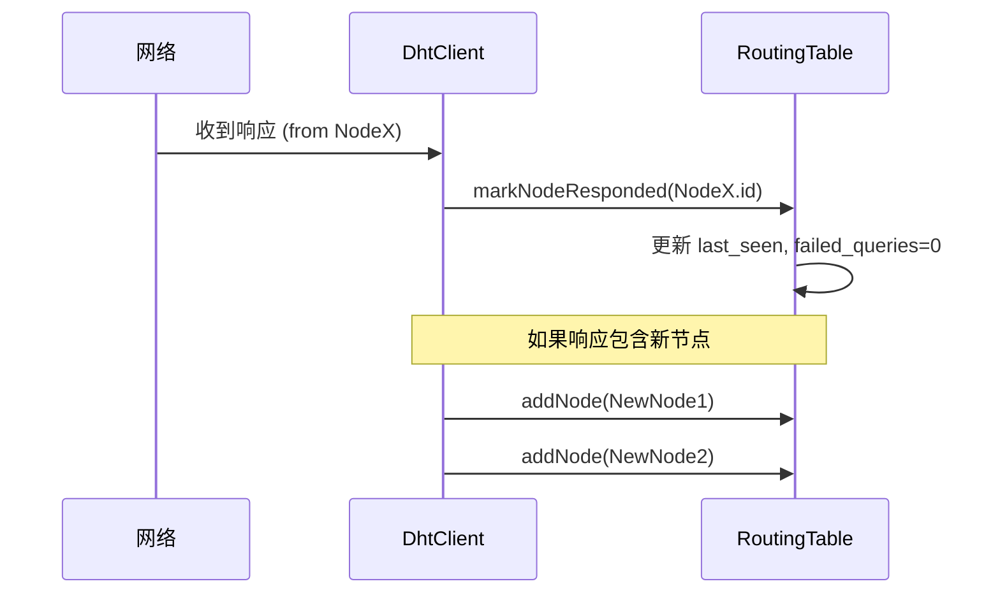

### 5.3 场景3：查询超时后标记失败

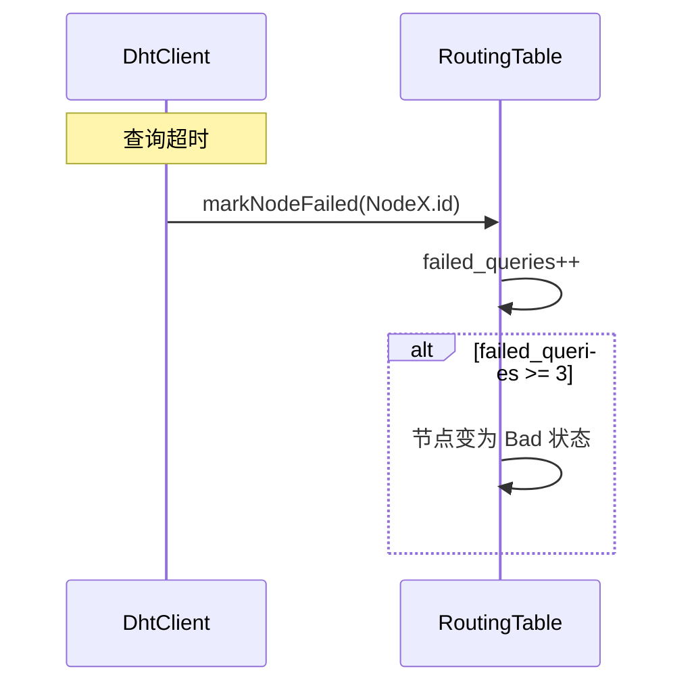

### 5.4 场景4：定期刷新桶

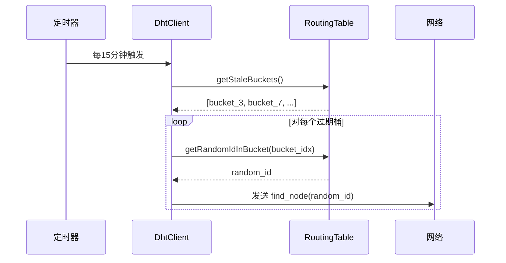

---

## 6. 类设计

### 6.1 UML 类图

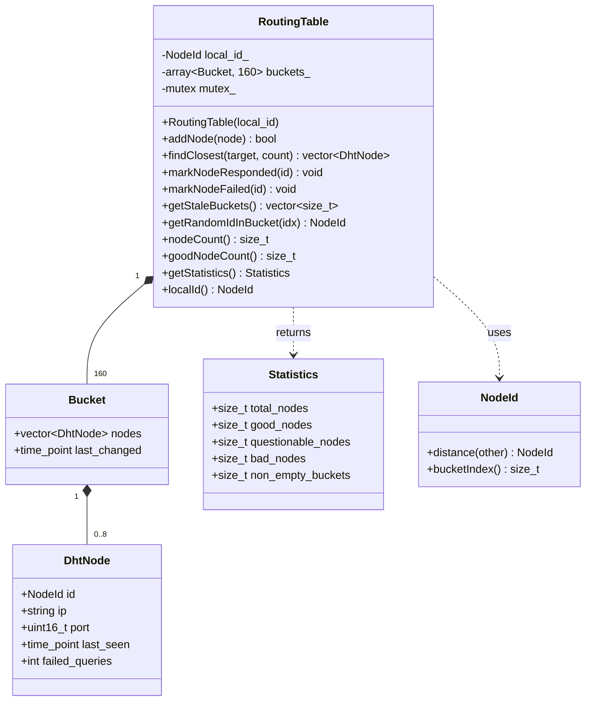

### 6.2 接口定义

```cpp
class RoutingTable {
public:
    static constexpr size_t K = 8;              // 每个桶最多 8 个节点
    static constexpr size_t BUCKET_COUNT = 160; // 160 个桶
    
    // 构造函数
    explicit RoutingTable(const NodeId& local_id);
    
    // ===== 核心操作 =====
    
    // 添加或更新节点
    // 返回 true 如果节点被添加或更新
    bool addNode(const DhtNode& node);
    
    // 查找最近的 K 个节点
    std::vector<DhtNode> findClosest(const NodeId& target, size_t count = K) const;
    
    // ===== 状态管理 =====
    
    // 标记节点响应成功
    void markNodeResponded(const NodeId& id);
    
    // 标记节点查询失败
    void markNodeFailed(const NodeId& id);
    
    // ===== 维护操作 =====
    
    // 获取需要刷新的桶索引（超过 15 分钟未活动）
    std::vector<size_t> getStaleBuckets() const;
    
    // 获取指定桶范围内的随机 NodeId（用于刷新）
    NodeId getRandomIdInBucket(size_t bucket_idx) const;
    
    // ===== 统计信息 =====
    
    size_t nodeCount() const;
    size_t goodNodeCount() const;
    Statistics getStatistics() const;
    const NodeId& localId() const;
    
    struct Statistics {
        size_t total_nodes = 0;
        size_t good_nodes = 0;
        size_t questionable_nodes = 0;
        size_t bad_nodes = 0;
        size_t non_empty_buckets = 0;
    };

private:
    struct Bucket {
        std::vector<DhtNode> nodes;
        std::chrono::steady_clock::time_point last_changed;
    };
    
    NodeId local_id_;
    std::array<Bucket, BUCKET_COUNT> buckets_;
    mutable std::mutex mutex_;  // 线程安全
};
```

---

## 7. 算法详解

### 7.1 addNode 算法

```cpp
bool addNode(const DhtNode& node) {
    // 1. 不添加自己
    if (node.id == local_id_) return false;
    
    // 2. 计算桶索引
    NodeId dist = local_id_.distance(node.id);
    size_t bucket_idx = dist.bucketIndex();
    
    auto& bucket = buckets_[bucket_idx];
    
    // 3. 检查节点是否已存在
    auto it = find_if(bucket.nodes, [&](auto& n) { return n.id == node.id; });
    
    if (it != bucket.nodes.end()) {
        // 3a. 已存在：更新信息，移到末尾（LRU）
        it->ip = node.ip;
        it->port = node.port;
        it->markResponded();
        
        DhtNode updated = *it;
        bucket.nodes.erase(it);
        bucket.nodes.push_back(updated);
        return true;
    }
    
    // 4. 节点不存在
    if (bucket.nodes.size() < K) {
        // 4a. 桶未满：直接添加
        bucket.nodes.push_back(node);
        return true;
    }
    
    // 5. 桶已满：检查是否有坏节点可替换
    auto bad_it = find_if(bucket.nodes, [](auto& n) { return n.isBad(); });
    
    if (bad_it != bucket.nodes.end()) {
        // 5a. 有坏节点：替换
        *bad_it = node;
        return true;
    }
    
    // 6. 桶已满且没有坏节点：丢弃新节点
    return false;
}
```

### 7.2 findClosest 算法

```cpp
vector<DhtNode> findClosest(const NodeId& target, size_t count) const {
    // 1. 收集所有非坏节点及其距离
    vector<pair<NodeId, DhtNode>> candidates;
    
    for (const auto& bucket : buckets_) {
        for (const auto& node : bucket.nodes) {
            if (!node.isBad()) {
                NodeId dist = target.distance(node.id);
                candidates.emplace_back(dist, node);
            }
        }
    }
    
    // 2. 按距离排序（距离小的在前）
    sort(candidates, [](auto& a, auto& b) {
        return a.first < b.first;
    });
    
    // 3. 返回前 count 个
    vector<DhtNode> result;
    for (size_t i = 0; i < min(count, candidates.size()); ++i) {
        result.push_back(candidates[i].second);
    }
    
    return result;
}
```

---

## 8. 线程安全

路由表会被多个线程访问：
- **接收线程**：收到响应后更新节点状态
- **发送线程**：查询时获取最近节点
- **定时器线程**：定期刷新桶

使用 `std::mutex` 保护所有操作：

```cpp
bool addNode(const DhtNode& node) {
    std::lock_guard<std::mutex> lock(mutex_);
    // ... 实际操作
}

vector<DhtNode> findClosest(...) const {
    std::lock_guard<std::mutex> lock(mutex_);
    // ... 实际操作
}
```

---

## 9. 测试用例

### 9.1 基本功能测试

```cpp
// 1. 添加节点
RoutingTable rt(my_id);
DhtNode node(random_id, "192.168.1.1", 6881);
EXPECT_TRUE(rt.addNode(node));
EXPECT_EQ(rt.nodeCount(), 1);

// 2. 不添加自己
DhtNode self(my_id, "127.0.0.1", 6881);
EXPECT_FALSE(rt.addNode(self));

// 3. 更新已存在的节点
node.port = 6882;
EXPECT_TRUE(rt.addNode(node));
EXPECT_EQ(rt.nodeCount(), 1);  // 数量不变
```

### 9.2 桶满测试

```cpp
// 填满一个桶（K=8 个节点）
for (int i = 0; i < 8; ++i) {
    rt.addNode(createNodeInBucket(bucket_idx, i));
}

// 第 9 个节点应该被丢弃
DhtNode extra = createNodeInBucket(bucket_idx, 9);
EXPECT_FALSE(rt.addNode(extra));
```

### 9.3 坏节点替换测试

```cpp
// 标记一个节点为坏
rt.markNodeFailed(node1.id);
rt.markNodeFailed(node1.id);
rt.markNodeFailed(node1.id);  // 3 次失败

// 新节点应该能替换坏节点
DhtNode new_node = createNodeInBucket(bucket_idx, 10);
EXPECT_TRUE(rt.addNode(new_node));
```

### 9.4 findClosest 测试

```cpp
// 添加多个节点
for (int i = 0; i < 20; ++i) {
    rt.addNode(createRandomNode());
}

// 查找最近的 8 个
auto closest = rt.findClosest(target, 8);
EXPECT_LE(closest.size(), 8);

// 验证排序正确（距离递增）
for (size_t i = 1; i < closest.size(); ++i) {
    auto dist_prev = target.distance(closest[i-1].id);
    auto dist_curr = target.distance(closest[i].id);
    EXPECT_LE(dist_prev, dist_curr);
}
```

---

## 10. 文件结构

```
include/magnet/protocols/
└── routing_table.h

src/protocols/
└── routing_table.cpp

tests/protocols/
└── test_routing_table.cpp
```

---

## 11. 依赖关系

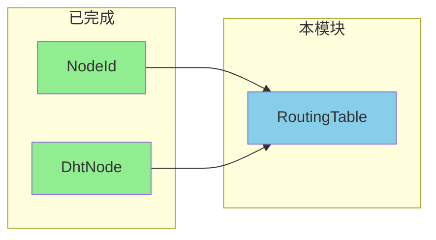

**依赖**：
- `NodeId` - 计算距离、桶索引
- `DhtNode` - 存储节点信息

**不依赖**：
- Bencode
- 网络模块
- DhtMessage

---

## 12. 验收清单

- [ ] 所有测试用例通过
- [ ] 线程安全（使用 mutex）
- [ ] LRU 策略正确实现
- [ ] 坏节点可被替换
- [ ] findClosest 返回正确排序的结果
- [ ] 统计信息准确
- [ ] 无编译警告
