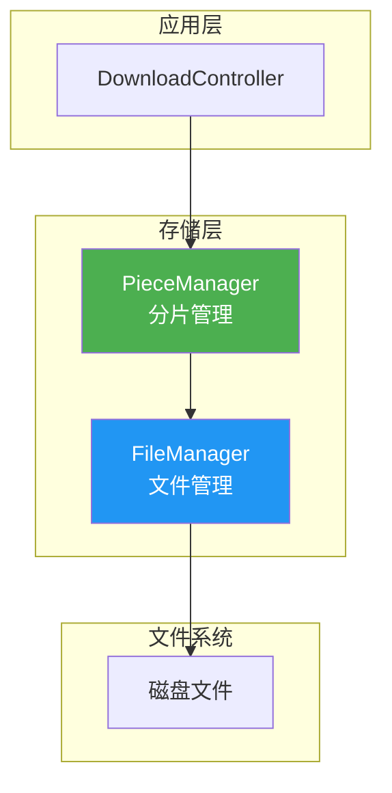
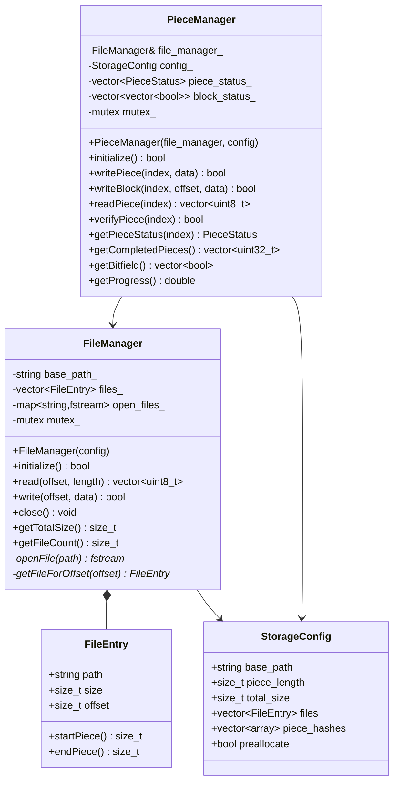
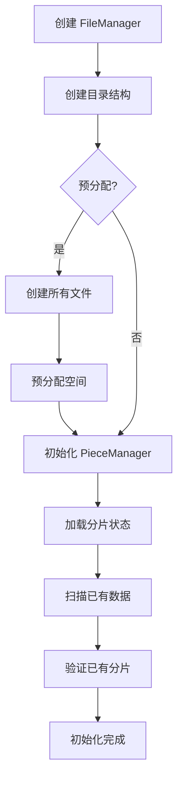
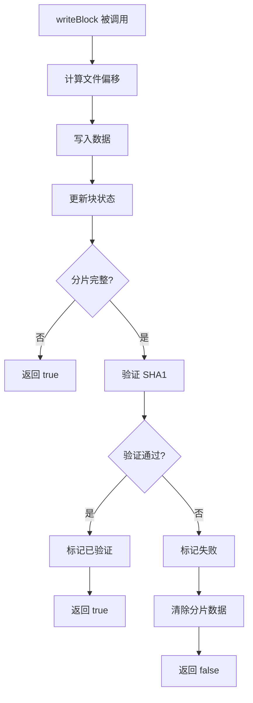
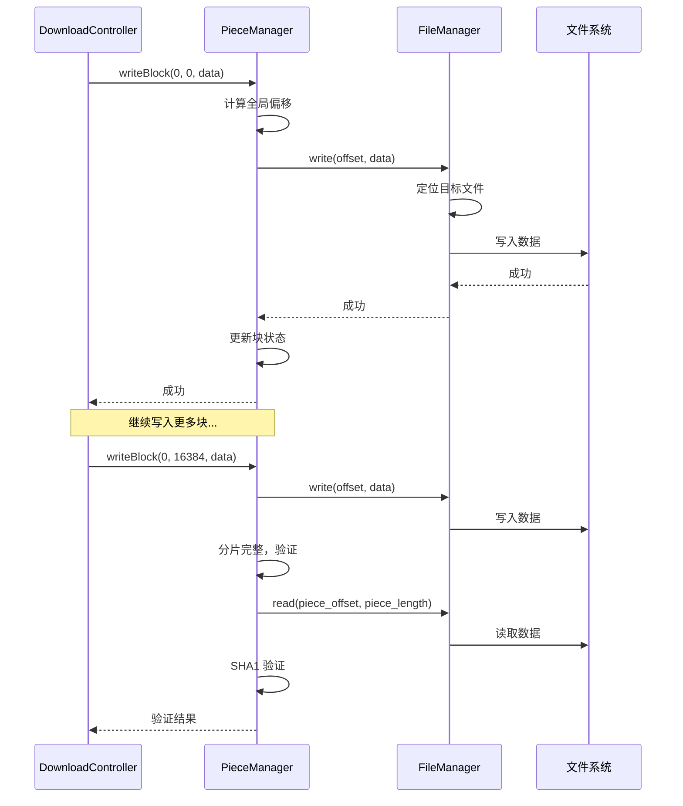

# Storage 存储层设计文档

> **模块名称**：Storage - 文件存储管理  
> **版本**：v1.0  
> **最后更新**：2025-01-12  
> **作者**：MagnetDownload Team

---

## 1. 模块概述

### 1.1 职责定义

Storage 层负责 **文件和分片数据的持久化存储**：
- 创建和管理下载文件
- 分片数据的写入和读取
- 分片完整性验证
- 磁盘空间预分配

### 1.2 在架构中的位置



### 1.3 设计原则

| 原则 | 说明 |
|------|------|
| **分层设计** | PieceManager 管理分片逻辑，FileManager 管理文件 IO |
| **预分配** | 预先分配磁盘空间，避免碎片 |
| **异步 IO** | 大文件操作异步执行 |
| **内存映射** | 可选使用 mmap 提高性能 |

---

## 2. 核心组件

### 2.1 FileManager（文件管理器）

负责底层文件操作：
- 创建/打开/关闭文件
- 读写指定偏移的数据
- 预分配空间
- 文件校验

### 2.2 PieceManager（分片管理器）

负责分片逻辑：
- 分片到文件的映射
- 分片状态跟踪
- 块（Block）管理
- SHA1 验证

---

## 3. 数据结构

### 3.1 文件信息

```cpp
struct FileEntry {
    std::string path;           // 相对路径
    size_t size;                // 文件大小
    size_t offset;              // 在所有文件中的起始偏移
    
    // 计算属性
    size_t startPiece() const;  // 起始分片索引
    size_t endPiece() const;    // 结束分片索引
};
```

### 3.2 分片信息

```cpp
struct PieceData {
    uint32_t index;
    std::vector<uint8_t> data;
    std::array<uint8_t, 20> expected_hash;
    
    bool verify() const;        // SHA1 验证
};
```

### 3.3 存储配置

```cpp
struct StorageConfig {
    std::string base_path;              // 保存目录
    size_t piece_length{0};             // 分片大小
    size_t total_size{0};               // 总大小
    std::vector<FileEntry> files;       // 文件列表
    std::vector<std::array<uint8_t, 20>> piece_hashes; // 分片哈希
    
    bool preallocate{true};             // 是否预分配
    size_t write_buffer_size{1024*1024};// 写缓冲大小
};
```

### 3.4 分片状态

```cpp
enum class PieceStatus {
    Missing,        // 未下载
    Partial,        // 部分下载
    Complete,       // 下载完成
    Verified        // 已验证
};
```

---

## 4. 类图



---

## 5. 核心流程

### 5.1 初始化流程



### 5.2 写入分片流程



### 5.3 分片到文件映射

```
总数据:    [-------- 分片 0 --------][-------- 分片 1 --------][...]
           |<-- piece_length -->|

文件:      [--- 文件A ---][-------- 文件B --------][- 文件C -]
           |<- size_a ->|  |<------ size_b ------>|  |< size_c >|

偏移计算:
  piece_offset = index * piece_length
  file_offset  = piece_offset - file.offset
```

---

## 6. 时序图

### 6.1 下载写入时序



---

## 7. 多文件处理

### 7.1 跨文件分片

一个分片可能跨越多个文件：

```
分片 N:  [===== 文件 A 尾部 =====|===== 文件 B 头部 =====]
         |<-- 写入 A -->|       |<-- 写入 B -->|
```

### 7.2 处理逻辑

```cpp
bool FileManager::write(size_t offset, const std::vector<uint8_t>& data) {
    size_t remaining = data.size();
    size_t data_offset = 0;
    
    while (remaining > 0) {
        // 找到包含当前偏移的文件
        auto* file = getFileForOffset(offset);
        
        // 计算可写入的长度
        size_t file_offset = offset - file->offset;
        size_t can_write = std::min(remaining, file->size - file_offset);
        
        // 写入
        writeToFile(file->path, file_offset, 
                    data.data() + data_offset, can_write);
        
        offset += can_write;
        data_offset += can_write;
        remaining -= can_write;
    }
    return true;
}
```

---

## 8. 公共 API

### 8.1 FileManager

```cpp
namespace magnet::storage {

class FileManager {
public:
    explicit FileManager(const StorageConfig& config);
    ~FileManager();
    
    // 初始化（创建目录和文件）
    bool initialize();
    
    // 读写操作
    std::vector<uint8_t> read(size_t offset, size_t length);
    bool write(size_t offset, const std::vector<uint8_t>& data);
    
    // 文件管理
    void close();
    bool exists() const;
    size_t getTotalSize() const;
    size_t getFileCount() const;
    const std::vector<FileEntry>& getFiles() const;
};

} // namespace magnet::storage
```

### 8.2 PieceManager

```cpp
namespace magnet::storage {

class PieceManager {
public:
    PieceManager(FileManager& file_manager, const StorageConfig& config);
    ~PieceManager();
    
    // 初始化
    bool initialize();
    
    // 分片操作
    bool writePiece(uint32_t index, const std::vector<uint8_t>& data);
    bool writeBlock(uint32_t piece_index, uint32_t offset, 
                    const std::vector<uint8_t>& data);
    std::vector<uint8_t> readPiece(uint32_t index);
    
    // 验证
    bool verifyPiece(uint32_t index);
    bool verifyAll();
    
    // 状态查询
    PieceStatus getPieceStatus(uint32_t index) const;
    std::vector<uint32_t> getCompletedPieces() const;
    std::vector<uint32_t> getMissingPieces() const;
    std::vector<bool> getBitfield() const;
    
    // 进度
    size_t getCompletedCount() const;
    size_t getTotalCount() const;
    double getProgress() const;
    size_t getDownloadedBytes() const;
};

} // namespace magnet::storage
```

---

## 9. 使用示例

```cpp
// 配置
StorageConfig config;
config.base_path = "/downloads/MyTorrent";
config.piece_length = 262144;  // 256KB
config.total_size = 1024 * 1024 * 100;  // 100MB
config.files = {
    {"file1.txt", 50 * 1024 * 1024, 0},
    {"file2.txt", 50 * 1024 * 1024, 50 * 1024 * 1024}
};
config.piece_hashes = {...};

// 初始化
FileManager file_manager(config);
file_manager.initialize();

PieceManager piece_manager(file_manager, config);
piece_manager.initialize();

// 写入数据块
piece_manager.writeBlock(0, 0, block_data);
piece_manager.writeBlock(0, 16384, block_data2);

// 检查进度
std::cout << "Progress: " << piece_manager.getProgress() * 100 << "%\n";
```

---

## 10. 实现检查清单

### 10.1 FileManager

- [ ] 构造函数（存储配置）
- [ ] `initialize()` - 创建目录和文件
- [ ] `read()` - 读取数据
- [ ] `write()` - 写入数据
- [ ] `close()` - 关闭所有文件
- [ ] 多文件支持

### 10.2 PieceManager

- [ ] 构造函数
- [ ] `initialize()` - 初始化分片状态
- [ ] `writePiece()` - 写入完整分片
- [ ] `writeBlock()` - 写入数据块
- [ ] `readPiece()` - 读取分片
- [ ] `verifyPiece()` - SHA1 验证
- [ ] 状态查询方法
- [ ] 进度统计方法

---

**设计文档完成，可以开始实现！**

