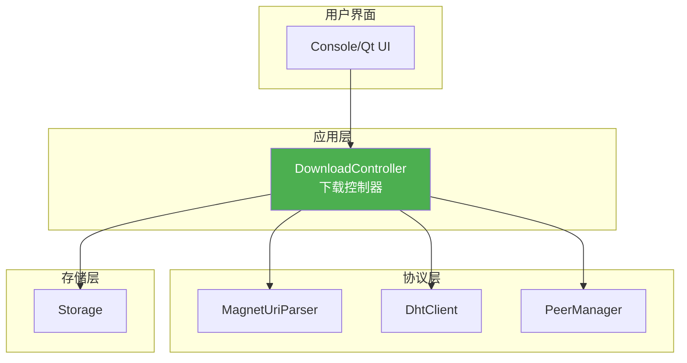
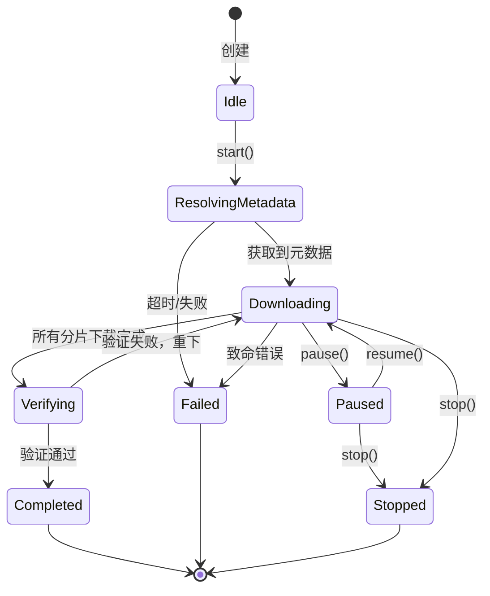
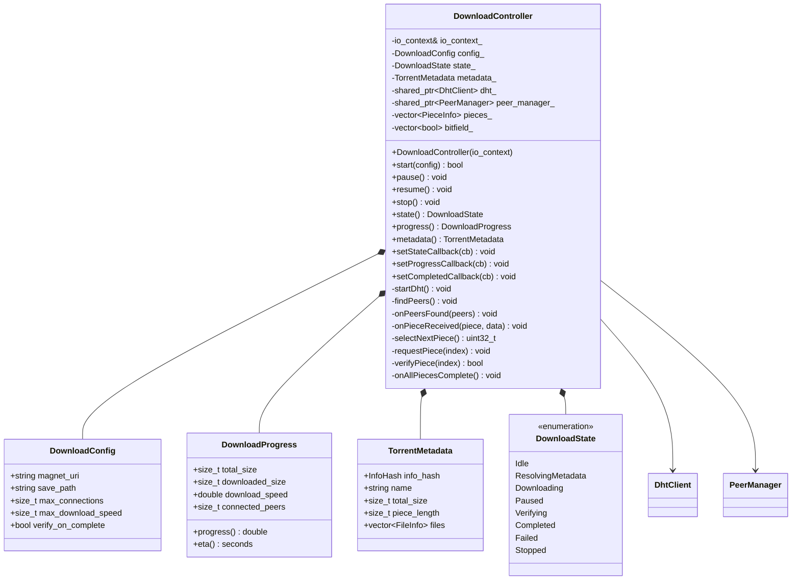
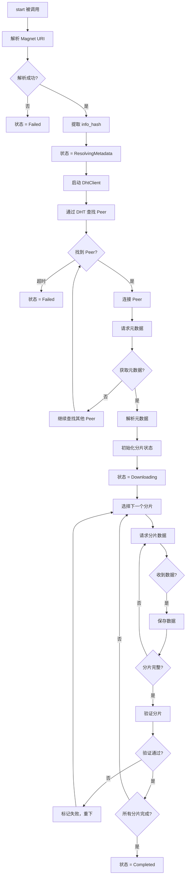
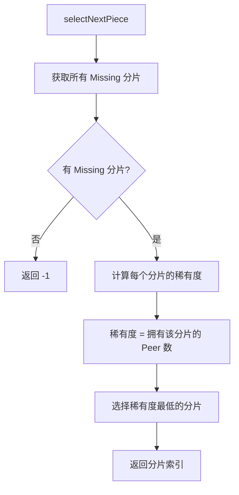
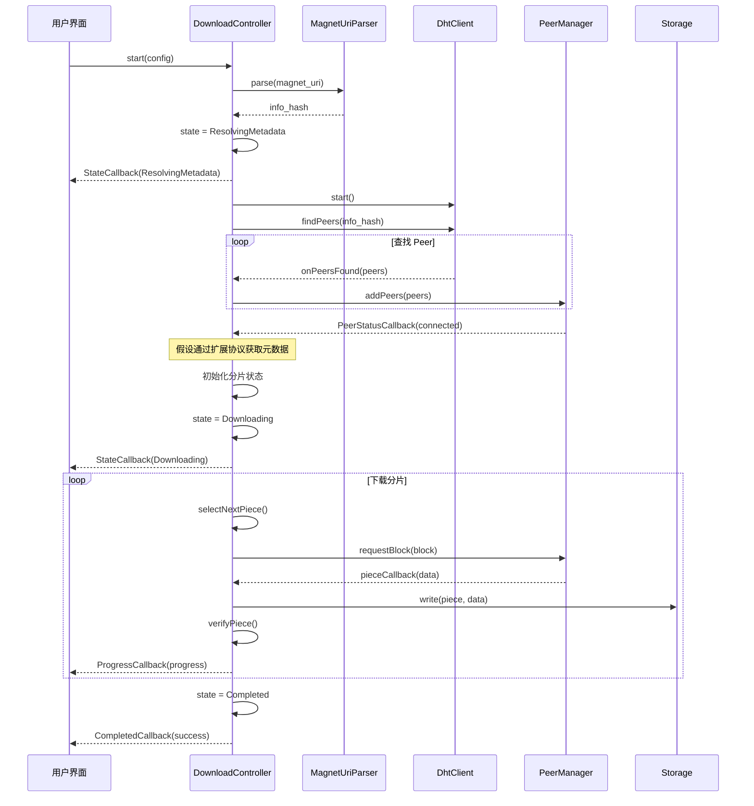
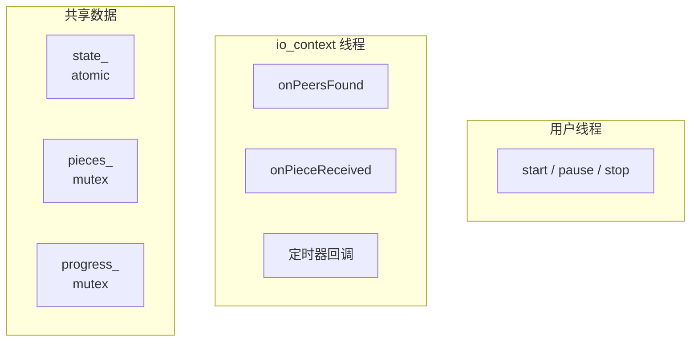

# DownloadController 设计文档

> **模块名称**：DownloadController - 下载控制器  
> **版本**：v1.0  
> **最后更新**：2025-01-12  
> **作者**：MagnetDownload Team

---

## 1. 模块概述

### 1.1 职责定义

DownloadController 是**核心业务控制器**，负责协调所有底层模块完成磁力链接下载：
- 解析 Magnet URI，提取 info_hash
- 通过 DHT 网络查找 Peer
- 管理 Peer 连接和数据下载
- 管理分片状态和数据验证
- 协调存储层写入文件

### 1.2 在架构中的位置



### 1.3 设计原则

| 原则 | 说明 |
|------|------|
| **单一入口** | 对外提供简单的下载接口 |
| **事件驱动** | 基于回调通知进度和状态 |
| **状态机** | 清晰的下载状态转换 |
| **可暂停** | 支持暂停/恢复下载 |

---

## 2. 下载状态机

### 2.1 状态定义



### 2.2 状态说明

| 状态 | 说明 |
|------|------|
| `Idle` | 初始状态，等待启动 |
| `ResolvingMetadata` | 正在获取种子元数据（文件列表、分片信息） |
| `Downloading` | 正在下载数据 |
| `Paused` | 已暂停 |
| `Verifying` | 验证已下载的分片 |
| `Completed` | 下载完成 |
| `Failed` | 下载失败 |
| `Stopped` | 用户停止 |

---

## 3. 核心数据结构

### 3.1 下载任务配置

```cpp
struct DownloadConfig {
    std::string magnet_uri;             // 磁力链接
    std::string save_path;              // 保存路径
    
    size_t max_connections{50};         // 最大连接数
    size_t max_download_speed{0};       // 最大下载速度 (0=无限制)
    size_t max_upload_speed{0};         // 最大上传速度
    
    bool verify_on_complete{true};      // 完成后验证
    bool auto_start{true};              // 自动开始
    
    std::chrono::seconds metadata_timeout{300}; // 元数据获取超时
};
```

### 3.2 下载进度

```cpp
struct DownloadProgress {
    size_t total_size{0};           // 总大小（字节）
    size_t downloaded_size{0};      // 已下载大小
    size_t uploaded_size{0};        // 已上传大小
    
    size_t total_pieces{0};         // 总分片数
    size_t completed_pieces{0};     // 已完成分片数
    size_t pending_pieces{0};       // 等待中的分片数
    
    double download_speed{0};       // 下载速度 (bytes/s)
    double upload_speed{0};         // 上传速度 (bytes/s)
    
    size_t connected_peers{0};      // 已连接 Peer 数
    size_t total_peers{0};          // 已知 Peer 总数
    
    double progress() const {
        return total_size > 0 ? 
            static_cast<double>(downloaded_size) / total_size : 0;
    }
    
    std::chrono::seconds eta() const {
        if (download_speed <= 0) return std::chrono::seconds::max();
        size_t remaining = total_size - downloaded_size;
        return std::chrono::seconds(static_cast<long long>(remaining / download_speed));
    }
};
```

### 3.3 种子元数据

```cpp
struct TorrentMetadata {
    InfoHash info_hash;
    std::string name;                   // 文件/目录名
    size_t total_size{0};               // 总大小
    size_t piece_length{0};             // 分片大小
    size_t piece_count{0};              // 分片数量
    std::vector<std::array<uint8_t, 20>> piece_hashes; // 每个分片的 SHA1
    
    struct FileInfo {
        std::string path;               // 相对路径
        size_t size;                    // 文件大小
        size_t start_piece;             // 起始分片
        size_t end_piece;               // 结束分片
    };
    std::vector<FileInfo> files;        // 文件列表
    
    bool isValid() const {
        return !name.empty() && total_size > 0 && piece_length > 0;
    }
};
```

### 3.4 分片状态

```cpp
enum class PieceState {
    Missing,        // 未下载
    Pending,        // 正在下载
    Downloaded,     // 已下载，待验证
    Verified,       // 已验证
    Failed          // 验证失败
};

struct PieceInfo {
    uint32_t index;
    PieceState state{PieceState::Missing};
    size_t size{0};
    size_t downloaded{0};
    std::vector<bool> blocks;   // 块下载状态
};
```

### 3.5 回调类型

```cpp
// 状态变化回调
using StateCallback = std::function<void(DownloadState state)>;

// 进度更新回调
using ProgressCallback = std::function<void(const DownloadProgress& progress)>;

// 完成回调
using CompletedCallback = std::function<void(bool success, const std::string& error)>;

// 元数据获取回调
using MetadataCallback = std::function<void(const TorrentMetadata& metadata)>;
```

---

## 4. 类图



---

## 5. 核心流程

### 5.1 完整下载流程



### 5.2 分片选择算法



**稀有优先算法（Rarest First）**：
- 优先下载稀有分片，提高整体可用性
- 避免所有人都下载相同分片导致的拥堵

---

## 6. 时序图

### 6.1 完整下载时序



---

## 7. 块请求管理

### 7.1 块大小

标准 BitTorrent 块大小为 **16KB (16384 字节)**。

```cpp
static constexpr size_t kBlockSize = 16384;  // 16KB
```

### 7.2 请求队列

每个分片分成多个块并行请求：

```cpp
// 计算分片的块数
size_t getBlockCount(uint32_t piece_index) const {
    size_t piece_size = getPieceSize(piece_index);
    return (piece_size + kBlockSize - 1) / kBlockSize;
}

// 生成块请求
std::vector<BlockInfo> getBlocksForPiece(uint32_t piece_index) const {
    std::vector<BlockInfo> blocks;
    size_t piece_size = getPieceSize(piece_index);
    
    for (size_t offset = 0; offset < piece_size; offset += kBlockSize) {
        size_t block_size = std::min(kBlockSize, piece_size - offset);
        blocks.push_back({piece_index, static_cast<uint32_t>(offset), 
                          static_cast<uint32_t>(block_size)});
    }
    
    return blocks;
}
```

---

## 8. 元数据获取

### 8.1 BEP-9: 元数据扩展

对于只有 Magnet 链接的情况，需要通过 **BEP-9 (Extension for Peers to Send Metadata Files)** 获取种子元数据。

> **简化实现**：本版本假设 Magnet URI 中包含足够的信息，或者通过其他方式预先获取元数据。完整的 BEP-9 实现可作为后续扩展。

### 8.2 简化方案

```cpp
// 当前简化：假设已知元数据或从外部获取
void DownloadController::setMetadata(const TorrentMetadata& metadata) {
    metadata_ = metadata;
    initializePieces();
    setState(DownloadState::Downloading);
}
```

---

## 9. 线程安全

### 9.1 线程模型



### 9.2 锁策略

| 数据 | 保护方式 |
|------|----------|
| `state_` | `std::atomic` |
| `pieces_` | `std::mutex` |
| `metadata_` | `std::mutex` |
| `progress_` | `std::mutex` |

---

## 10. 公共 API

```cpp
namespace magnet::application {

class DownloadController : public std::enable_shared_from_this<DownloadController> {
public:
    // ========== 构造 ==========
    explicit DownloadController(asio::io_context& io_context);
    ~DownloadController();
    
    // ========== 生命周期 ==========
    bool start(const DownloadConfig& config);
    void pause();
    void resume();
    void stop();
    
    // ========== 状态查询 ==========
    DownloadState state() const;
    DownloadProgress progress() const;
    const TorrentMetadata& metadata() const;
    
    // ========== 回调设置 ==========
    void setStateCallback(StateCallback callback);
    void setProgressCallback(ProgressCallback callback);
    void setCompletedCallback(CompletedCallback callback);
    void setMetadataCallback(MetadataCallback callback);
    
    // ========== 元数据设置（简化版） ==========
    void setMetadata(const TorrentMetadata& metadata);
};

} // namespace magnet::application
```

---

## 11. 使用示例

```cpp
auto controller = std::make_shared<DownloadController>(io_context);

// 设置回调
controller->setStateCallback([](DownloadState state) {
    std::cout << "State: " << stateToString(state) << "\n";
});

controller->setProgressCallback([](const DownloadProgress& p) {
    std::cout << "Progress: " << (p.progress() * 100) << "% "
              << "Speed: " << (p.download_speed / 1024) << " KB/s\n";
});

controller->setCompletedCallback([](bool success, const std::string& error) {
    if (success) {
        std::cout << "Download completed!\n";
    } else {
        std::cout << "Download failed: " << error << "\n";
    }
});

// 配置并启动
DownloadConfig config;
config.magnet_uri = "magnet:?xt=urn:btih:...";
config.save_path = "/downloads/";

controller->start(config);

// 运行事件循环
io_context.run();
```

---

## 12. 实现检查清单

### 12.1 必须实现

- [ ] 构造函数和析构函数
- [ ] `start()` - 启动下载
- [ ] `pause()` / `resume()` - 暂停/恢复
- [ ] `stop()` - 停止下载
- [ ] `state()` / `progress()` / `metadata()`
- [ ] 所有回调设置方法

### 12.2 内部实现

- [ ] `initializeDht()` - 初始化 DHT
- [ ] `findPeers()` - 查找 Peer
- [ ] `onPeersFound()` - Peer 发现回调
- [ ] `onPieceReceived()` - 收到数据块
- [ ] `selectNextPiece()` - 分片选择算法
- [ ] `requestPiece()` - 请求分片
- [ ] `verifyPiece()` - 验证分片
- [ ] `updateProgress()` - 更新进度
- [ ] `checkCompletion()` - 检查是否完成

---

**设计文档完成，可以开始实现！**

