# TcpClient 设计文档

> **模块名称**：TcpClient - TCP 客户端  
> **版本**：v1.0  
> **最后更新**：2025-01-12  
> **作者**：MagnetDownload Team

---

## 1. 模块概述

### 1.1 职责定义

TcpClient 是网络层的基础组件，负责提供**异步的 TCP 通信能力**。它将被 PeerConnection 用于与 BitTorrent Peer 进行数据传输。

### 1.2 与 UdpClient 的区别

| 特性 | UdpClient | TcpClient |
|------|-----------|-----------|
| **连接模式** | 无连接，任意发送 | 面向连接，先连接后通信 |
| **可靠性** | 不保证送达 | 保证有序、可靠送达 |
| **数据边界** | 保留消息边界 | 字节流，无边界 |
| **用途** | DHT 查询 | Peer 数据传输 |
| **生命周期** | 创建即可用 | 需要 connect → 通信 → close |

### 1.3 为什么需要 TcpClient？

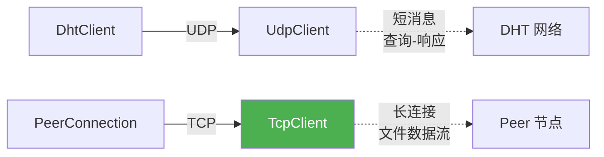

BitTorrent 协议要求：
- **可靠传输**：文件数据不能丢失或乱序
- **持久连接**：与 Peer 保持长连接，持续传输
- **流量控制**：TCP 内置拥塞控制，适合大数据传输

---

## 2. 设计目标

### 2.1 功能目标

| 目标 | 说明 |
|------|------|
| **异步连接** | 非阻塞的 connect 操作 |
| **异步读写** | 非阻塞的 send/receive 操作 |
| **连接管理** | 连接状态跟踪、断线检测 |
| **统计信息** | 字节数、消息数、错误数统计 |

### 2.2 非功能目标

| 目标 | 说明 |
|------|------|
| **线程安全** | 所有公共方法可从任意线程调用 |
| **异常安全** | 不抛出异常，通过回调报告错误 |
| **资源安全** | RAII 管理，析构时自动清理 |
| **高性能** | 零拷贝设计（尽可能） |

---

## 3. 架构设计

### 3.1 状态机

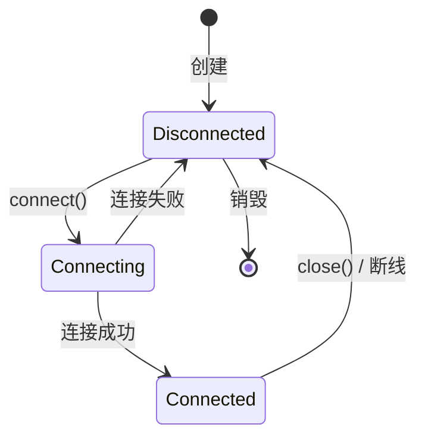

### 3.2 与其他模块的关系

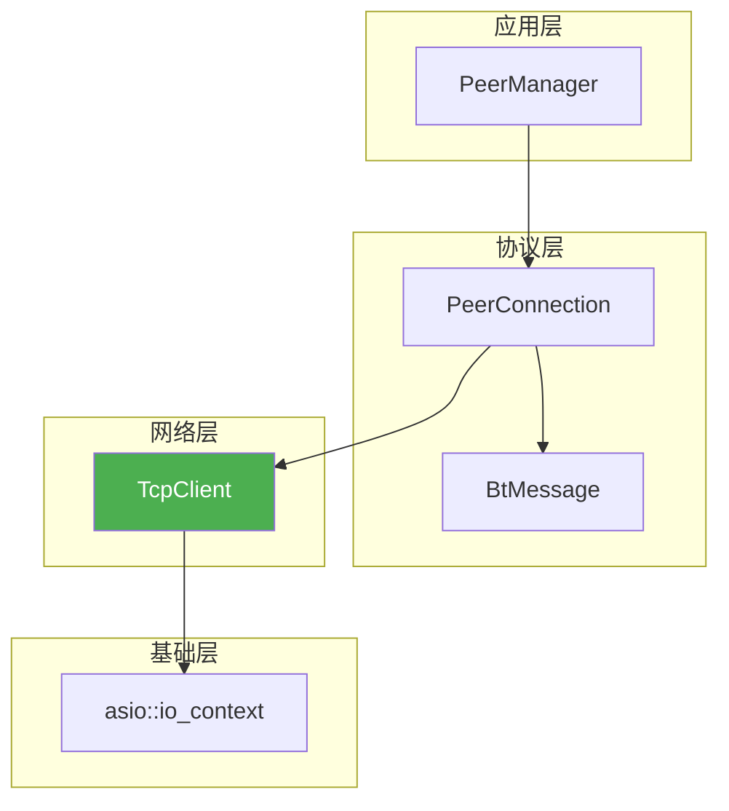

---

## 4. 核心数据结构

### 4.1 TCP 端点

```cpp
// 复用已有的 UdpEndpoint，或定义 TcpEndpoint
using TcpEndpoint = UdpEndpoint;  // IP + Port，结构相同
```

### 4.2 连接状态

```cpp
enum class TcpConnectionState {
    Disconnected,   // 未连接
    Connecting,     // 连接中
    Connected,      // 已连接
    Closing         // 关闭中
};
```

### 4.3 统计信息

```cpp
struct TcpStatistics {
    size_t bytes_sent{0};           // 发送的总字节数
    size_t bytes_received{0};       // 接收的总字节数
    size_t messages_sent{0};        // 发送次数
    size_t messages_received{0};    // 接收次数
    size_t connect_attempts{0};     // 连接尝试次数
    size_t connect_failures{0};     // 连接失败次数
    size_t send_errors{0};          // 发送错误次数
    size_t receive_errors{0};       // 接收错误次数
    
    std::chrono::steady_clock::time_point connect_time;  // 连接建立时间
    
    void reset();
};
```

### 4.4 回调类型

```cpp
// 连接完成回调
using ConnectCallback = std::function<void(const asio::error_code& ec)>;

// 发送完成回调
using SendCallback = std::function<void(const asio::error_code& ec, size_t bytes_sent)>;

// 接收数据回调
using ReceiveCallback = std::function<void(const asio::error_code& ec, 
                                           const std::vector<uint8_t>& data)>;

// 连接断开回调
using DisconnectCallback = std::function<void(const asio::error_code& ec)>;
```

---

## 5. 类图

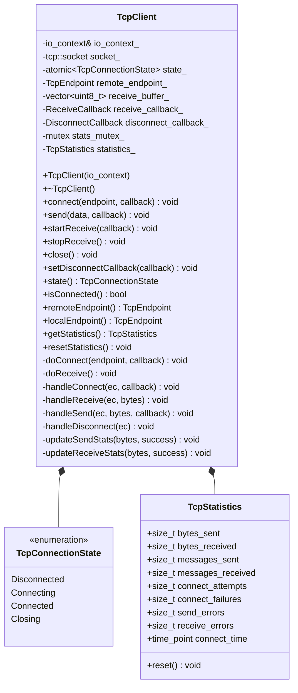

---

## 6. 核心流程

### 6.1 连接流程

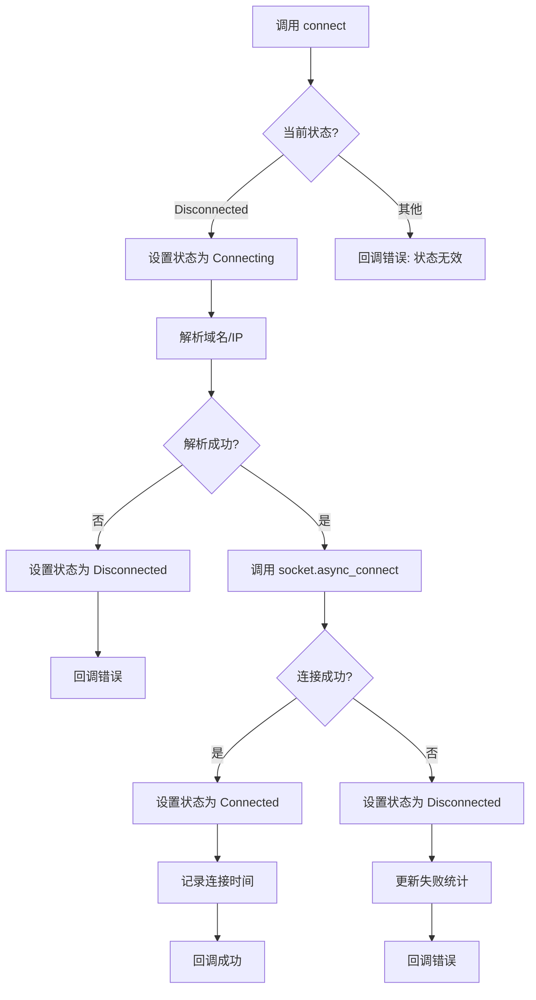

### 6.2 发送流程

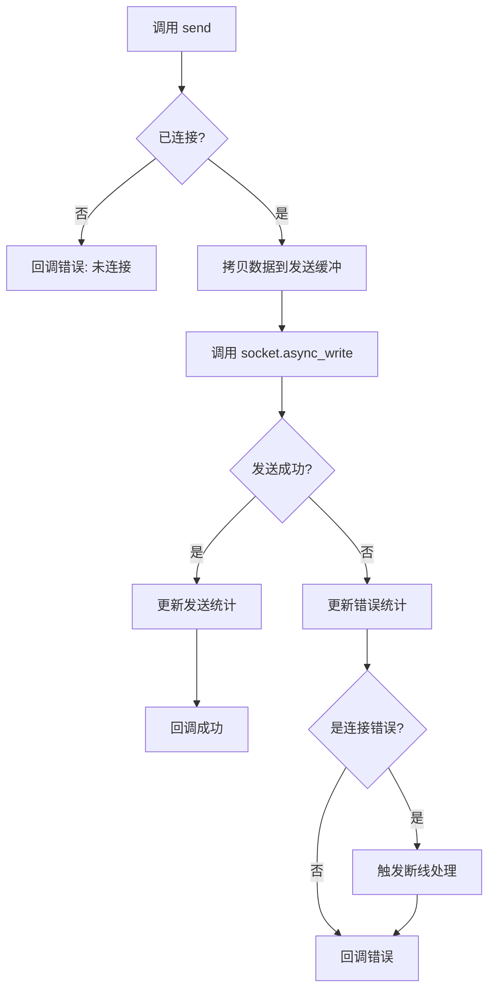

### 6.3 接收流程

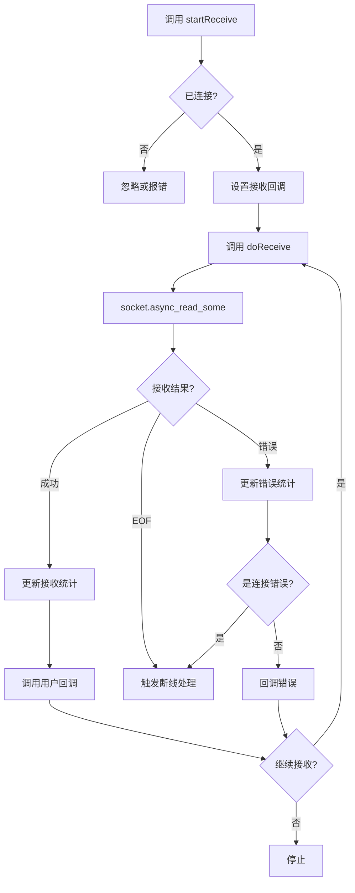

### 6.4 断线处理流程

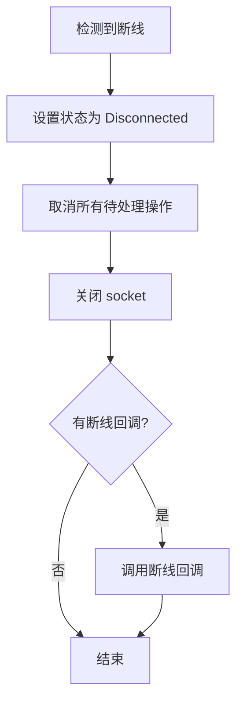

---

## 7. 时序图

### 7.1 完整的连接-通信-断开流程

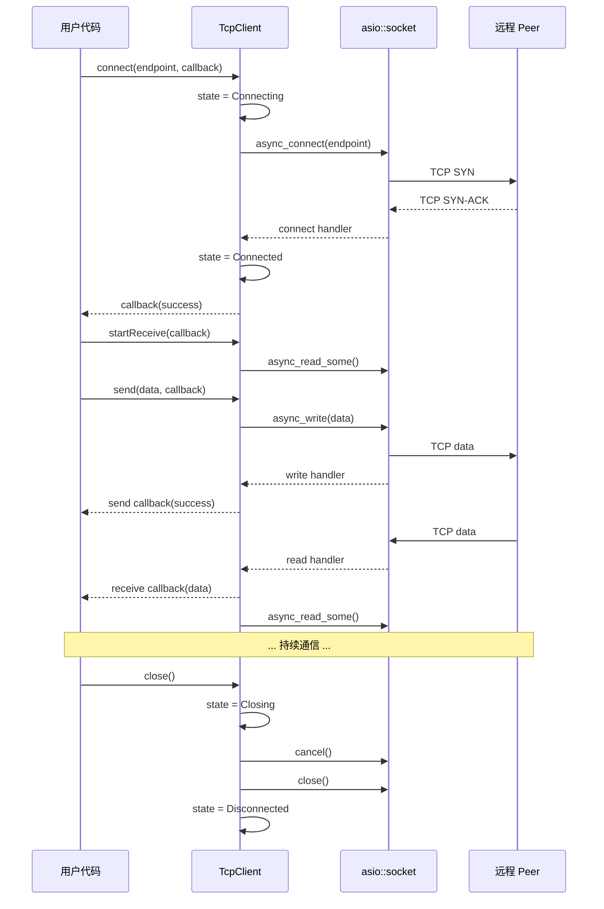

### 7.2 断线检测和恢复

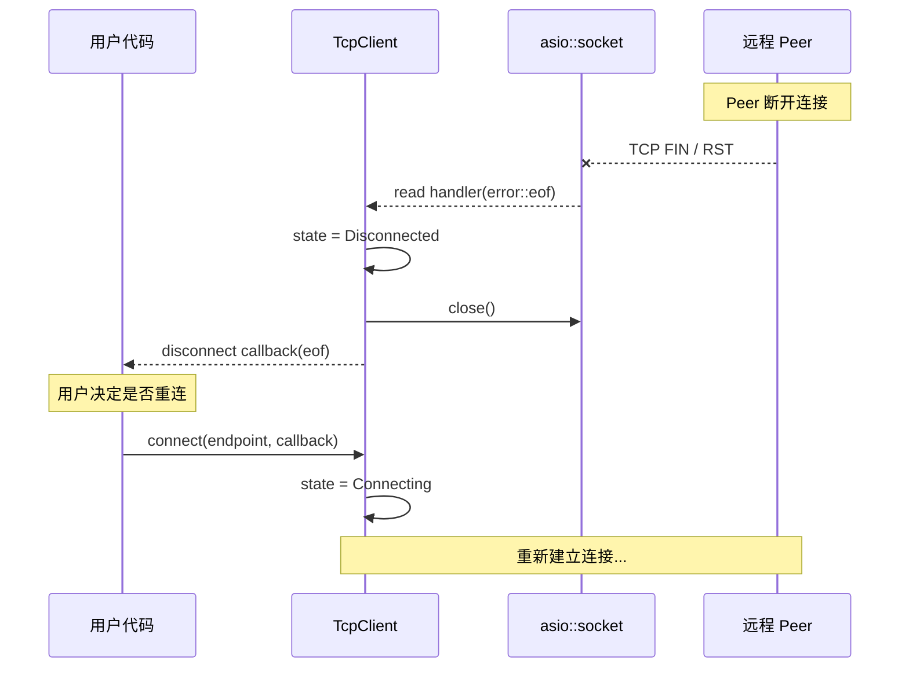

---

## 8. 线程安全设计

### 8.1 线程模型

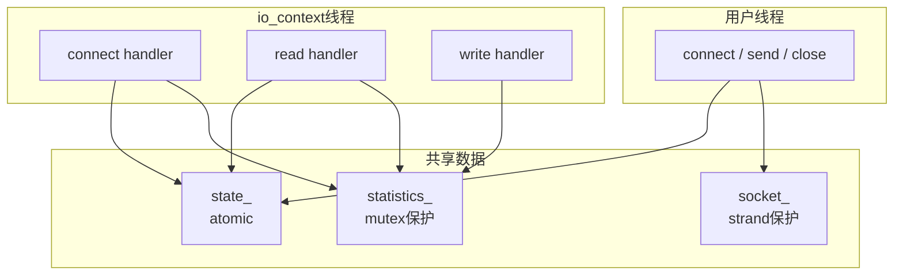

### 8.2 同步策略

| 数据 | 保护方式 | 说明 |
|------|----------|------|
| `state_` | `std::atomic` | 状态频繁读取，用原子变量 |
| `statistics_` | `std::mutex` | 统计信息，低频访问 |
| `socket_` | asio strand 或串行化 | socket 操作本身不是线程安全的 |
| `receive_buffer_` | 无需保护 | 只在 io_context 线程中使用 |

### 8.3 关键原则

1. **所有回调都在 io_context 线程中执行**
2. **公共方法通过 `asio::post()` 提交到 io_context**
3. **状态检查使用原子变量，避免锁竞争**

---

## 9. 错误处理

### 9.1 错误分类

| 错误类型 | 场景 | 处理方式 |
|----------|------|----------|
| **连接错误** | 连接超时、拒绝、不可达 | 回调报错，状态变为 Disconnected |
| **发送错误** | 连接断开、缓冲区满 | 回调报错，可能触发断线 |
| **接收错误** | EOF、连接重置 | 触发断线回调 |
| **状态错误** | 未连接时发送 | 立即回调错误 |

### 9.2 典型错误码

```cpp
// asio::error::* 常见错误
asio::error::connection_refused   // 连接被拒绝
asio::error::connection_reset     // 连接被重置
asio::error::eof                  // 对端关闭
asio::error::timed_out            // 超时
asio::error::operation_aborted    // 操作被取消
```

### 9.3 错误恢复

```cpp
void TcpClient::handleReceive(const asio::error_code& ec, size_t bytes) {
    if (ec == asio::error::eof || 
        ec == asio::error::connection_reset) {
        // 连接断开，触发断线处理
        handleDisconnect(ec);
        return;
    }
    
    if (ec == asio::error::operation_aborted) {
        // 操作被取消（通常是主动 close），忽略
        return;
    }
    
    if (ec) {
        // 其他错误，报告但继续尝试接收
        updateReceiveStats(0, false);
        if (receive_callback_) {
            receive_callback_(ec, {});
        }
    }
    
    // 继续接收
    if (state_ == TcpConnectionState::Connected) {
        doReceive();
    }
}
```

---

## 10. 公共 API

```cpp
namespace magnet::network {

class TcpClient : public std::enable_shared_from_this<TcpClient> {
public:
    // ========== 类型定义 ==========
    using ConnectCallback = std::function<void(const asio::error_code&)>;
    using SendCallback = std::function<void(const asio::error_code&, size_t)>;
    using ReceiveCallback = std::function<void(const asio::error_code&, 
                                               const std::vector<uint8_t>&)>;
    using DisconnectCallback = std::function<void(const asio::error_code&)>;
    
    // ========== 构造和析构 ==========
    explicit TcpClient(asio::io_context& io_context);
    ~TcpClient();
    
    // 禁止拷贝和移动
    TcpClient(const TcpClient&) = delete;
    TcpClient& operator=(const TcpClient&) = delete;
    
    // ========== 连接管理 ==========
    
    /**
     * @brief 异步连接到远程端点
     * @param endpoint 目标地址（IP + 端口）
     * @param callback 连接完成回调
     * @param timeout 连接超时（0 = 无超时）
     */
    void connect(const TcpEndpoint& endpoint, 
                 ConnectCallback callback,
                 std::chrono::milliseconds timeout = std::chrono::milliseconds{0});
    
    /**
     * @brief 关闭连接
     * 
     * 取消所有待处理操作，关闭 socket
     */
    void close();
    
    /**
     * @brief 设置断线回调
     * @param callback 连接断开时调用
     */
    void setDisconnectCallback(DisconnectCallback callback);
    
    // ========== 数据传输 ==========
    
    /**
     * @brief 异步发送数据
     * @param data 要发送的数据
     * @param callback 发送完成回调
     * 
     * 注意：data 会被拷贝，调用后可立即释放
     */
    void send(const std::vector<uint8_t>& data, SendCallback callback = nullptr);
    
    /**
     * @brief 开始接收数据
     * @param callback 每次收到数据时调用
     * 
     * 持续接收，直到调用 stopReceive() 或连接断开
     */
    void startReceive(ReceiveCallback callback);
    
    /**
     * @brief 停止接收数据
     */
    void stopReceive();
    
    // ========== 状态查询 ==========
    
    TcpConnectionState state() const;
    bool isConnected() const;
    TcpEndpoint remoteEndpoint() const;
    TcpEndpoint localEndpoint() const;
    
    // ========== 统计信息 ==========
    
    TcpStatistics getStatistics() const;
    void resetStatistics();
};

} // namespace magnet::network
```

---

## 11. 使用示例

### 11.1 基本使用

```cpp
asio::io_context io_context;
auto tcp = std::make_shared<TcpClient>(io_context);

// 连接
TcpEndpoint peer{"192.168.1.100", 6881};
tcp->connect(peer, [tcp](const asio::error_code& ec) {
    if (ec) {
        std::cerr << "连接失败: " << ec.message() << "\n";
        return;
    }
    
    std::cout << "连接成功!\n";
    
    // 开始接收
    tcp->startReceive([](const asio::error_code& ec, 
                         const std::vector<uint8_t>& data) {
        if (!ec) {
            std::cout << "收到 " << data.size() << " 字节\n";
        }
    });
    
    // 发送数据
    std::vector<uint8_t> msg = {0x13, 'B', 'i', 't', 'T', 'o', 'r', 'r', 'e', 'n', 't'};
    tcp->send(msg, [](const asio::error_code& ec, size_t bytes) {
        if (!ec) {
            std::cout << "发送了 " << bytes << " 字节\n";
        }
    });
});

// 设置断线回调
tcp->setDisconnectCallback([](const asio::error_code& ec) {
    std::cout << "连接断开: " << ec.message() << "\n";
});

io_context.run();
```

### 11.2 与 PeerConnection 集成

```cpp
class PeerConnection {
    std::shared_ptr<TcpClient> tcp_;
    
public:
    void connect(const TcpEndpoint& peer) {
        tcp_->connect(peer, [this](const asio::error_code& ec) {
            if (!ec) {
                sendHandshake();
            }
        });
    }
    
    void sendHandshake() {
        auto msg = BtMessage::createHandshake(info_hash_, peer_id_);
        tcp_->send(msg.encode());
    }
};
```

---

## 12. 配置参数

| 参数 | 默认值 | 说明 |
|------|--------|------|
| `receive_buffer_size` | 64KB | 接收缓冲区大小 |
| `connect_timeout` | 30s | 默认连接超时 |
| `keep_alive` | true | 是否启用 TCP KeepAlive |
| `no_delay` | true | 是否禁用 Nagle 算法 |

---

## 13. 实现检查清单

### 13.1 必须实现

- [ ] 构造函数 / 析构函数
- [ ] `connect()` - 异步连接
- [ ] `close()` - 关闭连接
- [ ] `send()` - 异步发送
- [ ] `startReceive()` / `stopReceive()` - 接收管理
- [ ] `setDisconnectCallback()` - 断线回调
- [ ] 状态查询方法
- [ ] 统计信息方法

### 13.2 内部实现

- [ ] `doConnect()` - 执行连接
- [ ] `doReceive()` - 执行接收
- [ ] `handleConnect()` - 处理连接结果
- [ ] `handleReceive()` - 处理接收结果
- [ ] `handleSend()` - 处理发送结果
- [ ] `handleDisconnect()` - 处理断线

### 13.3 可选增强

- [ ] 连接超时支持
- [ ] TCP KeepAlive 配置
- [ ] 发送队列（批量发送优化）
- [ ] 读取指定字节数（readExactly）

---

## 14. 与 UdpClient 的对比

| 方面 | UdpClient | TcpClient |
|------|-----------|-----------|
| 构造 | 可指定本地端口 | 无需指定 |
| 使用前 | 直接可用 | 需先 connect |
| 发送目标 | 每次指定 | 固定为连接的远端 |
| 接收来源 | 任意来源 | 只能从已连接的远端 |
| 断线处理 | 无 | 需要处理 |
| 消息边界 | 保留 | 需要应用层处理 |

---

**设计文档完成，可以开始实现 TcpClient！**

