# UdpClient 设计文档

> **模块名称**：UdpClient - UDP 网络通信客户端  
> **版本**：v1.0  
> **最后更新**：2025-01-12  
> **作者**：MagnetDownload Team

---

## 1. 为什么需要 UdpClient？

### 1.1 问题背景

在 BitTorrent/DHT 协议中，节点之间的通信主要依赖 **UDP 协议**。原因如下：

1. **DHT 网络特点**：
   - 需要与大量节点通信（可能同时与数百个节点交互）
   - 消息通常很小（几百字节到几KB）
   - 消息是"发后即忘"的查询/响应模式
   - 不需要可靠传输（协议层会处理重试）

2. **为什么不用 TCP？**
   - TCP 需要三次握手建立连接，开销大
   - 每个连接占用系统资源（文件描述符、内存）
   - 对于 DHT 的短消息交互，TCP 的可靠性是多余的

3. **直接使用 asio::udp::socket 的问题**：

```cpp
// 直接使用 asio 的问题示例
asio::ip::udp::socket socket(io_context);
socket.open(asio::ip::udp::v4());
socket.bind(asio::ip::udp::endpoint(asio::ip::udp::v4(), 6881));

// 问题1: 需要手动管理接收缓冲区
std::array<uint8_t, 65536> buffer;
asio::ip::udp::endpoint sender_endpoint;

// 问题2: 异步接收的回调需要处理很多细节
socket.async_receive_from(
    asio::buffer(buffer), 
    sender_endpoint,
    [&](const asio::error_code& ec, size_t bytes_received) {
        // 问题3: 需要在这里处理错误
        // 问题4: 需要手动构造消息对象
        // 问题5: 需要手动继续接收下一个包
        // 问题6: 需要自己实现统计功能
    });
```

### 1.2 UdpClient 的解决方案

UdpClient 的设计目标是：**封装底层细节，提供简洁易用的 UDP 通信接口**。

```cpp
// 使用 UdpClient 后的代码
UdpClient client(io_context, 6881);

// 一行代码开始接收，所有细节被封装
client.startReceive([](const UdpMessage& msg) {
    // 直接使用消息，不需要关心缓冲区、错误处理等
    std::cout << "收到 " << msg.size() << " 字节" << std::endl;
});

// 发送也很简单
client.send({"192.168.1.1", 6881}, data);
```

---

## 2. 设计目标与原则

### 2.1 设计目标

| 目标 | 说明 | 优先级 |
|------|------|--------|
| **简单易用** | 上层代码只需要关心业务逻辑，不需要了解 asio 细节 | 高 |
| **异步非阻塞** | 所有 I/O 操作都是异步的，不会阻塞调用线程 | 高 |
| **线程安全** | send() 可以从任何线程调用 | 高 |
| **资源安全** | 使用 RAII 管理资源，析构时自动清理 | 高 |
| **可观测性** | 提供统计信息，便于监控和调试 | 中 |
| **可扩展性** | 接口设计允许将来添加新功能 | 中 |

### 2.2 设计原则

#### 原则1：单一职责

UdpClient **只负责 UDP 数据包的收发**，不涉及：
- 协议解析（DHT、BitTorrent）→ 由协议层处理
- 消息编解码（Bencode）→ 由 Bencode 模块处理
- 重试机制 → 由上层业务决定
- 连接管理 → UDP 是无连接的，没有这个概念

**为什么？**
- 职责清晰，便于测试和维护
- 上层可以灵活组合不同的协议实现
- 符合"组合优于继承"的原则

#### 原则2：回调而非 Future/Promise

我们选择使用回调函数而不是 std::future：

```cpp
// 我们的设计：回调方式
void send(const UdpEndpoint& endpoint, 
          const std::vector<uint8_t>& data,
          SendCallback callback);

// 另一种选择：future 方式（我们没有采用）
std::future<size_t> send(const UdpEndpoint& endpoint,
                         const std::vector<uint8_t>& data);
```

**为什么选择回调？**
1. **与 asio 模型一致**：asio 本身是回调驱动的
2. **避免阻塞**：future.get() 会阻塞线程
3. **更好的性能**：回调不需要创建额外的同步对象
4. **链式操作更自然**：在回调中可以直接发起下一个操作

#### 原则3：接收回调持续触发

```cpp
// 我们的设计：一次注册，多次回调
client.startReceive([](const UdpMessage& msg) {
    // 每收到一个包，这个回调就会被调用一次
    // 不需要每次都重新注册
});
```

**为什么这样设计？**
- DHT 需要持续接收消息，不是"接收一次就结束"
- 减少重复代码，上层不需要在每次回调后重新调用 startReceive
- 内部实现会自动继续监听下一个数据包

---

## 3. 架构设计

### 3.1 在系统中的位置

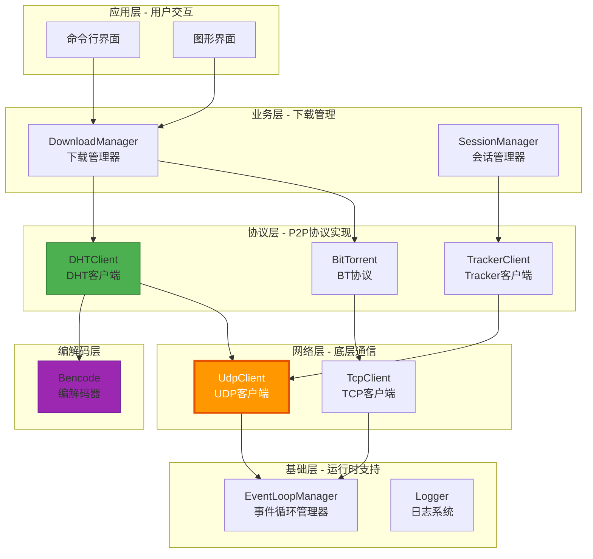

### 3.2 为什么放在网络层？

**网络层的职责**：提供基础的网络通信能力，对上层隐藏操作系统和网络库的差异。

**UdpClient 在网络层的原因**：
1. 它是对 asio UDP socket 的封装
2. 它不理解任何业务协议（DHT、Tracker）
3. 它只处理"字节流"的发送和接收
4. 它可以被不同的协议层模块复用

### 3.3 与其他模块的关系

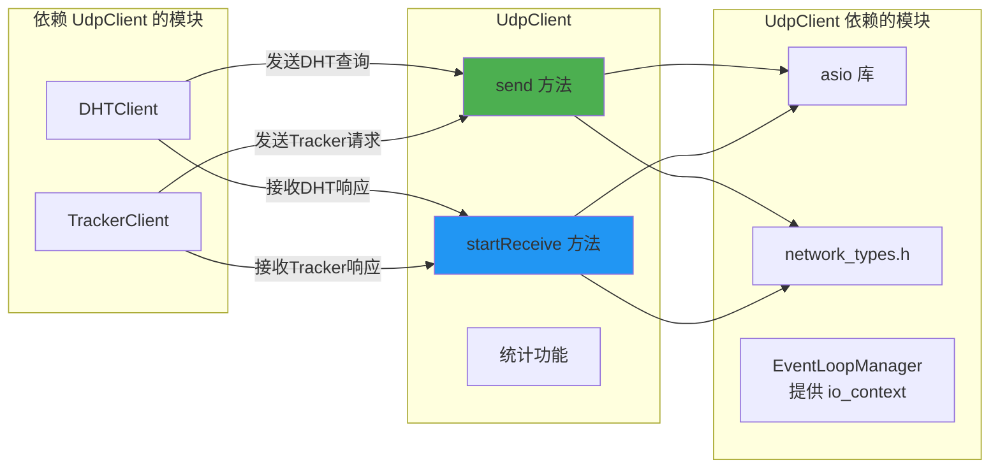

---

## 4. 接口设计详解

### 4.1 为什么使用 `enable_shared_from_this`？

```cpp
class UdpClient : public std::enable_shared_from_this<UdpClient> {
    // ...
};
```

**问题场景**：
```cpp
void UdpClient::doReceive() {
    socket_.async_receive_from(
        asio::buffer(receive_buffer_), 
        remote_endpoint_,
        [this](const asio::error_code& ec, size_t bytes) {
            // 危险！如果 UdpClient 对象已经被销毁，
            // 这里的 this 指针就是悬空的！
            handleReceive(ec, bytes);
        });
}
```

当异步操作还没完成时，如果 UdpClient 对象被销毁了，回调中的 `this` 指针就会指向已释放的内存。

**解决方案**：
```cpp
void UdpClient::doReceive() {
    socket_.async_receive_from(
        asio::buffer(receive_buffer_), 
        remote_endpoint_,
        [this, self = shared_from_this()](const asio::error_code& ec, size_t bytes) {
            // 安全！self 持有 shared_ptr，保证对象在回调执行期间不会被销毁
            handleReceive(ec, bytes);
        });
}
```

`shared_from_this()` 会返回一个指向自己的 `shared_ptr`，被 lambda 捕获后，会延长对象的生命周期。

### 4.2 回调类型设计

```cpp
// 接收回调：收到数据时调用
using ReceiveCallback = std::function<void(const UdpMessage& message)>;

// 发送回调：发送完成时调用
using SendCallback = std::function<void(const asio::error_code& ec, size_t bytes_sent)>;
```

**为什么接收回调不包含错误码？**

对于接收操作，我们选择"只在成功时回调"：
- 成功接收 → 调用回调，传递消息
- 接收失败 → 更新错误统计，不调用回调，继续接收

**原因**：
1. DHT 协议下，偶尔的接收失败（如 ICMP 错误）是正常的
2. 上层代码通常只关心成功收到的消息
3. 错误可以通过统计信息监控，不需要每次都通知

**发送回调为什么包含错误码？**

发送操作是"有明确预期"的：
- 调用 `send()` 时，调用者期望知道发送是否成功
- 发送失败可能需要重试或通知用户
- 错误码可以帮助判断失败原因（网络不可达、主机不存在等）

### 4.3 UdpEndpoint 设计

```cpp
struct UdpEndpoint {
    std::string ip;      // 为什么用 string 而不是 asio::ip::address？
    uint16_t port;
    
    // 为什么要 toString()？
    std::string toString() const;
    
    // 为什么要 isValid()？
    bool isValid() const;
};
```

**为什么 ip 用 `std::string` 而不是 `asio::ip::address`？**

1. **隐藏 asio 依赖**：上层代码不需要包含 asio 头文件
2. **支持域名**：`"router.bittorrent.com"` 可以直接传入，UdpClient 内部解析
3. **易于序列化**：字符串便于存储和传输
4. **与配置文件兼容**：配置文件中的地址就是字符串形式

**为什么需要 `isValid()`？**

```cpp
bool UdpEndpoint::isValid() const {
    return !ip.empty() && port != 0;
}
```

防止无效参数：
```cpp
UdpEndpoint endpoint;  // 默认构造，ip 为空，port 为 0
client.send(endpoint, data);  // 应该被拒绝

// 使用 isValid() 检查
if (!endpoint.isValid()) {
    throw std::invalid_argument("Invalid endpoint");
}
```

### 4.4 UdpMessage 设计

```cpp
struct UdpMessage {
    std::vector<uint8_t> data;       // 为什么用 vector 而不是 array？
    UdpEndpoint remote_endpoint;     // 为什么要包含来源地址？
};
```

**为什么用 `std::vector<uint8_t>` 而不是固定大小的数组？**

1. **大小可变**：UDP 包大小不固定（从几字节到 64KB）
2. **所有权转移**：可以 `std::move` 避免拷贝
3. **内存效率**：不浪费内存在小包上

**为什么要包含 `remote_endpoint`？**

DHT 协议需要知道消息的来源：
- 回复消息需要发送到正确的地址
- 路由表需要记录节点的地址
- 用于验证消息是否来自预期的节点

---

## 5. 核心方法详解

### 5.1 构造函数

```cpp
explicit UdpClient(asio::io_context& io_context, uint16_t local_port = 0);
```

**参数说明**：

| 参数 | 说明 |
|------|------|
| `io_context` | 引用而非拷贝，UdpClient 不拥有 io_context |
| `local_port` | 本地端口，0 表示让系统自动分配 |

**为什么 `local_port` 默认为 0？**

```cpp
// 场景1：DHT 客户端 - 需要固定端口，因为其他节点可能记住了这个端口
UdpClient dht_client(io_context, 6881);

// 场景2：一次性查询 - 不需要固定端口，让系统分配更安全
UdpClient query_client(io_context, 0);  // 系统分配一个可用端口
```

**构造函数内部做了什么？**

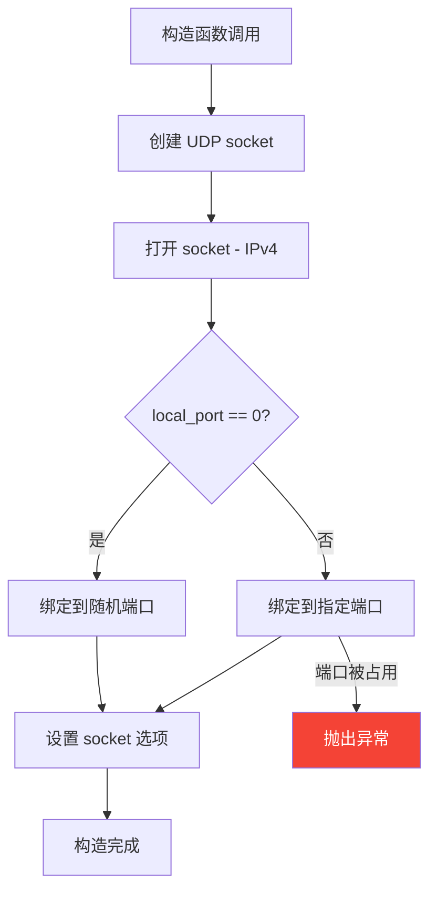

### 5.2 send() 方法

```cpp
void send(const UdpEndpoint& endpoint, 
          const std::vector<uint8_t>& data,
          SendCallback callback = nullptr);
```

**为什么 data 是 `const std::vector<uint8_t>&`？**

```cpp
// 方案1：const 引用（我们的选择）
void send(const std::vector<uint8_t>& data);
// 优点：调用者可以传入临时对象或已有对象
// 缺点：需要内部拷贝（因为异步操作，原数据可能在发送完成前被修改）

// 方案2：值传递
void send(std::vector<uint8_t> data);
// 优点：对于临时对象可以 move 避免拷贝
// 缺点：对于已有对象总是会拷贝

// 方案3：右值引用
void send(std::vector<uint8_t>&& data);
// 优点：强制 move，性能好
// 缺点：调用者必须 move，不能传入需要保留的数据
```

我们选择方案1的原因：
- 接口最友好，调用者负担最小
- 性能差异在 DHT 场景下可以忽略（消息很小）

**为什么 callback 是可选的？**

```cpp
// 场景1：不关心发送结果
client.send(endpoint, data);  // 简洁

// 场景2：需要知道发送结果
client.send(endpoint, data, [](auto ec, auto bytes) {
    if (ec) { /* 处理错误 */ }
});
```

很多场景下调用者不需要知道发送是否成功（UDP 本身就是不可靠的），提供默认参数可以简化调用。

**send() 内部流程**：

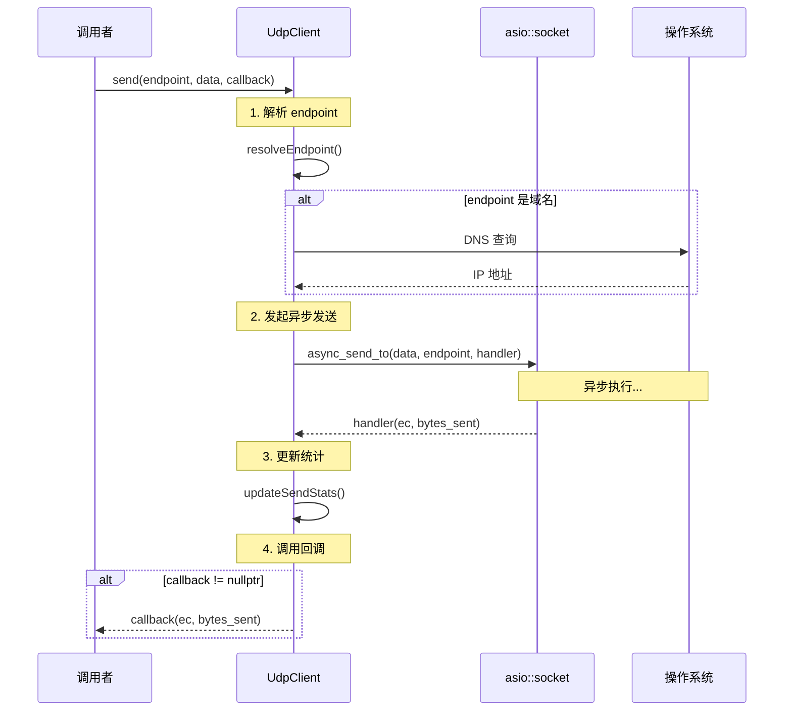

### 5.3 startReceive() 方法

```cpp
void startReceive(ReceiveCallback callback);
```

**为什么只能调用一次？**

```cpp
client.startReceive(callback1);  // OK
client.startReceive(callback2);  // 抛出异常！
```

原因：
1. 同一个 socket 上只需要一个接收监听
2. 多次调用会导致混乱：哪个回调应该被调用？
3. 强制这个约束可以防止使用错误

**如果需要更换回调怎么办？**

```cpp
client.stopReceive();
client.startReceive(newCallback);  // OK
```

**startReceive() 内部流程**：

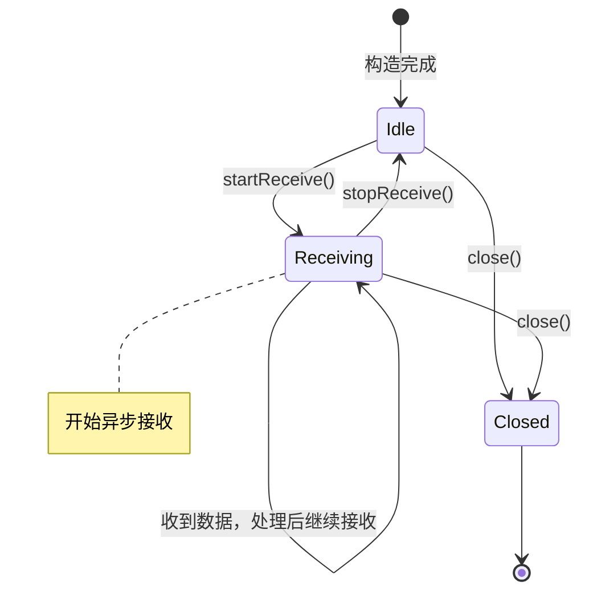

### 5.4 stopReceive() 与 close() 的区别

```cpp
void stopReceive();  // 只停止接收
void close();        // 关闭整个 socket
```

**为什么要分成两个方法？**

| 场景 | 使用的方法 |
|------|-----------|
| 暂时不想接收数据，但还要发送 | `stopReceive()` |
| 完全结束通信 | `close()` |
| 需要更换接收回调 | `stopReceive()` → `startReceive(newCallback)` |

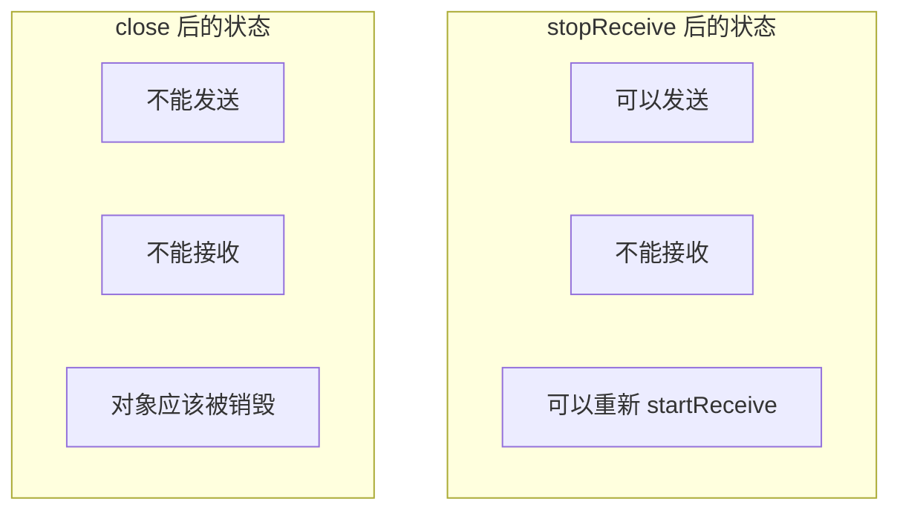

---

## 6. 线程安全设计

### 6.1 哪些操作是线程安全的？

| 方法 | 线程安全 | 说明 |
|------|----------|------|
| `send()` | ✅ 是 | 可以从任何线程调用 |
| `startReceive()` | ⚠️ 部分 | 只能调用一次，需要保证不并发调用 |
| `stopReceive()` | ✅ 是 | 可以从任何线程调用 |
| `close()` | ✅ 是 | 可以从任何线程调用 |
| `getStatistics()` | ✅ 是 | 有锁保护 |

### 6.2 为什么 send() 是线程安全的？

```cpp
void UdpClient::send(const UdpEndpoint& endpoint, 
                     const std::vector<uint8_t>& data,
                     SendCallback callback) {
    // asio::async_send_to 本身是线程安全的
    // 它会把操作提交到 io_context 的队列中
    socket_.async_send_to(asio::buffer(data), resolve_endpoint(endpoint), ...);
}
```

asio 的设计保证了：
- `async_send_to` 可以从任何线程调用
- 实际的发送操作会在 io_context 线程中执行
- 多个发送操作会排队执行，不会相互干扰

### 6.3 统计信息的线程安全

```cpp
class UdpClient {
    mutable std::mutex stats_mutex_;  // 为什么用 mutable？
    Statistics statistics_;
    
    void updateSendStats(size_t bytes, bool success) {
        std::lock_guard<std::mutex> lock(stats_mutex_);  // 加锁
        statistics_.bytes_sent += bytes;
        if (success) statistics_.messages_sent++;
        else statistics_.send_errors++;
    }
    
    Statistics getStatistics() const {
        std::lock_guard<std::mutex> lock(stats_mutex_);  // const 方法也需要锁
        return statistics_;  // 返回拷贝
    }
};
```

**为什么 mutex 是 mutable？**

`getStatistics()` 是 const 方法，但需要加锁。`mutable` 允许在 const 方法中修改 mutex。

**为什么返回拷贝而不是引用？**

```cpp
// 错误做法：返回引用
const Statistics& getStatistics() const {
    std::lock_guard<std::mutex> lock(stats_mutex_);
    return statistics_;  // 锁释放后，调用者访问 statistics_ 就不安全了！
}

// 正确做法：返回拷贝
Statistics getStatistics() const {
    std::lock_guard<std::mutex> lock(stats_mutex_);
    return statistics_;  // 返回的是拷贝，锁释放后调用者访问的是自己的拷贝
}
```

---

## 7. 类图

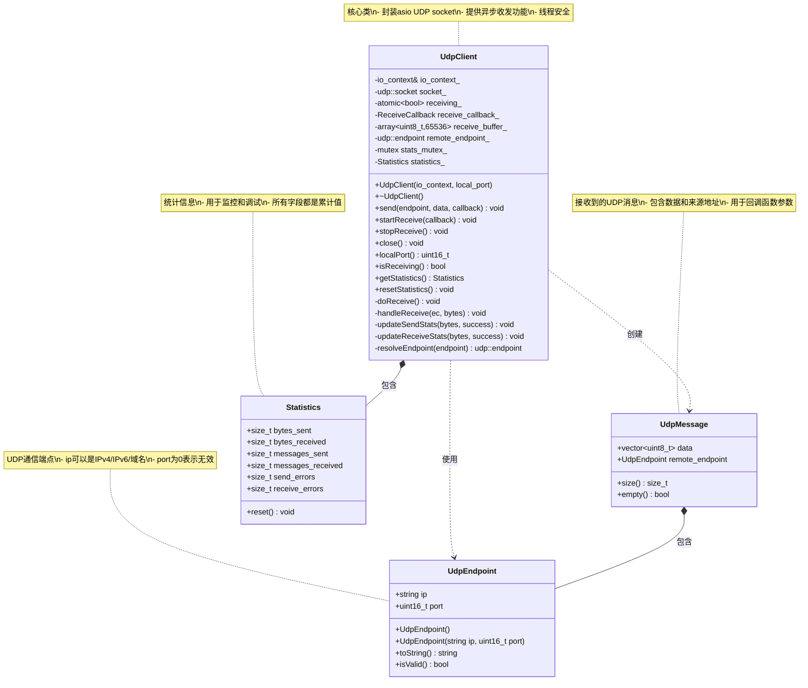

---

## 8. 时序图

### 8.1 发送消息时序

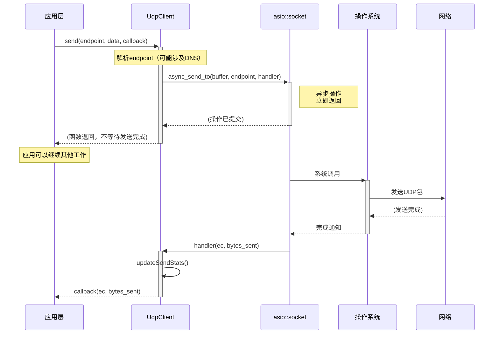

### 8.2 接收消息时序

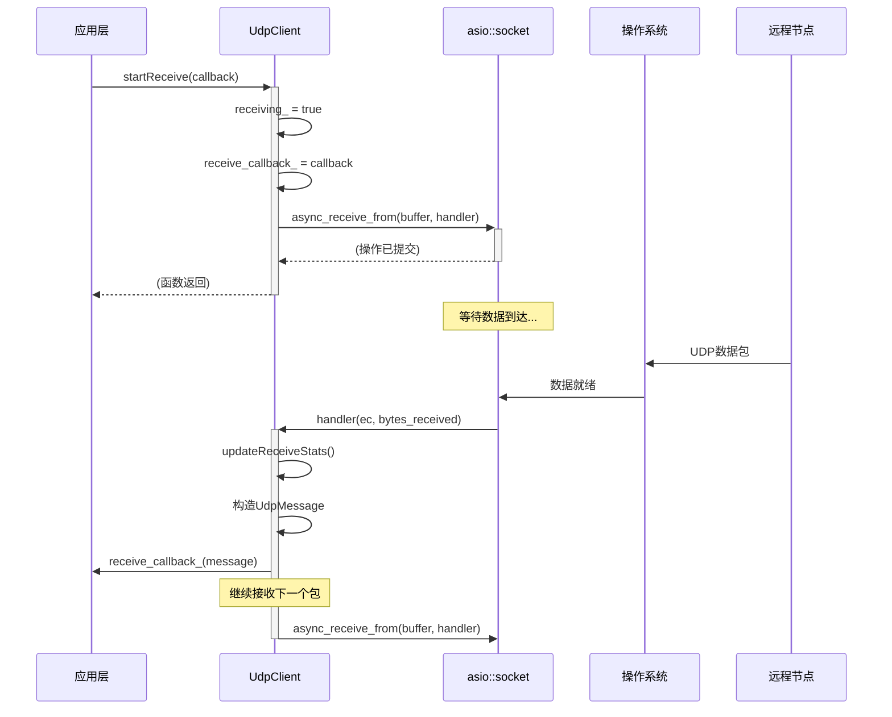

---

## 9. 流程图

### 9.1 发送流程

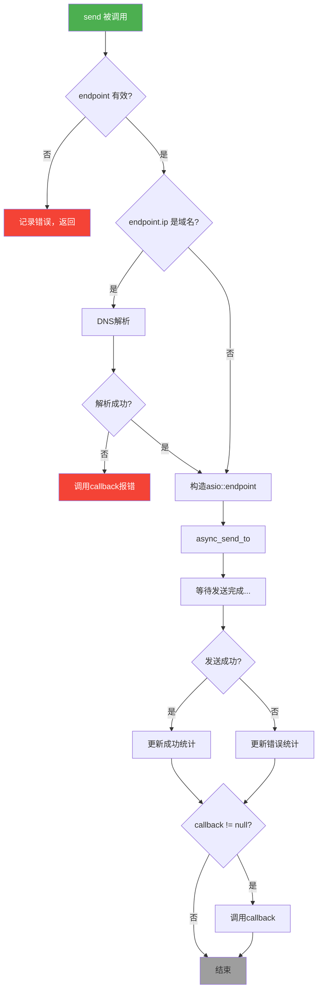

### 9.2 接收流程

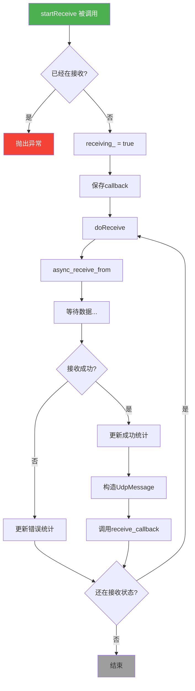

---

## 10. 错误处理

### 10.1 错误分类

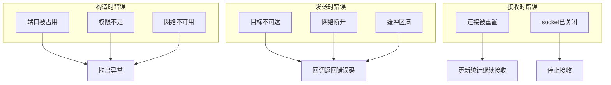

### 10.2 错误处理策略

| 错误类型 | 处理方式 | 原因 |
|----------|----------|------|
| 构造失败 | 抛出异常 | 构造失败说明无法正常工作，应该尽早失败 |
| 发送失败 | 回调返回错误码 | 调用者可能需要重试或通知用户 |
| 接收失败 | 记录统计，继续接收 | 网络偶发错误不应该中断服务 |

---

## 11. 实现检查清单

### 11.1 必须实现的功能

- [ ] 构造函数：创建socket、绑定端口、设置选项
- [ ] send()：解析地址、异步发送、统计更新、回调调用
- [ ] startReceive()：状态检查、保存回调、启动接收循环
- [ ] stopReceive()：更新状态、取消当前接收操作
- [ ] close()：停止接收、关闭socket
- [ ] 统计功能：线程安全的统计更新和查询

### 11.2 边界条件处理

- [ ] endpoint 为空或无效
- [ ] data 为空
- [ ] callback 为 nullptr
- [ ] 重复调用 startReceive()
- [ ] 对已关闭的 socket 调用 send()
- [ ] DNS 解析失败

### 11.3 测试要点

- [ ] 基本发送接收测试
- [ ] 本地回环测试
- [ ] 多线程并发发送测试
- [ ] 统计信息准确性测试
- [ ] 错误处理测试
- [ ] 生命周期测试（对象销毁时有待处理的异步操作）

---

**设计文档完成，可以开始实现！**
